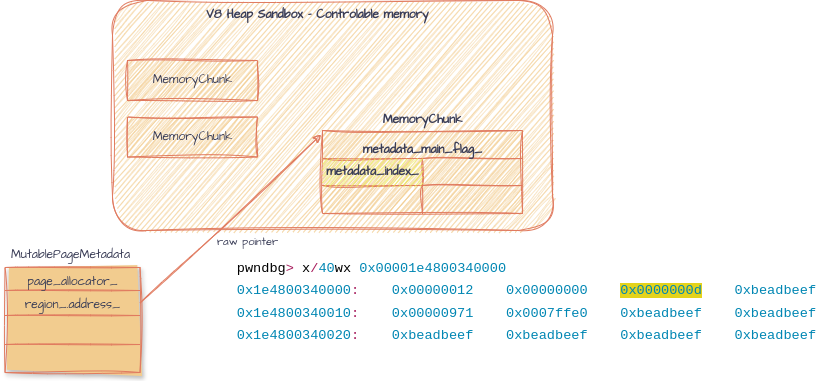

## Table of Contents

<!-- toc -->

- [Previous issues](#previous-issues)
  * [V8 Sandbox escape due to writable MemoryChunk header](#v8-sandbox-escape-due-to-writable-memorychunk-header)
- [Mutable Page Metadata](#mutable-page-metadata)
- [Conclusion](#conclusion)

<!-- tocstop -->

## Previous issues

### [V8 Sandbox escape due to writable MemoryChunk header](https://issues.chromium.org/issues/40849120)

- Description: The MemoryChunk struct is located inside V8 sandbox and contains raw pointer or particular HeapObject (which necessary to find the ExternalPointerTable to use when accessing external object), it means that they are potential to be corrupted by attackers. 

- Solution: Changing protection of HeapMetaData, or moving them into a trusted area. 


## Mutable Page Metadata


V8 uses a garbage collector to manage memory allocation and deallocation. The heap in v8 is divied into different spaces (e.g., new space, old space, code space), and each of space consists of memory chunks or pages. Managing these pages involves maintaining metadata about their state, usage, and other attributes.  

```
#
# Fatal error in ../../src/heap/mutable-page-inl.h, line 57
# Debug check failed: owner() == nullptr == Chunk()->InReadOnlySpace() (0 vs. 1).
#
// Stacktrace

#0  0x00007ffff4028016 in v8::base::OS::Abort() () at ../../src/base/platform/platform-posix.cc:699
#1  0x00007ffff400b8cb in V8_Fatal(char const*, int, char const*, ...) () at ../../src/base/logging.cc:205
#2  0x00007ffff400b305 in v8::base::(anonymous namespace)::DefaultDcheckHandler(char const*, int, char const*) () at ../../src/base/logging.cc:57
#3  0x00007ffff5bffedd in v8::internal::MainAllocator::Verify() const () at ../../src/heap/mutable-page-inl.h:57
#4  0x00007ffff5c00ead in v8::internal::MainAllocator::FreeLinearAllocationArea() () at ../../src/heap/main-allocator.cc:338
#5  0x00007ffff5b9988e in v8::internal::HeapAllocator::FreeLinearAllocationAreas() () at ../../src/heap/heap-allocator.cc:236
#6  0x00007ffff5bd1b64 in v8::internal::Heap::StartTearDown() () at ../../src/heap/heap.cc:6106
#7  0x00007ffff5a1963c in v8::internal::Isolate::Deinit() () at ../../src/execution/isolate.cc:4151
#8  0x00007ffff5a191b3 in v8::internal::Isolate::Delete(v8::internal::Isolate*) () at ../../src/execution/isolate.cc:3833
#9  0x000055555559e4c9 in v8::Shell::OnExit(v8::Isolate*, bool) () at ../../src/d8/d8.cc:3901
#10 0x00005555555ab4bd in v8::Shell::Main(int, char**) () at ../../src/d8/d8.cc:6233
#11 0x00007ffff3833083 in __libc_start_main (main=0x5555555ab830 <main>, argc=4, argv=0x7fffffffe308, init=<optimized out>, fini=<optimized out>, rtld_fini=<optimized out>, stack_end=0x7fffffffe2f8) at ../csu/libc-start.c:308
#12 0x0000555555576c9a in _start ()
```

```cpp

pwndbg> p s
$10 = {
  <v8::internal::Tagged<v8::internal::HeapObject>> = {
    <v8::internal::TaggedImpl<1, unsigned long>> = {
      static kIsFull = 0x1,
      static kCanBeWeak = 0x0,
      ptr_ = 0x345200049ccd
    }, <No data fields>}, <No data fields>}
```

**When using gc()**

- semispace...


Stacktrace:
```cpp
#0  0x00007fffeda6f189 in v8::base::OS::Abort()::$_0::operator()() const (this=0x7fffffffd1af) at ../../src/base/platform/platform-posix.cc:699
#1  0x00007fffeda6f173 in v8::base::OS::Abort () at ../../src/base/platform/platform-posix.cc:699
#2  0x00007fffeda453d1 in V8_Fatal (file=0x7ffff1e6a339 "../../src/heap/memory-allocator.h", line=0x3b, format=0x7fffeda18f73 "Debug check failed: %s.") at ../../src/base/logging.cc:205
#3  0x00007fffeda44d9c in v8::base::(anonymous namespace)::DefaultDcheckHandler (file=0x7ffff1e6a339 "../../src/heap/memory-allocator.h", line=0x3b, message=0x7ffff1f2e467 "!chunk->Chunk()->IsLargePage()") at ../../src/base/logging.cc:57
#4  0x00007fffeda4548e in V8_Dcheck (file=0x7ffff1e6a339 "../../src/heap/memory-allocator.h", line=0x3b, message=0x7ffff1f2e467 "!chunk->Chunk()->IsLargePage()") at ../../src/base/logging.cc:217
#5  0x00007ffff462dfa8 in v8::internal::MemoryAllocator::Pool::Add (this=0x5555556fdaf8, chunk=0x5555557670f0) at ../../src/heap/memory-allocator.h:59
#6  0x00007ffff462c15b in v8::internal::MemoryAllocator::Free (this=0x5555556fda80, mode=v8::internal::MemoryAllocator::FreeMode::kPool, chunk_metadata=0x5555557670f0) at ../../src/heap/memory-allocator.cc:396
#7  0x00007ffff464f906 in v8::internal::SemiSpace::Uncommit (this=0x5555556f5660) at ../../src/heap/new-spaces.cc:163
#8  0x00007ffff464f808 in v8::internal::SemiSpace::TearDown (this=0x5555556f5660) at ../../src/heap/new-spaces.cc:119
#9  0x00007ffff4651af0 in v8::internal::SemiSpaceNewSpace::~SemiSpaceNewSpace (this=0x5555556f5550) at ../../src/heap/new-spaces.cc:490
#10 0x00007ffff4651b59 in v8::internal::SemiSpaceNewSpace::~SemiSpaceNewSpace (this=0x5555556f5550) at ../../src/heap/new-spaces.cc:488
#11 0x00007ffff455f6e8 in std::__Cr::default_delete<v8::internal::Space>::operator() (this=0x555555716258, __ptr=0x5555556f5550) at ../../third_party/libc++/src/include/__memory/unique_ptr.h:67
#12 0x00007ffff45362e6 in std::__Cr::unique_ptr<v8::internal::Space, std::__Cr::default_delete<v8::internal::Space> >::reset (this=0x555555716258, __p=0x0) at ../../third_party/libc++/src/include/__memory/unique_ptr.h:278
#13 0x00007ffff4514a60 in v8::internal::Heap::TearDown (this=0x5555557160f8) at ../../src/heap/heap.cc:6212
#14 0x00007ffff42a3e33 in v8::internal::Isolate::Deinit (this=0x555555708000) at ../../src/execution/isolate.cc:4215
#15 0x00007ffff42a381f in v8::internal::Isolate::Delete (isolate=0x555555708000) at ../../src/execution/isolate.cc:3833
#16 0x00007ffff3d272e5 in v8::Isolate::Dispose (this=0x555555708000) at ../../src/api/api.cc:9816
#17 0x000055555567edfd in v8::Shell::OnExit (isolate=0x555555708000, dispose=0x1) at ../../src/d8/d8.cc:3901
#18 0x000055555568c92b in v8::Shell::Main (argc=0x5, argv=0x7fffffffe2e8) at ../../src/d8/d8.cc:6233
#19 0x000055555568cd52 in main (argc=0x5, argv=0x7fffffffe2e8) at ../../src/d8/d8.cc:6256
#20 0x00007fffed1eb083 in __libc_start_main (main=0x55555568cd30 <main(int, char**)>, argc=0x5, argv=0x7fffffffe2e8, init=<optimized out>, fini=<optimized out>, rtld_fini=<optimized out>, stack_end=0x7fffffffe2d8) at ../csu/libc-start.c:308
#21 0x00005555556388da in _start ()
```

```cpp

// normal page 
pwndbg> x/40wx 0x00001e4800340000
0x1e4800340000:	0x00000012	0x00000000	0x0000000d	0xbeadbeef
0x1e4800340010:	0x00000971	0x0007ffe0	0xbeadbeef	0xbeadbeef
0x1e4800340020:	0xbeadbeef	0xbeadbeef	0xbeadbeef	0xbeadbeef

// corrupted page
pwndbg> x/40wx 0x00001e4800040000
0x1e4800040000:	0x42424242	0x41414141	0x00000001	0xbeadbeef
0x1e4800040010:	0x42424242	0x41414141	0xbeadbeef	0xbeadbeef
0x1e4800040020:	0x42424242	0x41414141	0xbeadbeef	0xbeadbeef

pwndbg> p chunk_metadata
$10 = (v8::internal::MutablePageMetadata *) 0x5555557670f0
pwndbg> x/40gx 0x5555557670f0
0x5555557670f0:	0x00005555556fe140	0x00001e4800040000
0x555555767100:	0x0000000000040000	0x000000000003fff0 // +0x10 -> size_
0x555555767110:	0x0000000000000000	0x0000000000009cc8

/// proc mapping
seacloud at ~/Desktop/v8/v8 ❯ cat /proc/3901929/maps | head -n 50
1913b1539000-1913b153a000 r--p 00000000 00:00 0 
1e4000000000-1e4800000000 ---p 00000000 00:00 0 
1e4800000000-1e4800010000 r--p 00000000 00:00 0 
1e4800010000-1e4800020000 ---p 00000000 00:00 0 
1e4800020000-1e4800040000 r--p 00000000 00:00 0 
1e4800040000-1e4800149000 rw-p 00000000 00:00 0 
1e4800149000-1e4800180000 ---p 00000000 00:00 0 
1e4800180000-1e480027e000 r--p 00000000 00:00 0 
1e480027e000-1e4800280000 ---p 00000000 00:00 0 
1e4800280000-1e48003c0000 rw-p 00000000 00:00 0 
1e48003c0000-1e4900000000 ---p 00000000 00:00 0 
1e4900000000-1e4900100000 ---p 00000000 00:00 0 
1e4900100000-1f5000000000 ---p 00000000 00:00 0 
3b3700000000-3b3700001000 rw-p 00000000 00:00 0 
3b3700001000-3b3700040000 ---p 00000000 00:00 0 
3b3700040000-3b3700080000 rw-p 00000000 00:00 0 
3b3700080000-3b3740000000 ---p 00000000 00:00 0 
555555554000-555555638000 r--p 00000000 08:03 8704715                    /home/vult/Desktop/v8/v8/out/debug/d8
555555638000-5555556e7000 r-xp 000e3000 08:03 8704715                    /home/vult/Desktop/v8/v8/out/debug/d8
5555556e7000-5555556e9000 r--p 00191000 08:03 8704715                    /home/vult/Desktop/v8/v8/out/debug/d8
5555556e9000-5555556eb000 rw-p 00192000 08:03 8704715                    /home/vult/Desktop/v8/v8/out/debug/d8
5555556eb000-5555557e7000 rw-p 00000000 00:00 0  

// ../../src/heap/memory-allocator.cc:380
pwndbg> p *(v8::internal::MutablePageMetadata *) 0x5555557670f0 // out of sandbox
$58 = {
  <v8::internal::MemoryChunkMetadata> = {
    reservation_ = {
      page_allocator_ = 0x5555556fe140,
      region_ = {
        address_ = 0x104500040000,
        size_ = 0x40000
      }
    },

// ../../src/heap/mutable-page.cc:150
pwndbg> p page
$59 = (v8::internal::PageMetadata *) 0x5555557670f0
pwndbg> p *page
$60 = {
  <v8::internal::MutablePageMetadata> = {
    <v8::internal::MemoryChunkMetadata> = {
      reservation_ = {
        page_allocator_ = 0x5555556fe140,
        region_ = {
          address_ = 0x104500040000,
          size_ = 0x40000
        }
      },

//
pwndbg> p *page
$60 = {
  <v8::internal::MutablePageMetadata> = {
    <v8::internal::MemoryChunkMetadata> = {
      reservation_ = {
        page_allocator_ = 0x5555556fe140,
        region_ = {
          address_ = 0x104500040000,
          size_ = 0x40000
        }
      },
      allocated_bytes_ = 0x3fff0,
      wasted_memory_ = 0x0,
      high_water_mark_ = {
        <std::__Cr::__atomic_base<long, 1>> = {
          <std::__Cr::__atomic_base<long, 0>> = {
            __a_ = {
              <std::__Cr::__cxx_atomic_base_impl<long>> = {
                __a_value = 0x9cec
              }, <No data fields>},
            static is_always_lock_free = <optimized out>
          }, <No data fields>}, <No data fields>},
      size_ = 0x40000,
      area_end_ = 0x104500080000,
      heap_ = 0x5555557160f8,
      area_start_ = 0x104500040010,
      owner_ = {
        <std::__Cr::__atomic_base<v8::internal::BaseSpace*, 0>> = {
          __a_ = {
            <std::__Cr::__cxx_atomic_base_impl<v8::internal::BaseSpace*>> = {
              __a_value = 0x5555556f5660
            }, <No data fields>},
          static is_always_lock_free = <optimized out>
        }, <No data fields>}
    }, 
    members of v8::internal::MutablePageMetadata:
    static kHeaderSize = 0x10,
    static kOldToNewSlotSetOffset = 0x58,
    static kPageSize = 0x40000,
    slot_set_ = {0x0, 0x0, 0x0, 0x0, 0x0, 0x0, 0x0},
    typed_slot_set_ = {0x0, 0x0, 0x0, 0x0, 0x0, 0x0, 0x0},
    progress_bar_ = {
      static kDisabledSentinel = 0xffffffffffffffff,
      value_ = {
        <std::__Cr::__atomic_base<unsigned long, 1>> = {
          <std::__Cr::__atomic_base<unsigned long, 0>> = {
            __a_ = {
              <std::__Cr::__cxx_atomic_base_impl<unsigned long>> = {
                __a_value = 0xffffffffffffffff
              }, <No data fields>},
            static is_always_lock_free = <optimized out>
          }, <No data fields>}, <No data fields>}
    },
    live_byte_count_ = {
      <std::__Cr::__atomic_base<long, 1>> = {
        <std::__Cr::__atomic_base<long, 0>> = {
          __a_ = {
            <std::__Cr::__cxx_atomic_base_impl<long>> = {
              __a_value = 0x0
            }, <No data fields>},
          static is_always_lock_free = <optimized out>
        }, <No data fields>}, <No data fields>},
    mutex_ = 0x0,
    shared_mutex_ = 0x0,
    page_protection_change_mutex_ = 0x0,
    concurrent_sweeping_ = {
      <std::__Cr::__atomic_base<v8::internal::MutablePageMetadata::ConcurrentSweepingState, 0>> = {
        __a_ = {
          <std::__Cr::__cxx_atomic_base_impl<v8::internal::MutablePageMetadata::ConcurrentSweepingState>> = {
            __a_value = v8::internal::MutablePageMetadata::ConcurrentSweepingState::kDone
          }, <No data fields>},
        static is_always_lock_free = <optimized out>
      }, <No data fields>},
    external_backing_store_bytes_ = {{
        <std::__Cr::__atomic_base<unsigned long, 1>> = {
          <std::__Cr::__atomic_base<unsigned long, 0>> = {
            __a_ = {
              <std::__Cr::__cxx_atomic_base_impl<unsigned long>> = {
                __a_value = 0x0
              }, <No data fields>},
            static is_always_lock_free = <optimized out>
          }, <No data fields>}, <No data fields>}, {
        <std::__Cr::__atomic_base<unsigned long, 1>> = {
          <std::__Cr::__atomic_base<unsigned long, 0>> = {
            __a_ = {
              <std::__Cr::__cxx_atomic_base_impl<unsigned long>> = {
                __a_value = 0x0
              }, <No data fields>},
            static is_always_lock_free = <optimized out>
          }, <No data fields>}, <No data fields>}},
    list_node_ = {
      next_ = 0x0,
      prev_ = 0x0
    },
    categories_ = 0x0,
    possibly_empty_buckets_ = {
      static kPointerTag = 0x1,
      static kWordSize = 0x8,
      static kBitsPerWord = 0x40,
      bitmap_ = 0x0
    },
    active_system_pages_ = 0x0,
    allocated_lab_size_ = 0x0,
    age_in_new_space_ = 0x0,
    marking_bitmap_ = {
      static kBitsPerCell = 0x40,
      static kBitsPerCellLog2 = 0x6,
      static kBitIndexMask = 0x3f,
      static kBytesPerCell = 0x8,
      static kBytesPerCellLog2 = 0x3,
      static kLength = 0x10000,
      static kCellsCount = 0x400,
      static kSize = 0x2000,
      cells_ = {0x0 <repeats 1024 times>}
    }
  }, <No data fields>}

/// Data's controlable
pwndbg> p *(MemoryChunk*)0x104500040000
$65 = {
  static kAllFlagsMask = {
    mask_ = 0xffffffffffffffff
  },
  static kPointersToHereAreInterestingMask = {
    mask_ = 0x2
  },
  static kPointersFromHereAreInterestingMask = {
    mask_ = 0x4
  },
  static kEvacuationCandidateMask = {
    mask_ = 0x400
  },
  static kIsInYoungGenerationMask = {
    mask_ = 0x18
  },
  static kIsInReadOnlyHeapMask = <optimized out>,
  static kIsLargePageMask = {
    mask_ = 0x200
  },
  static kInSharedHeap = <optimized out>,
  static kIncrementalMarking = <optimized out>,
  static kSkipEvacuationSlotsRecordingMask = {
    mask_ = 0x418
  },
  static kCopyOnFlipFlagsMask = {
    mask_ = 0x26
  },
  static kIsOnlyOldOrMajorGCInProgressMask = {
    mask_ = 0x180
  },
  main_thread_flags_ = {
    mask_ = 0x4141414142068000
  },
  metadata_index_ = 0x1,    // 
  static kAlignment = 0x40000,
  static kAlignmentMask = 0x3ffff,
  static kPagesInMainCage = 0x4000,
  static kPagesInCodeCage = 0x800,
  static kPagesInTrustedCage = 0x1000,
  static kMainCageMetadataOffset = 0x0,
  static kTrustedSpaceMetadataOffset = 0x4000,
  static kCodeRangeMetadataOffset = 0x5000,
  static kMetadataPointerTableSizeLog2 = 0xf,
  static kMetadataPointerTableSize = 0x8000,
  static kMetadataPointerTableSizeMask = 0x7fff,
  static metadata_pointer_table_ = <error reading variable: value requires 262144 bytes, which is more than max-value-size>
}

```
Another stacktrace:
```cpp
#0  v8::internal::MemoryChunkMetadata::area_start (this=0x0) at ../../src/heap/memory-chunk-metadata.h:56
#1  0x000055555563d135 in v8::internal::MemoryChunkMetadata::Chunk (this=0x0) at ../../src/heap/memory-chunk-metadata.h:117
#2  0x000055555563cf8a in v8::internal::MemoryChunk::Metadata (this=0x3acf00040000) at ../../src/heap/memory-chunk-inl.h:23
#3  0x00007ffff462e745 in v8::internal::MemoryChunk::Metadata (this=0x3acf00040000) at ../../src/heap/memory-chunk-inl.h:31
#4  0x00007ffff4634fd4 in v8::internal::MemoryChunk::IsTrusted (this=0x3acf00040000) at ../../src/heap/memory-chunk.cc:149
#5  0x00007ffff462dfbd in v8::internal::MemoryAllocator::Pool::Add (this=0x5555556fdaf8, chunk=0x5555557670f0) at ../../src/heap/memory-allocator.h:60
#6  0x00007ffff462c15b in v8::internal::MemoryAllocator::Free (this=0x5555556fda80, mode=v8::internal::MemoryAllocator::FreeMode::kPool, chunk_metadata=0x5555557670f0) at ../../src/heap/memory-allocator.cc:396
#7  0x00007ffff464f906 in v8::internal::SemiSpace::Uncommit (this=0x5555556f5660) at ../../src/heap/new-spaces.cc:163
#8  0x00007ffff464f808 in v8::internal::SemiSpace::TearDown (this=0x5555556f5660) at ../../src/heap/new-spaces.cc:119
#9  0x00007ffff4651af0 in v8::internal::SemiSpaceNewSpace::~SemiSpaceNewSpace (this=0x5555556f5550) at ../../src/heap/new-spaces.cc:490
#10 0x00007ffff4651b59 in v8::internal::SemiSpaceNewSpace::~SemiSpaceNewSpace (this=0x5555556f5550) at ../../src/heap/new-spaces.cc:488
#11 0x00007ffff455f6e8 in std::__Cr::default_delete<v8::internal::Space>::operator() (this=0x555555716258, __ptr=0x5555556f5550) at ../../third_party/libc++/src/include/__memory/unique_ptr.h:67
#12 0x00007ffff45362e6 in std::__Cr::unique_ptr<v8::internal::Space, std::__Cr::default_delete<v8::internal::Space> >::reset (this=0x555555716258, __p=0x0) at ../../third_party/libc++/src/include/__memory/unique_ptr.h:278
#13 0x00007ffff4514a60 in v8::internal::Heap::TearDown (this=0x5555557160f8) at ../../src/heap/heap.cc:6212
#14 0x00007ffff42a3e33 in v8::internal::Isolate::Deinit (this=0x555555708000) at ../../src/execution/isolate.cc:4215
#15 0x00007ffff42a381f in v8::internal::Isolate::Delete (isolate=0x555555708000) at ../../src/execution/isolate.cc:3833
#16 0x00007ffff3d272e5 in v8::Isolate::Dispose (this=0x555555708000) at ../../src/api/api.cc:9816
#17 0x000055555567edfd in v8::Shell::OnExit (isolate=0x555555708000, dispose=0x1) at ../../src/d8/d8.cc:3901
#18 0x000055555568c92b in v8::Shell::Main (argc=0x5, argv=0x7fffffffe2e8) at ../../src/d8/d8.cc:6233
#19 0x000055555568cd52 in main (argc=0x5, argv=0x7fffffffe2e8) at ../../src/d8/d8.cc:6256
#20 0x00007fffed1eb083 in __libc_start_main (main=0x55555568cd30 <main(int, char**)>, argc=0x5, argv=0x7fffffffe2e8, init=<optimized out>, fini=<optimized out>, rtld_fini=<optimized out>, stack_end=0x7fffffffe2d8) at ../csu/libc-start.c:308
#21 0x00005555556388da in _start ()
```

**Rechecking** 

```cpp
pwndbg> find 0x1e700000000,0x1e800000000,0x1e700
0x1e70000004b
0x1e70000005b
0x1e70018004b
0x1e70018005b
0x1e7001c004b
0x1e7001c005b
0x1e70020004b
0x1e70020005b
0x1e70024004b
0x1e70024005b

// all of pointers are in readonly region 
```

## Conclusion 

Corrupting a MemoryChunk (metadata_index_, flags, etc.) does not result in escaping the v8 sandbox. 




Issue: https://issues.chromium.org/issues/40849120

Studying more...
