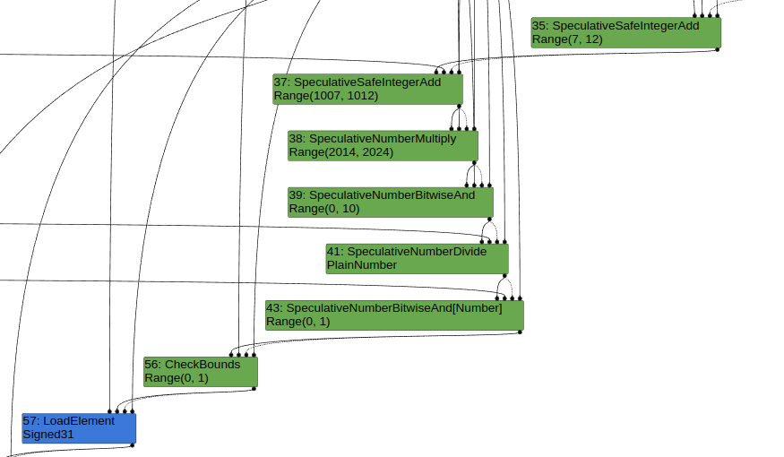

# Turbofan on V8 

Turbofan compiler is an advanced optimizing compiler used by the V8 Javascript engine. It has some functionalities:
- Optimization
- Just-In-Time compilation: Turbofan compiles JavaScript code into machine code at runtime, rewther than ahead of time. This allows it to optimize code based on actual usage patterns

## Table of Content


## Sea of Nodes

TurboFan works on a program representation called `sea of nodes`. There are 3 types of edges:
- Control Edges: will be stored in Control Flow Graphs
- Value Edges: will be stored in Data Flow Graphs
- Effect edges: 


### NumberAdd

```js
// d8 --trace-turbo --allow-natives-syntax number_add.js
function opt_me() {
    let x = Math.random();
    let y = x + 2;
    return y + 3;
}

opt_me();
%OptimizeFunctionOnNextCall(opt_me);
opt_me();

```

Graph comes through `OptimizeGraph`

```cpp


bool PipelineImpl::OptimizeTurbofanGraph(Linkage* linkage) {
  DCHECK(!v8_flags.turboshaft_from_maglev);
  TFPipelineData* data = this->data_;

  data->BeginPhaseKind("V8.TFLowering");
  // Trim the graph before typing to ensure all nodes are typed.
  Run<EarlyGraphTrimmingPhase>();
  RunPrintAndVerify(EarlyGraphTrimmingPhase::phase_name(), true);

  // Type the graph and keep the Typer running such that new nodes get
  // automatically typed when they are created.
  Run<TyperPhase>(data->CreateTyper());
  RunPrintAndVerify(TyperPhase::phase_name());

  Run<TypedLoweringPhase>();
  RunPrintAndVerify(TypedLoweringPhase::phase_name());

  if (data->info()->loop_peeling()) {
    Run<LoopPeelingPhase>();
    RunPrintAndVerify(LoopPeelingPhase::phase_name(), true);
  } else {
    Run<LoopExitEliminationPhase>();
    RunPrintAndVerify(LoopExitEliminationPhase::phase_name(), true);
  }

  if (v8_flags.turbo_load_elimination) {
    Run<LoadEliminationPhase>();
    RunPrintAndVerify(LoadEliminationPhase::phase_name());
  }
  data->DeleteTyper();

  if (v8_flags.turbo_escape) {
    Run<EscapeAnalysisPhase>();
    RunPrintAndVerify(EscapeAnalysisPhase::phase_name());
  }

  if (v8_flags.assert_types) {
    Run<TypeAssertionsPhase>();
    RunPrintAndVerify(TypeAssertionsPhase::phase_name());
  }

  if (!v8_flags.turboshaft_frontend) {
    // Perform x. This has to run w/o the Typer decorator,
    // because we cannot compute meaningful types anyways, and the computed
    // types might even conflict with the representation/truncation logic.
    Run<SimplifiedLoweringPhase>(linkage);
    RunPrintAndVerify(SimplifiedLoweringPhase::phase_name(), true);

//... And many optimizing steps above 

```

Graph Builder Phase


Typer Phase


Typed Lowering Phase

```cpp
// v8/src/compiler/pipeline.cc
struct TypedLoweringPhase {
  DECL_PIPELINE_PHASE_CONSTANTS(TypedLowering)

  void Run(TFPipelineData* data, Zone* temp_zone) {
    GraphReducer graph_reducer(
        temp_zone, data->graph(), &data->info()->tick_counter(), data->broker(),
        data->jsgraph()->Dead(), data->observe_node_manager());
    DeadCodeElimination dead_code_elimination(&graph_reducer, data->graph(),
                                              data->common(), temp_zone);
    JSCreateLowering create_lowering(&graph_reducer, data->jsgraph(),
                                     data->broker(), temp_zone);
    JSTypedLowering typed_lowering(&graph_reducer, data->jsgraph(),
                                   data->broker(), temp_zone);
    ConstantFoldingReducer constant_folding_reducer(
        &graph_reducer, data->jsgraph(), data->broker());
    TypedOptimization typed_optimization(&graph_reducer, data->dependencies(),
                                         data->jsgraph(), data->broker());
    SimplifiedOperatorReducer simple_reducer(
        &graph_reducer, data->jsgraph(), data->broker(), BranchSemantics::kJS);
    CheckpointElimination checkpoint_elimination(&graph_reducer);
    CommonOperatorReducer common_reducer(
        &graph_reducer, data->graph(), data->broker(), data->common(),
        data->machine(), temp_zone, BranchSemantics::kJS);
    AddReducer(data, &graph_reducer, &dead_code_elimination);

    AddReducer(data, &graph_reducer, &create_lowering);
    AddReducer(data, &graph_reducer, &constant_folding_reducer);
    AddReducer(data, &graph_reducer, &typed_lowering);
    AddReducer(data, &graph_reducer, &typed_optimization);
    AddReducer(data, &graph_reducer, &simple_reducer);
    AddReducer(data, &graph_reducer, &checkpoint_elimination);
    AddReducer(data, &graph_reducer, &common_reducer);

    // ConstantFoldingReducer, JSCreateLowering, JSTypedLowering, and
    // TypedOptimization access the heap.
    UnparkedScopeIfNeeded scope(data->broker());

    graph_reducer.ReduceGraph();
  }
};


```


### CheckBound


```js
function opt_me(b) {
  let values = [42,1337];       // HeapConstant <FixedArray[2]>
  let x = 10;                   // NumberConstant[10]          | Range(10,10)
  if (b == "foo")
    x = 5;                      // NumberConstant[5]           | Range(5,5)
                                // Phi                         | Range(5,10)
  let y = x + 2;                // SpeculativeSafeIntegerAdd   | Range(7,12)
  y = y + 1000;                 // SpeculativeSafeIntegerAdd   | Range(1007,1012)
  y = y * 2;                    // SpeculativeNumberMultiply   | Range(2014,2024)
  y = y & 10;                   // SpeculativeNumberBitwiseAnd | Range(0,10)
  y = y / 3;                    // SpeculativeNumberDivide     | PlainNumber[r][s][t]
  y = y & 1;                    // SpeculativeNumberBitwiseAnd | Range(0,1)
  return values[y];             // CheckBounds                 | Range(0,1)
}

for (let i = 0; i < 0x10000; i++)
  opt_me(i);

// opt_me("foo");

```

Escape Analysis

