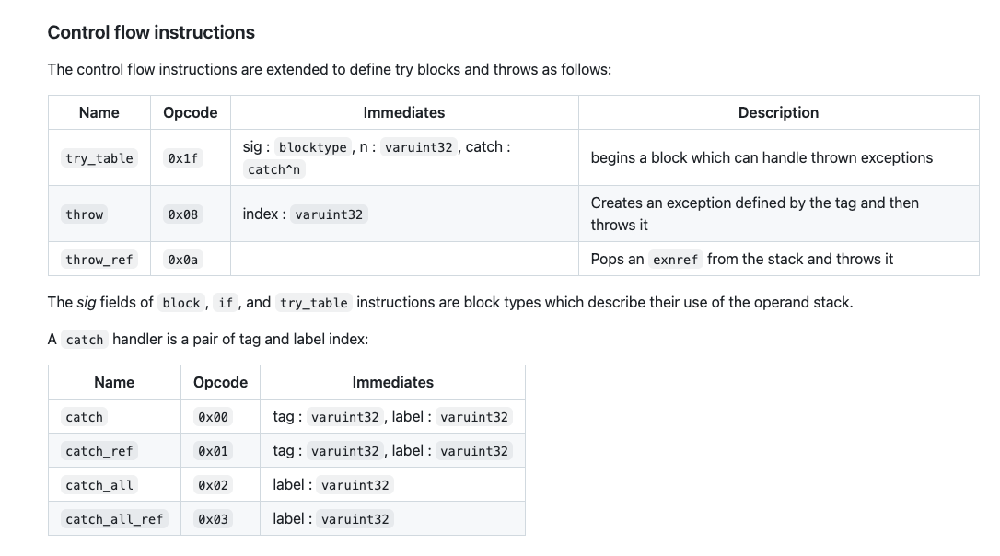

# Wasm Type

## TOC


## Use wasm_null for exnref


Commit: https://chromium-review.googlesource.com/c/v8/v8/+/5953226

```
[wasm][exnref] Use wasm_null for exnref

A JS null caught in wasm as an exnref with catch_(all_)ref should be
observably different from a null exnref: a JS null should behave like a
regular JS exception with null as the externref package, while a null
exnref is the actual null value for this type. In particular, a JS
null exception can be rethrown while a null exnref cannot.
Represent null exnrefs with wasm_null instead of JS null to avoid the
confusion.
```

This commit message explains a change in the handling of `exnref` (exception reference) values in WebAssembly (Wasm). The goal is to distinguish between two different types of "null" values in the context of Wasm and JavaScript. 

### Context

- `exnref`: A Wasm type used to represent exception references
- JS null: the null value in JavaScript, which can be caught and manipulated in various ways.
- `wasm_null`: A dedicated representation of a null value specific to Wasm, distinct from JavaScript's `null`

### Problem

When Wasm code interacts with JS:
1. JS null in Wasm:
    - If a JS `null` is caught in Wasm as an `exnref` (e.g., using catch_ref or catch_all_ref), it should behave as a JS exception.
    - This means it can be rethrown as a regular JS exception with `null` encapsulated as the `externref` value.

2. Wasm null `exnref`:
    - A null value of type `exnref` in Wasm represents a true null for this type
    - Unlike a JS exception, it **cannot be rethrown** because it is not a valid exception object

### Confusion

Using a JS `null` to represent both types of null (JS null and Wasm null `exnref`) leads to ambiguity:
    - A JS `null` might be incorrectly interpreted as a Wasm `null exnref`, or vice versa.
    - This could result in unexpected behaviours, especially when distinguishing between rethrowable exceptions and actualll nulls in Wasm


## Exception handling Spec

Reading Exception Handling spec: https://github.com/WebAssembly/exception-handling/blob/main/proposals/exception-handling/Exceptions.md

#### Throwing an exception

- In case of `catch` or `catch_ref`, **the arguments** of the exception are pushed back onto the stack. For `catch_ref` and `catch_all_ref`, an **exception reference** is then pushed to the stack, which represents the caught exception.

#### ReThrowing an exception

- The `throw_ref` takes an operand of type `exnref` and re-throws the corresponding caught exception. If the operand is null, a trap occurs.
- To preserve stack trace info when crossing the JS to Wasm boundary, exceptions can internally containi a stack trace, which is propagated when caught by a `catch[_all]_ref` clause and rethrown by `throw_ref`.

#### Changes to the binary model

- The type `exnref` is represented by the type opcode `-0x17`
- When combined with the GC proposal, there also is a value type `nullexnref` with opcode `-0x0c`. Furthermore, these opcodes also function as heap type, i.e., `exn` is a new heap type with opcode `-0x17`, and `noexn` is a new heap type with opcode `-0x0c`; `exnref` and `nullexnref` are shorthands for `ref null exn` and `(ref null noexn)`, respectively.

- The heap type `noexn` is a subtype of `exn`. They are not in a subtype relation with any other type (exception bottom), such that they form a new disjoint hierarchy of heap types.
 



## Examples

**Example1**

WebAssembly.Exception

Tell what did they do?? which one be affected??
This example throughs `WASM_EXCEPTION_PACKAGE_TYPE`. 

```js

// Flags: --no-liftoff
// scripts/output/regress-1484393.js

d8.file.execute("/home/vult/Desktop/v8-wasm/v8/test/mjsunit/wasm/wasm-module-builder.js");

// Helper module to produce an exnref or convert a JS value to an exnref.
let helper = (function () {
  let builder = new WasmModuleBuilder();
  let tag_index = builder.addTag(makeSig([], []));
  let throw_index = builder.addImport('m', 'import', makeSig([kWasmExternRef], []));
  builder.addFunction('get_exnref', makeSig([], [kWasmExnRef]))
    .addLocals(kWasmNullExnRef, 1)
      .addBody([
          kExprTryTable, kWasmVoid, 1,
          kCatchAllRef, 0,
          kExprThrow, tag_index,
          kExprEnd,
          kExprUnreachable,
      ]).exportFunc();

  function throw_js(r) {
    console.log("================ throw_js object =================");
    %DebugPrint(r);
    //   r = null;
     throw r; }
  let instance = builder.instantiate({m: {import: throw_js}});
  return instance;
})();

let builder = new WasmModuleBuilder();
let get_exnref = builder.addImport('m', 'get_exnref', makeSig([], [kWasmExnRef]));

builder.addFunction('main',
    makeSig([], []))
.addBody([
    kExprCallFunction, get_exnref,
    kGCPrefix, kExprRefCastNull, kExnRefCode,
    kExprThrowRef])
.exportFunc();


// let obj = {};
// console.log("===================== begining obj==================");
// %DebugPrint(obj);
let instance = builder.instantiate({m: {get_exnref: helper.exports.get_exnref}});
let wasm = instance.exports;

try {
    wasm.main();
} catch (e) {
    console.log("===================== catch obj==================");
    console.log(e);
}

```

Output:
```c
❯ /home/vult/Desktop/v8-wasm/v8/out/debug/d8 -test /home/vult/Desktop/v8-wasm/v8/test/mjsunit/mjsunit.js /home/vult/Desktop/v8-wasm/scripts/output/test3.js --no-liftoff  --experimental-wasm-exnref --allow-natives-syntax

===== graph-builder-interface.cc ThrowRef =====
#33:Call
====================================
====wasm-compiler rethrow====
==== builtin WasmRethrow ====

exception: : DebugPrint: 0x2ff002b70f9: [WasmExceptionPackage]
 - map: 0x02ff0008fd05 <Map[20](HOLEY_ELEMENTS)>
0x2ff0008fd05: [Map] in OldSpace
 - map: 0x02ff00081a35 <MetaMap (0x02ff00081a85 <NativeContext[301]>)>
 - type: WASM_EXCEPTION_PACKAGE_TYPE
 - instance size: 20
 - inobject properties: 2
 - unused property fields: 0
 - elements kind: HOLEY_ELEMENTS
 - enum length: invalid
 - stable_map
 - back pointer: 0x02ff00000069 <undefined>
 - prototype_validity cell: 0x02ff00000ab1 <Cell value= 1>
 - instance descriptors (own) #2: 0x02ff0008fde9 <DescriptorArray[2]>
 - prototype: 0x02ff0008fd95 <Object map = 0x2ff0008fd2d>
 - constructor: 0x02ff0008fce5 <JSFunction Exception (sfi = 0x2ff000482d9)>
 - dependent code: 0x02ff00000785 <Other heap object (WEAK_ARRAY_LIST_TYPE)>
 - construction counter: 0

===Runtime_WasmReThrow====
===================== catch obj==================
[object WebAssembly.Exception]
```


**Example2**

```js

// Flags: --no-liftoff
// scripts/output/regress-1484393.js

d8.file.execute("/home/vult/Desktop/v8-wasm/v8/test/mjsunit/wasm/wasm-module-builder.js");

// Helper module to produce an exnref or convert a JS value to an exnref.
let helper = (function () {
  let builder = new WasmModuleBuilder();
  let throw_index = builder.addImport('m', 'import', makeSig([kWasmExternRef], []));

  builder.addFunction('to_exnref', makeSig([kWasmExternRef], [kWasmExnRef]))
      .addBody([
          kExprTryTable, kWasmVoid, 1,
          kCatchAllRef, 0,
          kExprLocalGet, 0,
          kExprCallFunction, throw_index,
          kExprEnd,
          kExprUnreachable,
      ]).exportFunc();

  function throw_js(r) {
    console.log("================ throw_js object =================");
    %DebugPrint(r);
    // r = kWasmNullExternRef;
     throw r; }
  let instance = builder.instantiate({m: {import: throw_js}});
  return instance;
})();


let builder = new WasmModuleBuilder();
let to_exnref = builder.addImport('m', 'to_exnref', makeSig([kWasmExternRef], [kWasmExnRef]));


builder.addMemory(1, 10);

builder.addFunction('main',
  makeSig([kWasmExternRef], []))
.addBody([
    kExprLocalGet, 0,
    kExprCallFunction, to_exnref,
    kGCPrefix, kExprRefCastNull, kExnRefCode,
    kExprThrowRef])
.exportFunc();


let instance = builder.instantiate({m: {to_exnref: helper.exports.to_exnref}});

let obj = {};
%DebugPrint(obj);
console.log("==================begining object =====================");

try {
  instance.exports.main(obj);
} catch (e) {
    console.log("==================catch object =====================");
    console.log(e);
    // %DebugPrint(e);
}

```

Output:

```c
❯ /home/vult/Desktop/v8-wasm/v8/out/debug/d8 -test /home/vult/Desktop/v8-wasm/v8/test/mjsunit/mjsunit.js /home/vult/Desktop/v8-wasm/scripts/output/test4.js --no-liftoff  --experimental-wasm-exnref --allow-natives-syntax

DebugPrint: 0x3395002b71c1: [JS_OBJECT_TYPE]
 - map: 0x3395000827b9 <Map[28](HOLEY_ELEMENTS)> [FastProperties]
 - prototype: 0x33950008298d <Object map = 0x339500081f99>
 - elements: 0x339500000775 <FixedArray[0]> [HOLEY_ELEMENTS]
 - properties: 0x339500000775 <FixedArray[0]>
 - All own properties (excluding elements): {}
0x3395000827b9: [Map] in OldSpace
 - map: 0x339500081a35 <MetaMap (0x339500081a85 <NativeContext[301]>)>
 - type: JS_OBJECT_TYPE
 - instance size: 28
 - inobject properties: 4
 - unused property fields: 4
 - elements kind: HOLEY_ELEMENTS
 - enum length: invalid
 - back pointer: 0x339500000069 <undefined>
 - prototype_validity cell: 0x339500000ab1 <Cell value= 1>
 - instance descriptors (own) #0: 0x3395000007a9 <DescriptorArray[0]>
 - transitions #3: 0x3395000b2431 <TransitionArray[11]>
   Transitions #3:
     0x3395000a2d39: [String] in OldSpace: #module: (transition to (const data field, attrs: [WEC]) @ Any) -> 0x3395000b04cd <Map[28](HOLEY_ELEMENTS)>
     0x33950024e3ad: [String] in ReadOnlySpace: #min: (transition to (const data field, attrs: [WEC]) @ Any) -> 0x3395000b2409 <Map[28](HOLEY_ELEMENTS)>
     0x33950009ea89: [String] in OldSpace: #GC: (transition to (const data field, attrs: [WEC]) @ Any) -> 0x3395000af5d1 <Map[28](HOLEY_ELEMENTS)>
   Prototype transitions #2: 0x3395000827f5 <WeakFixedArray[3]>
     0x339500000085 <null> -> 0x3395000b211d <Map[28](HOLEY_ELEMENTS)>
 - prototype: 0x33950008298d <Object map = 0x339500081f99>
 - constructor: 0x3395000824ad <JSFunction Object (sfi = 0x339500254879)>
 - dependent code: 0x339500000785 <Other heap object (WEAK_ARRAY_LIST_TYPE)>
 - construction counter: 0

==================begining object =====================
===== graph-builder-interface.cc ThrowRef =====
#37:Call
====================================
====wasm-compiler rethrow====
================ throw_js object =================
DebugPrint: 0x3395002b71c1: [JS_OBJECT_TYPE]
 - map: 0x3395000827b9 <Map[28](HOLEY_ELEMENTS)> [FastProperties]
 - prototype: 0x33950008298d <Object map = 0x339500081f99>
 - elements: 0x339500000775 <FixedArray[0]> [HOLEY_ELEMENTS]
 - properties: 0x339500000775 <FixedArray[0]>
 - All own properties (excluding elements): {}
0x3395000827b9: [Map] in OldSpace
 - map: 0x339500081a35 <MetaMap (0x339500081a85 <NativeContext[301]>)>
 - type: JS_OBJECT_TYPE
 - instance size: 28
 - inobject properties: 4
 - unused property fields: 4
 - elements kind: HOLEY_ELEMENTS
 - enum length: invalid
 - back pointer: 0x339500000069 <undefined>
 - prototype_validity cell: 0x339500000ab1 <Cell value= 1>
 - instance descriptors (own) #0: 0x3395000007a9 <DescriptorArray[0]>
 - transitions #3: 0x3395000b2431 <TransitionArray[11]>
   Transitions #3:
     0x3395000a2d39: [String] in OldSpace: #module: (transition to (const data field, attrs: [WEC]) @ Any) -> 0x3395000b04cd <Map[28](HOLEY_ELEMENTS)>
     0x33950024e3ad: [String] in ReadOnlySpace: #min: (transition to (const data field, attrs: [WEC]) @ Any) -> 0x3395000b2409 <Map[28](HOLEY_ELEMENTS)>
     0x33950009ea89: [String] in OldSpace: #GC: (transition to (const data field, attrs: [WEC]) @ Any) -> 0x3395000af5d1 <Map[28](HOLEY_ELEMENTS)>
   Prototype transitions #2: 0x3395000827f5 <WeakFixedArray[3]>
     0x339500000085 <null> -> 0x3395000b211d <Map[28](HOLEY_ELEMENTS)>
 - prototype: 0x33950008298d <Object map = 0x339500081f99>
 - constructor: 0x3395000824ad <JSFunction Object (sfi = 0x339500254879)>
 - dependent code: 0x339500000785 <Other heap object (WEAK_ARRAY_LIST_TYPE)>
 - construction counter: 0

==== builtin WasmRethrow ====

exception: : DebugPrint: 0x3395002b71c1: [JS_OBJECT_TYPE]
 - map: 0x3395000827b9 <Map[28](HOLEY_ELEMENTS)> [FastProperties]
 - prototype: 0x33950008298d <Object map = 0x339500081f99>
 - elements: 0x339500000775 <FixedArray[0]> [HOLEY_ELEMENTS]
 - properties: 0x339500000775 <FixedArray[0]>
 - All own properties (excluding elements): {}
0x3395000827b9: [Map] in OldSpace
 - map: 0x339500081a35 <MetaMap (0x339500081a85 <NativeContext[301]>)>
 - type: JS_OBJECT_TYPE
 - instance size: 28
 - inobject properties: 4
 - unused property fields: 4
 - elements kind: HOLEY_ELEMENTS
 - enum length: invalid
 - back pointer: 0x339500000069 <undefined>
 - prototype_validity cell: 0x339500000ab1 <Cell value= 1>
 - instance descriptors (own) #0: 0x3395000007a9 <DescriptorArray[0]>
 - transitions #3: 0x3395000b2431 <TransitionArray[11]>
   Transitions #3:
     0x3395000a2d39: [String] in OldSpace: #module: (transition to (const data field, attrs: [WEC]) @ Any) -> 0x3395000b04cd <Map[28](HOLEY_ELEMENTS)>
     0x33950024e3ad: [String] in ReadOnlySpace: #min: (transition to (const data field, attrs: [WEC]) @ Any) -> 0x3395000b2409 <Map[28](HOLEY_ELEMENTS)>
     0x33950009ea89: [String] in OldSpace: #GC: (transition to (const data field, attrs: [WEC]) @ Any) -> 0x3395000af5d1 <Map[28](HOLEY_ELEMENTS)>
   Prototype transitions #2: 0x3395000827f5 <WeakFixedArray[3]>
     0x339500000085 <null> -> 0x3395000b211d <Map[28](HOLEY_ELEMENTS)>
 - prototype: 0x33950008298d <Object map = 0x339500081f99>
 - constructor: 0x3395000824ad <JSFunction Object (sfi = 0x339500254879)>
 - dependent code: 0x339500000785 <Other heap object (WEAK_ARRAY_LIST_TYPE)>
 - construction counter: 0

===Runtime_WasmReThrow====
==================catch object =====================
[object Object]
```