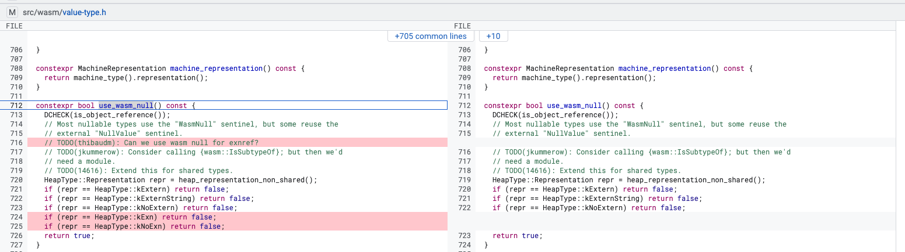

# Wasm Wrappers


## Buiding v8

```
Step 1: checkout commit 7e6d85b27b1633a918373b1ea533b516e0169a86

Step 2: building 
```

## Documents
- Slides: https://i.blackhat.com/BH-US-24/Presentations/US24-Liu-Achilles-Heel-of-JS-Engines-Exploiting-Modern-Browsers-During-WASM-Execution.pdf
=> It's too compilcated

- wasm-null and js-null confusion: https://issues.chromium.org/issues/40067712


## Comments

- Wrappers plays an important role when connecting Wasm <-> JS
Example: 

```js
function throw_js_eh222(r) {// [1]
    console.log("================ throw_js22222 object =================");
    %DebugPrint(r);
     throw r; }

let builder = new WasmModuleBuilder();
let throw2 = builder.addImport('m', 'throw_js_eh222', makeSig([kWasmNullExnRef], []));// [2]


builder.addFunction('nullCastNullToExnRef', makeSig([], []))
.addLocals(kWasmNullExnRef, 1)
.addBody([
    kExprLocalGet, 0,
    // kGCPrefix, kExprRefCastNull, kNullExnRefCode,
    // kGCPrefix, kExprRefCastNull, kExnRefCode,
    kExprCallFunction, throw2, // [3]
]).exportFunc();
```

JavaScript code above shows the interaction of JS function between Wasm and JS. Particularly, Wasm calls JS function [1] insides its clause [3]. So wrappers is the guard guys matching types for 2 guys, and helps them communicating with each others. 

Explanation by text-based illustration: 
1. WebAssembly calls a JavaScript function
2. Wrappers act as "guard guys" ensuring type compatibility for correctly communicating.

```
+------------------+         +--------------------+
|                  |         |                    |
|  WebAssembly     |  --->   |   JavaScript       |
|  (Wasm Module)   |  <---   |   Function         |
|                  |         |                    |
+------------------+         +--------------------+
        ^                               ^
        |                               |
        +----------- Wrappers ----------+
                     (Type Guards)
                     
```

My opinion: 

1. The program uses turboshaft compiling. Before going to `builtin WasmRethrow` function, the `exception` objects went out wrapper. 

2. How about `use_wasm_null`?
```c++
  Node* IsNull(Node* object, wasm::CanonicalValueType type) {
    // We immediately lower null in wrappers, as they do not go through a
    // lowering phase.
    Node* null = type.use_wasm_null() ? LOAD_ROOT(WasmNull, wasm_null)
                                      : LOAD_ROOT(NullValue, null_value);
    return gasm_->TaggedEqual(object, null);
  }
```
It distinguish between Wasm and JS, likes `wasm_null` presents null value in wasm context, meanwhile `null_value` shows the null in JS field. Look at this patch:



Previously heap types `kExn` and `kNoExn` are considered as JS object. But now, they are returned as Wasm object. 

3. 

